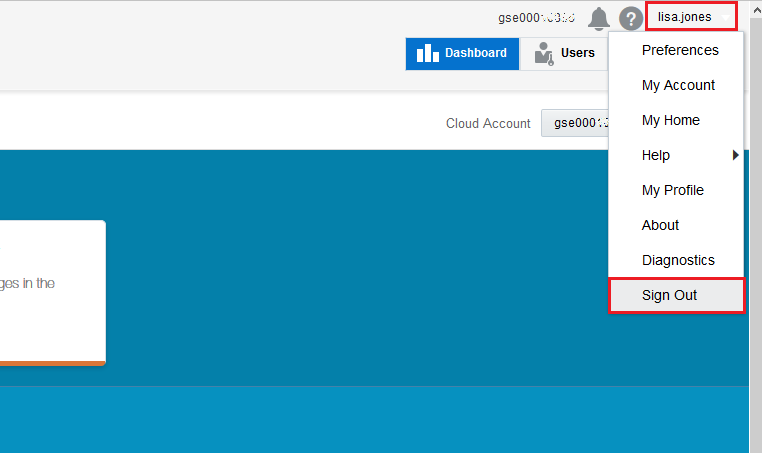
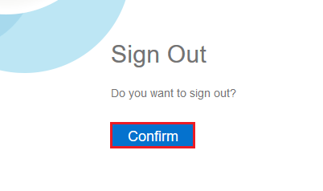

# 오라클 클라우드 테스트 드라이브 #
-----
## 301 : Oracle Integration Cloud Service 탐색 ##

### 소개 ###
이 자습서에서는 다음 작업을 수행하는 방법을 보여줍니다. 
- Oracle Integration Cloud Service 웹 기반 대시 보드에서 탐색하십시오. 

### 오늘 운동에 대하여 ###
이 연습에서는 다음을 수행합니다. 
- 웹 기반 통합 클라우드 서비스 (ICS) 대시 보드를 익숙하게 탐색하고 초기 응용 프로그램 개발과 다른 점을 처음 경험하십시오. 

### 선수 과목 ###

- 통합 클라우드 서비스를 포함한 Oracle Public Cloud Service 계정 (없는 경우 강사와 확인) 

#### Oracle Integration Cloud Service 탐색 

1. 이전의 Microservices 랩을 완료하면이 랩 실습을 진행하기 전에 Cloud Dashboard에서 로그 아웃 할 수 있습니다. 대시 보드의 오른쪽 상단에서 사용자 이름을 클릭하고 &#39;로그 아웃&#39;을 클릭하십시오. 

2. &#39;확인&#39;버튼을 클릭하여 로그 아웃합니다. 

3. [https://cloud.oracle.com/sign-in](https://cloud.oracle.com/sign-in)에서 다시 Cloud에 로그인하고, 먼저 데이터 센터를 선택한 다음 ID 통합 클라우드 서비스**의 ID 도메인과 자격 증명을 제공하십시오. 

**또는 귀하는 강사가 제공 한 액세스 문서 - 통합 Lab 섹션을 통해 액세스 할 수 있습니다.**

(**\*Notice**:이 Integrations Lab의 ID 도메인 및 자격 증명은 이전에 JavaApps Lab 및 Microservices Lab에서 사용했던**다른****강사가 제공 한 세부 정보를주의 깊게 확인하십시오) 

로그인이 성공하면 대시 보드가 표시됩니다.**통합**서비스 타일을 찾아 햄버거 아이콘을 클릭하십시오. 드롭 다운 메뉴에서 &#39;서비스 콘솔 열기&#39;를 클릭하십시오. 

2. **통합**서비스 타일을 찾을 수 없으면 브라우저의 오른쪽 상단에있는 &#39;대시 보드 사용자 정의&#39;버튼을 클릭 한 다음**대시 보드 사용자 정의 대화 상자**의 통합 섹션에서 &#39;표시&#39;버튼을 클릭하십시오. 

3. 서비스 콘솔이 열리면 ICS 홈 페이지가 다음과 같이 표시됩니다. 

\*맨 아래의 &#39;찾았습니다!&#39;버튼을 클릭하면**가이드 미**퀵 투어를 닫을 수 있습니다. 실습 중에는 필요하지 않습니다. 

4. 홈 페이지는 Oracle Integration Cloud Service의 주요 개발 기능인 연결, 통합, 모니터링, 조회, 패키지, 에이전트, 어댑터 및 라이브러리에 대한 링크를 제공합니다. 

5. 탐색 창을 사용하여 왼쪽 상단 모서리의! 을 클릭하여 탐색 창을 표시합니다. 

탐색 창은 Oracle Integration Cloud Service의 모든 개발 기능에 대한 액세스를 제공합니다. 

[Back to Integrations Lab Home](README.md) 

또는 

AAAA0 

