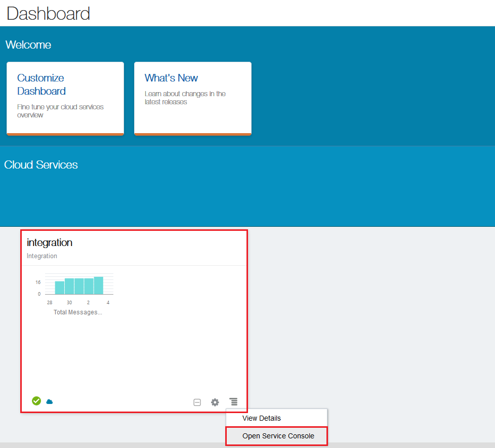
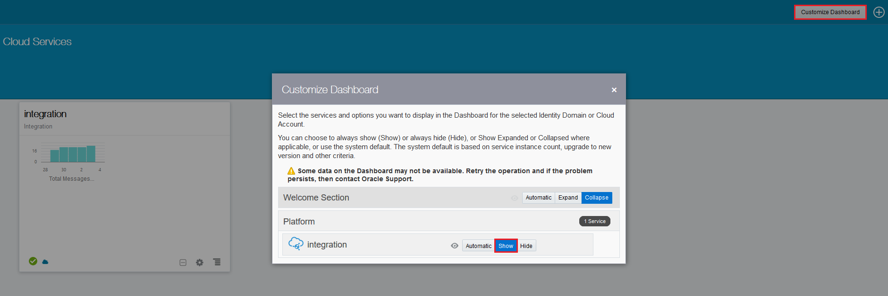
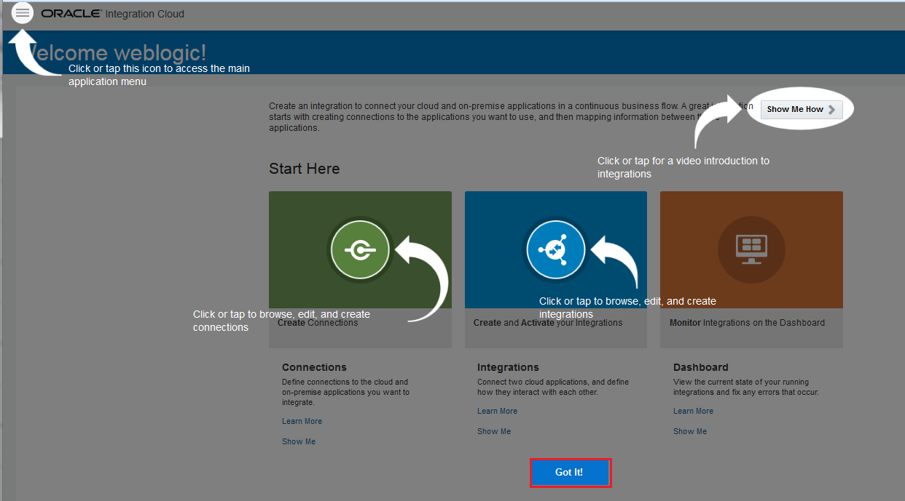

# ORACLE Cloud Test Drive #
-----
## 301: Rapid Connect Applications by Oracle Integration Cloud Service ##

### About this tutorial ###

### Prerequisites ###

- Oracle Public Cloud Service account including Integration Cloud Service

----

#### 301: Navigating Oracle Integration Cloud Service ####

1. [Sign in](sign.in.to.oracle.cloud.md) to [https://cloud.oracle.com/sign-in](https://cloud.oracle.com/sign-in). First select your datacenter then provide the identity domain and credentials of **Integration Cloud Service \(ICS\)**. After a successful login you will see your Dashboard. Find the **integration** services tile and click the hamburger icon. In the dropdown menu click `Open Service Console`.

2. If you cannot find the **integration** services tile, click `Customize Dashboard` button at top right corner of browser, and then click `Show` button at the integration section of the **Customize Dashboard** dialog window.

3. On Service Console opened, the ICS home page is displayed as following:

  \*Close the **Guide Me** Quick Tour if running by click `Got it!` button at the bottom, we don't need it during the lab exercise.

4. The home page provides links to the primary development features of Oracle Integration Cloud Service: connections, integrations, monitoring, lookups, packages, agents, adapters, and libraries.

5. Using the Navigation Pane, click  in the upper left corner to show the navigation pane.

The navigation pane provides you with access to all the development features in the Oracle Integration Cloud Service.
