# ORACLE Cloud Test Drive #
-----
## 303: Complete an Integration - An Orchestration Integration Flow ##

### Introduction ###
This tutorial demonstrates how to:
- Complete an integration flow on Integration Cloud Service (ICS) 

### About the Exercise Today ###
In this exercise, we will:
- Explore ICS Integration flow with REST and SOAP endpoints, and complete the remaining data mapping along integration flow
- Using the web-based click, configure, drag and drop techniques to explore integration resources detail and define data mapping on ICS dashboard

### Prerequisites ###
- Oracle Public Cloud Service account including Integration Cloud Service
- SOAP and REST Connections in ICS already configured (302-IntegrationsLab.md)

#### Complete an 'Orchestration' Integration ####

1. Using the Navigation Pane, click the hamburger menu icon in upper left corner to show the navigation pane, and then click `Integrations`.

2. The **Integrations** summary page is shown.  
Locate the entity named **XXX_ICS_INTMGT (1.0)** from the list, click the hamburger menu icon on the right side and select `Edit`.

3. The integration orchestration editor of the previous imported integration flow **XXX_ICS_INTMGT (1.0)** is shown. This is an incompleted flow in which the following subsequent steps will complete the remaining part.

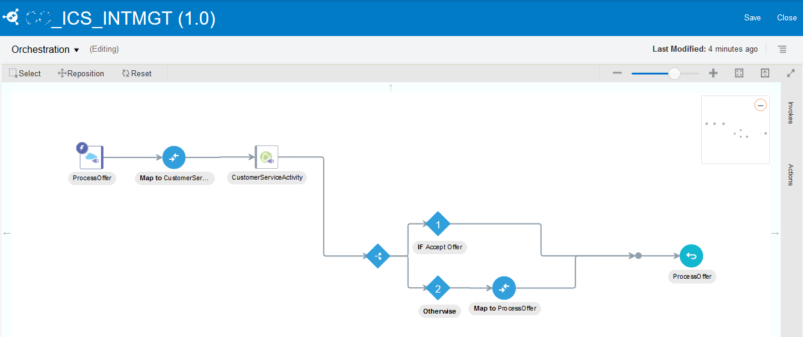

4. Before making any changes, let's review what has been pre-built during import.  
Click to select the first node named **ProcessOrder**, and then click `Edit` 'pen' button in the pop-up menu.

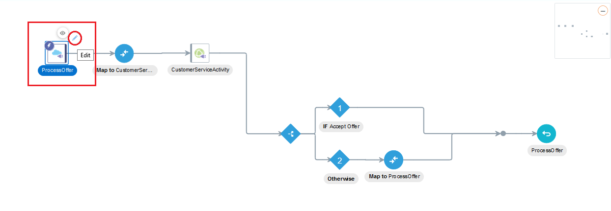

5. The **Configure Oracle REST Endpoint** dialog window is shown.  
This page summarizes the interface of the imported integration flow, i.e. how to interact with this process via REST request and response with appropriate JSON format.  
Click `< Back` button on the top right to review remaining detail.

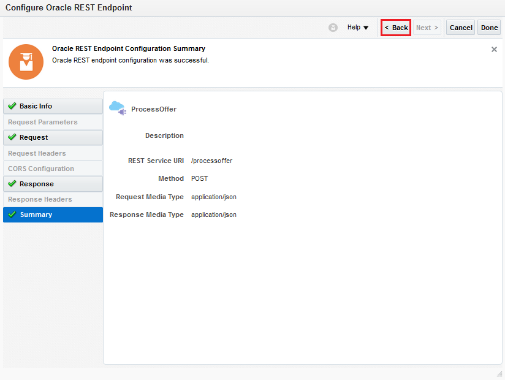

6. This page summarizes the response payload detail, feel free to explore the detail on this page without making any changes. Click `<<< inline >>>` link in the middle.

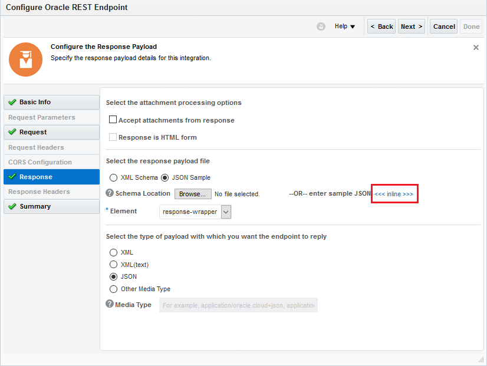

7. The form of **Response Sample Json Payload** is shown. Notice the sample response payload already provided during import in the format of:  
`{"activityid": "elit aliqua aliquip", "imgurl": "minim ipsum"}`  
Click `Cancel` button at bottom to return.

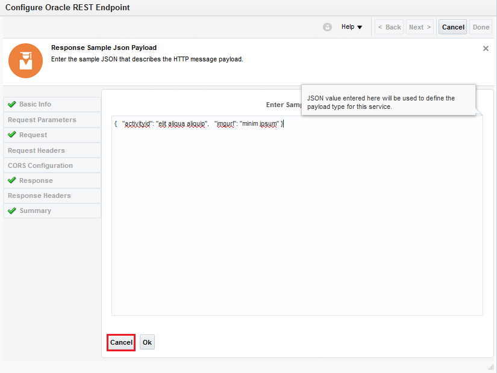

8. Click `< Back` button on the top right to review remaining detail.

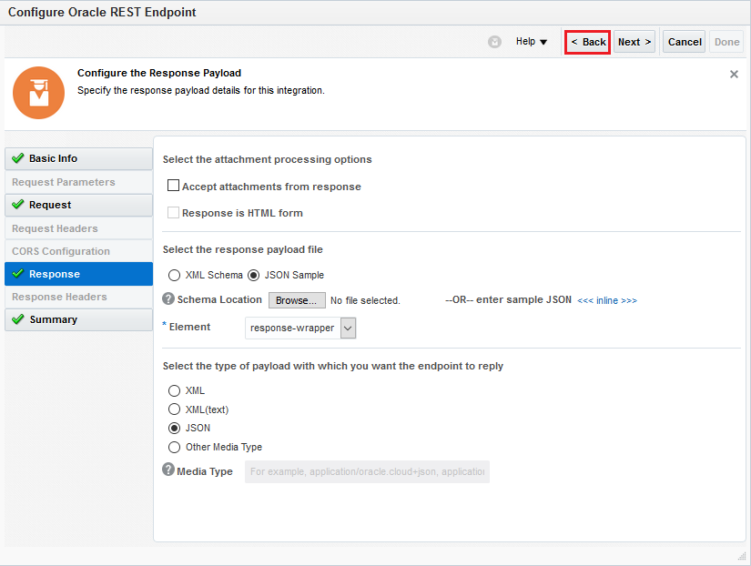

9. This page summarizes the request payload detail, feel free to explore the detail on this page without making any changes. Notice the sample request payload already provided during import in the format of:  
`{"customerid": 21767684, "offerid": 49531393, "productid": 28916305,   "accepted": true}`  
Click `< Back` button on the top right to review remaining detail.

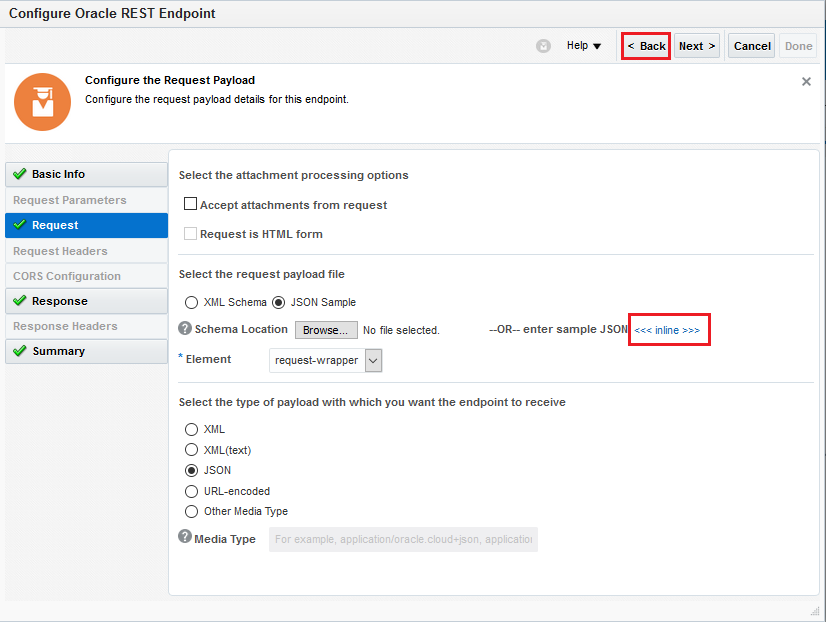

10. Finally, the **Welcome to the Oracle REST Endpoint Configuration Wizard** page is shown and summaries the overall setup of this REST endpoint interface.  
Do not change anything and click `Cancel` button at top right corner to return the orchestration flow.

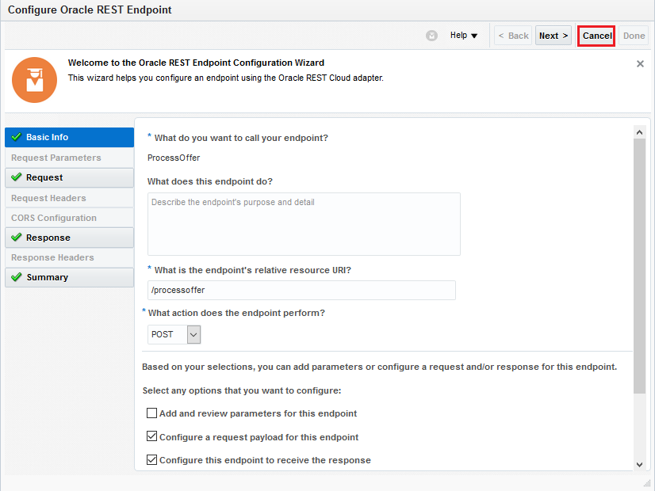

11. Click to select the second node named **Map to CustomerSer...**, and then click `Edit` 'pen' button in the pop-up menu.

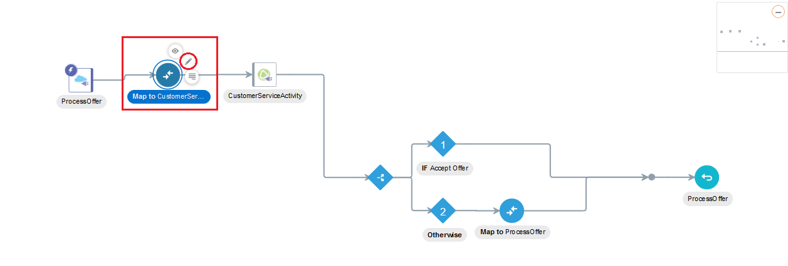

12. The **Map to CustomerServiceActivity** page is shown.  
Notice that there are some green tick radio buttons on some of fields in **Source** tree at left hand side, and on some of fields in **Target** tree at right hand side. It means mappings have been configured and used between these source to target field entities. (Already done during import)  
For example, the `customerId` under **Target** tree has been mapped with the same name field entity `customerId` from **Source** tree.  
Now, let's explore the second field `activityName` under **Target**, click the text named `f(x), offerid, of acceptance, accepted` under **Mapping** column like below.

13. The **Build Mappings** dialog window is shown. The mapping has been imported and done with the following mapping:  
`<xsl:value-of select = 'concat("Offer ID: ", /nssrcmpr:execute/nsmpr0:request-wrapper/nsmpr0:offerid, " of acceptance ", /nssrcmpr:execute/nsmpr0:request-wrapper/nsmpr0:accepted)`  
What does it mean? This mapping will take the `offerid` and `accepted` fields from request payload, alter and concatenate strings into a sample string like `Offer ID: 10001 of acceptance true`  
Once review is done, click `Close` button at the bottom right corner.

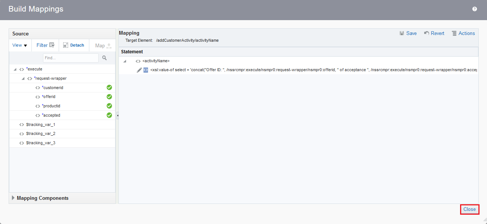

14. Back to the **Map to CustomerServiceActivity** page screen, click the text named `f(x), productid` under **Mapping** column like below.

15. The **Build Mappings** dialog window is shown with the imported mapping:  
`<xsl:value-of select = 'concat("Offer for product ID: ", /nssrcmpr:execute/nsmpr0:request-wrapper/nsmpr0:productid)'>`  
Once review is done, click `Close` button at the bottom right corner.

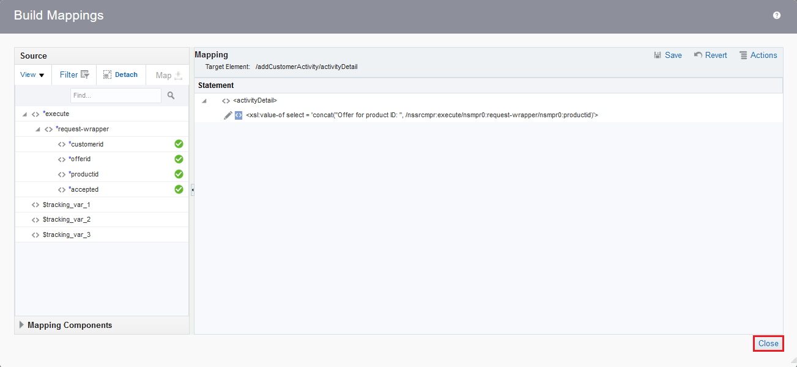

16. Back to the **Map to CustomerServiceActivity** page screen, click the last field text named `f(x)` under **Mapping** column like below.

17. The **Build Mappings** dialog window is shown with the imported mapping:  
`<xsl:value-of select = 'fn:current-data()'>`  
This is an out-of-the-box function provided by Integration Cloud Service, feel free to locate this function (under Functions->Date category) and many other functions by expand the **Mapping Component** tree at the bottom left corner.  
Once review is done, click `Close` button at the bottom right corner.

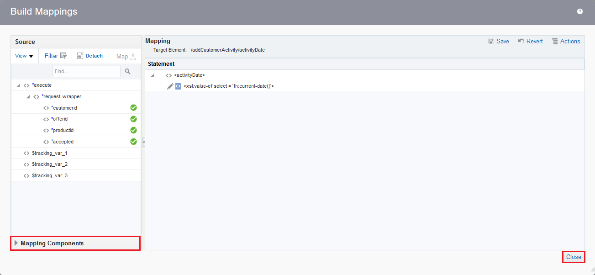

18. Back to the **Map to CustomerServiceActivity** page screen, click `Close` button on the top right corner.

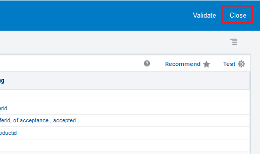

19. Back to orchestration flow, click to select the third node named **CustomerServiceActivity**, and then click `Edit` 'pen' button in the pop-up menu.

20. The **Configure SOAP Endpoint** dialog window is shown. Due to the nature of SOAP based interface, there is no additional pages available to be configured.  
Simply review this page and click `Cancel` button at top right corner.

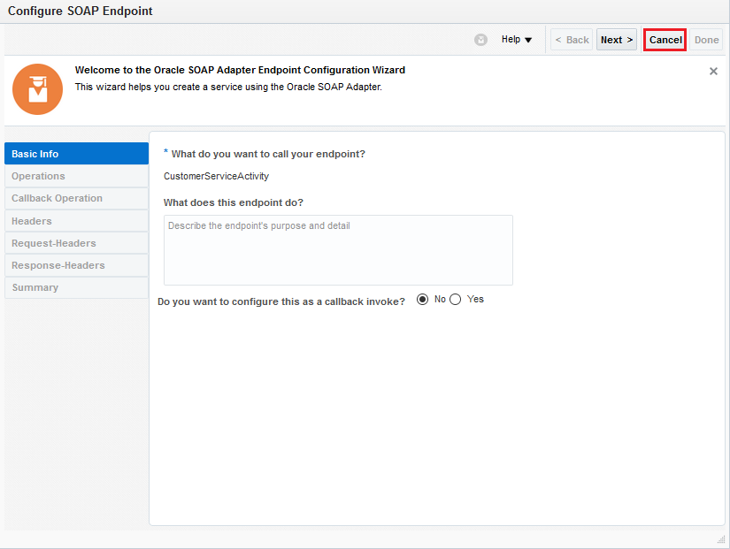

21. Back to orchestration flow, click to select the forth node named **IF Accept Offer**, and then click `Edit` 'pen' button in the pop-up menu.

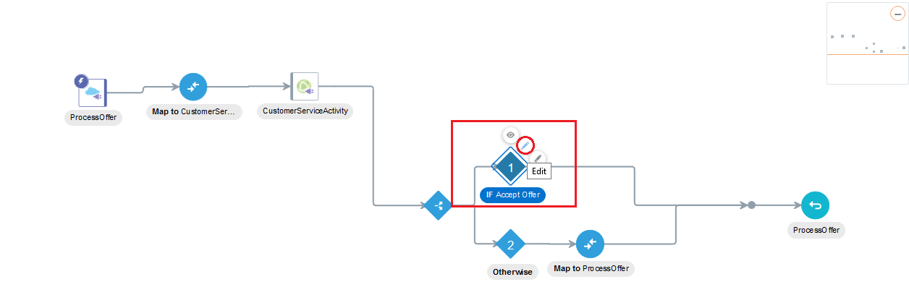

22. The **Accept Offer** page is shown. Notice a logic decision `lower-case(accepted) = "true"` has been provided in the text area and there is a green tick radio button next to `accepted` field under **Source** on the left.  
This function evaluates to return result true or false based on the lower case string value of `accepted`, in which the result is used to determine how message flow towards **IF** or **ELSE** path.  
On review done, click `Close` at top right corner.

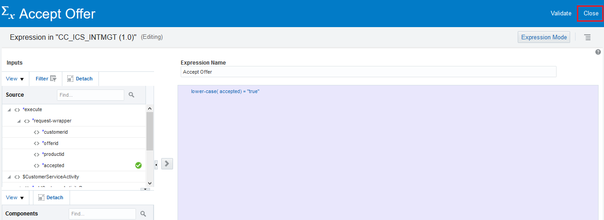

23. Under *if* or *otherwise* condition, different response data will be returned. Now, there is an one task remaining in the *if* path to complete the entire integration flow.

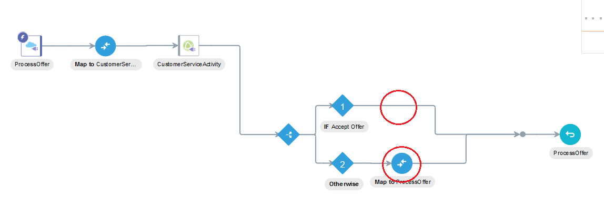

24. In order to handle proper response when customer *accept* an offer, we need to confirgure the missing **Map** of response data on the *if* path.  
Click `Actions` on the right side pane, then drag the `Map` and drop it onto the integration flow, between **IF Accept Offer** node and the join point of two switch lines, which appears with `+` icon like below.

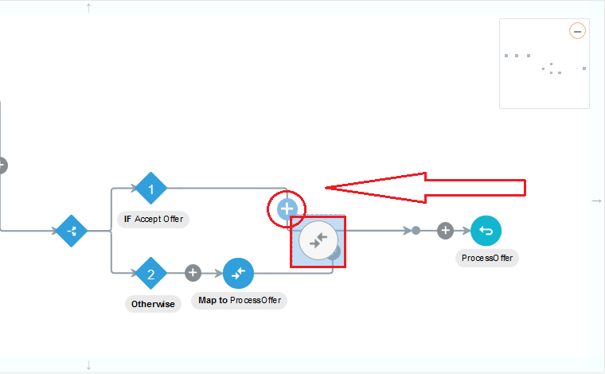

25. Once the `Map` is properly dropped, the **Data Mapping** dialog window is shown.  
    Expand the **Source** in left pane, drag the `return` field under `$CustomerServiceActivity` -> `addCustomerActivityResponse`, and drop it onto `activityid` in right pane.  
	Click `imgurl` to proceed advance data mapping.
    

26. The **Build Mappings** window dialog is shown.  
    Expand **Mapping Components** under **Source** in left pane, and then expand `Functions` -> `String`.  
	Drag the function `fx concat` and drop it onto `- Drag and Drop or Type value here...` under **Mapping** in right pane.  
	Click `Save`.
	

27. Click on `string1`, enter the QR code URL without the offer id including ' ' sign, i.e. `'https://qrcodegenerator-<Your Application Container Cloud Identity Domain Hostname>/ctdqr/v1/offer/'`, notice don't forget to put the single quote in the front and the end of the URL. (Hostname obtained from 'Microservices' lab)  
    Next, expand `Source` from the left pane, drag the `offerid` field and drop it onto `string2`. A string is automatically inserted. \(This is the XSLT variable representation of 'offerid'\)  
	Click `Save`, and then click `Close` button at the bottom to return previous screen.

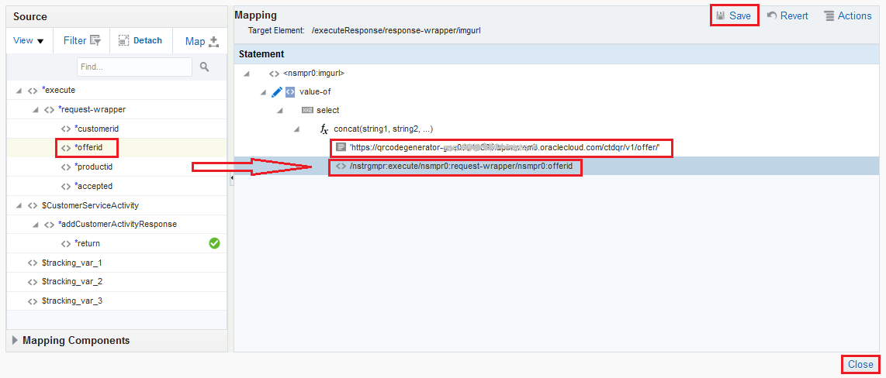

28. *Data Mapping* should be the same as below. Click `Validate` and and then click `Close`.

29. The *Process Offer* integration flow development is done.  

30. Click on the hamburger icon and then select `Tracking` at the top right corner.

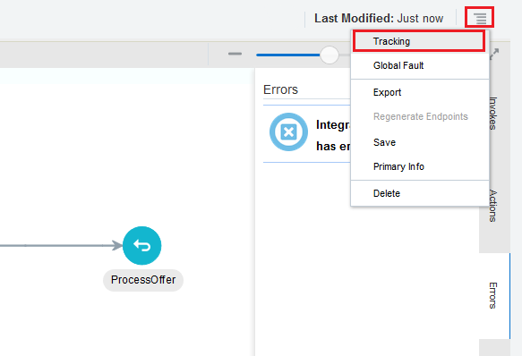

31. The **Business Identifiers for Tracking** dialog window is shown.  
    Business identifier is required for runtime transaction tracking on messages, espeically when hundreds and thousands of messages running thru ICS.  
    Notice the tracking business identifiers: `customerid`, `offerid` and `productid` have already been mapped. The screen looks like below.  
	Click `Cancel` button at the bottom on review completion of tracking setup to close the dialog.

32. Click `Save` and `Close` buttons respectively to go back to ICS dashboard main screen.

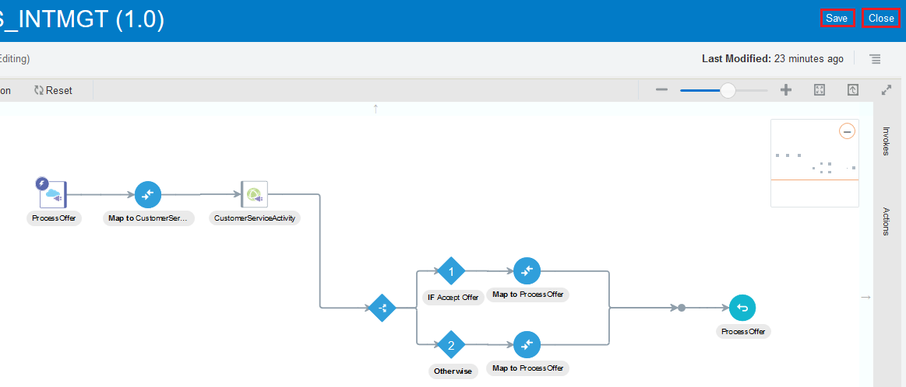

33. From the **Integrations** Summary page, click on the **Switch** button of your newly created `integration`, the `Activate Integration?` dialog window is shown.  
    Check `Enable tracing` and `Include payload` for testing later, although this is not recommended to turn on when serving production traffic.  
	Click `Activate` button at the bottom.

34. Wait for a couple of minutes for the integration activation.  
    Once it is done, a green banner telling the integration was activated successfully and the result looks like below:

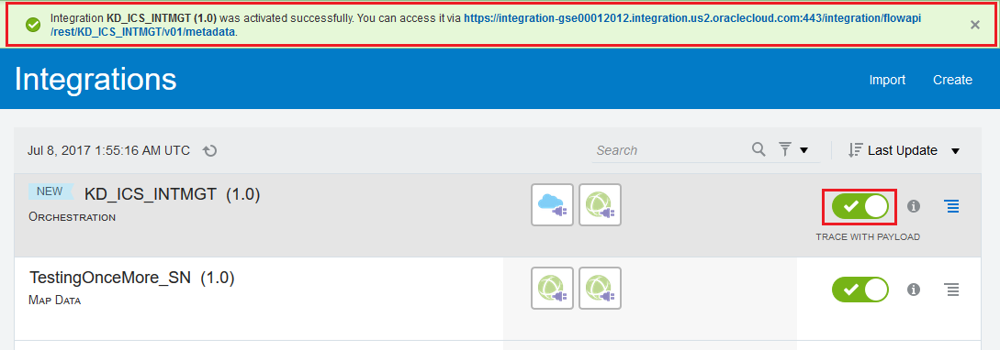

35. Save or copy into clipboard from your browser the unique URL: `https://integration-xxxxxxxxxxx.integration.xxx.oraclecloud.com:443/integration/flowapi/rest/XXX_ICS_INTMGT/`

36. The integration service is now ready for testing.

[Procced to Next - 304: Testing the service and Monitoring with ICS Dashboards](304-IntegrationsLab.md)

or

[Back to Integrations Lab Home](README.md)
