# ORACLE Cloud Test Drive #
-----
## 303: Create an Integration - An Orchestration Integration Flow ##

### Introduction ###
This tutorial demonstrates how to:
- Create an integration flow on Integration Cloud Service (ICS) 

### About the Exercise Today ###
In this exercise, we will:
- Explore and configure ICS Integration flow with REST and SOAP endpoints, and define data mapping along integration flow
- Using the web-based click, configure, drag and drop techniques to define data mapping and integration integration resources detail on ICS dashboard

### Prerequisites ###
- Oracle Public Cloud Service account including Integration Cloud Service
- SOAP and REST Connections in ICS already configured (302-IntegrationsLab.md)

#### Create an 'Orchestration' Integration ####

1. Using the Navigation Pane, click the hamburger menu icon in upper left corner to show the navigation pane, and then click `Integrations`.

2. The home page of **Integrations** is shown, click `Create` button on the top left corner.

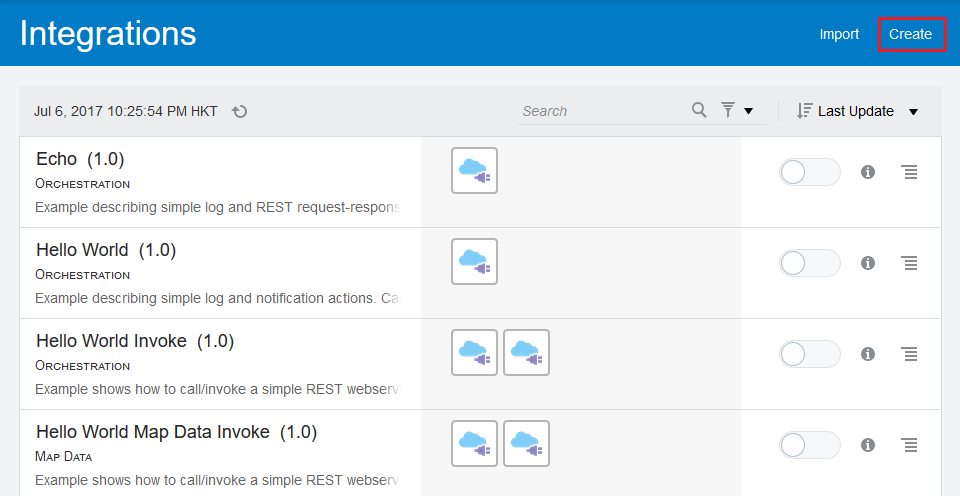

3. The **Create Integration - Select a Style\/Pattern** dialog window is shown.  
    You could see different types of integration are available, including *Orchestration, Map Data, Publish To ICS and Subscribe To ICS*. However in this lab exercise, we will create an *Orchestration* integration.  
    Click `Select` button under *Orchestration* box.   

4. A new dialog window **Create New Integration** is shown, enter the following information to create our *Integration*:
    * **What triggers this integration?** Keep the default selected *Application event or business object*.
    * **What do you want to call your integration?** Provide an unique and easily identified *Integration* Name, such as <Your Short Name>\_<System_Name>\_<Service_Name>. In our example, this is **KD_ICS_INTMGT**, while *KD* is short name of *Kelvin Durant*.
	* **Identifier** The **Identifier** will be automatically filled-in while you type the **Name** above, however you can provide another unique identifier, suggest include your short name as prefix.
	* **Version** Select Keep the default value. (Change only if you are going to create a new *versioned* integration)
	* **What does this integration do? (Optional)** You can leave it empty or enter any meaningful text to describe this *Integration*.
	* **Which package does this integration belong to? (Optional)** You can leave it empty or enter any meaningful package name to collectively group with other integrations.
	

	
5. Click `Create` button, the integration orchestration editor is shown.

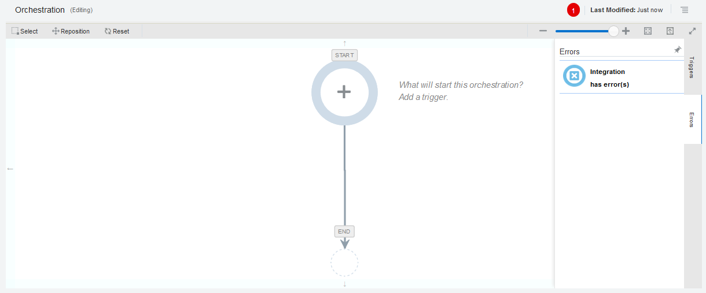

6. First of all, we are going to define how this integration flow being exposed to client consumer by setting up a **Trigger**.  
    Now, click `Triggers` at the right side bar, the palette title on the right changed to **Triggers**.  
    Select `REST`, the list of available *REST Trigger Connection* is shown.  
    Drag and Drop your newly created *Trigger Connection* (Our example is 'KD_ICSINTMGT_ProcessOffer'), to the "+" icon of flow diagram inside the big *circle* under *START*.

7. The **Configure Oracle REST Endpoint** dialog window is shown. Provide the following information:
    * **What do you want to call your endpoint?** Enter `ProcessOffer`
	* **What is the endpoint's relative resource URI?** Enter `/processoffer`
	* **What action does the endpoint perform?** Select `POST`
	* Check to select **Configure a request payload for this endpoint**
	* Check to select **Configure this endpoint to receive the response**
	* Leave others empty or unselect.
	
	Click `Next` button.

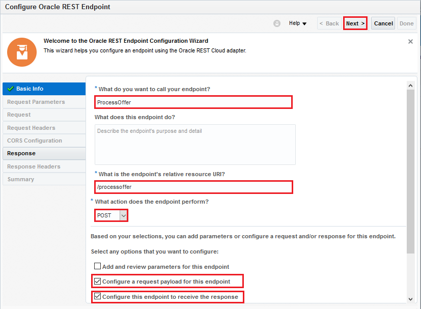

8. The **Configure the Request Payload** page is shown, check:
    * **Select the request payload file** `JSON Sample`
	* **Select the type of payload with which you want the endpoint to receive** `JSON`
	
	Click `<<< inline >>>` link next to **--OR-- enter sample JSON**
	

9. The **Request Sample Json Payload** page is shown.
    Copy this text `{   "customerid": 21767684,   "offerid": 49531393,   "productid": 28916305,   "accepted": true }` to the text area under **Enter Sample JSON**.  
    Click `OK` button at the bottom.

10. Click `Next` button to proceed next, **Configure the Response Payload** page, check:
    * **Select the response payload file** `JSON Sample`
	* **Select the type of payload with which you want the endpoint to reply** `JSON`
	
	Click `<<< inline >>>` link next to **--OR-- enter sample JSON**

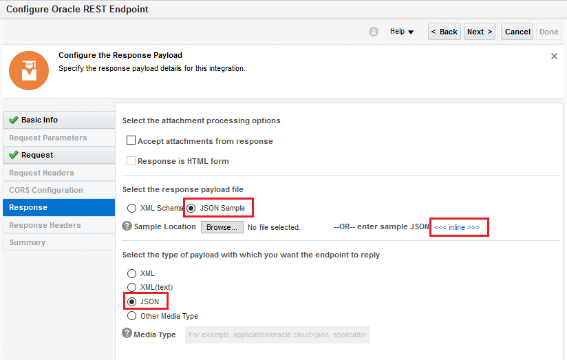

11. The **Response Sample Json Payload** page is shown.
    Copy this text `{   "activityid": "10001-43513-v1.0",   "imgurl": "tmptext" }` to the text area under **Enter Sample JSON**.  
    Click `OK` button at the bottom.

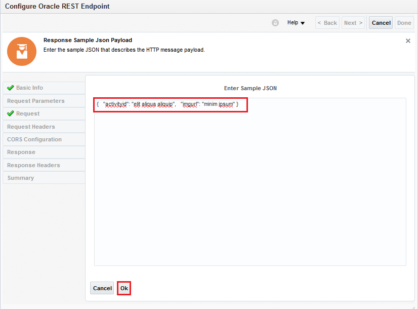

12. Click `Next` button to proceed next, **Oracle REST Endpoint Configuration Summary** page.  
    Your setup should look like below, then click `Done` button. We just finish defining a REST **Trigger** to expose this integration flow to client consumer.
	

13. Back to the *Integration Orchestration Editor*, you can:
    * Drag and drop to re-arrange each node of integration orchestration flow to different location.
    * Click `-` or `+` button on top left corner to re-size flow diagram to fit your screen resolution.
	* As best practice, regularly click `Save` button at the top left corner to store your work from time to time.
	

14. Next, we are going to define a service callout, to **Invoke** an endpoint service - CRM Customer Service.  
    Now, click `Invokes` at the right side bar, the palette title on the right changed to **Invokes**.  
    Select `SOAP`, the list of available *SOAP Invoke Connection* is shown.  
    Drag and Drop your newly created *Invoke Connection* (Our example is 'KD_CRM_CustomerService'), to the middle of integration flow, between **ProcessOffer** and **Map to ProcessOffer** activity.

15. The **Configure SOAP Endpoint** dialog window is shown. Provide the following information:
    * **What do you want to call your endpoint?** Enter `CustomerServiceActivity`
	* **What does this endpoint do?** Optional
	* **Do you want to configure this as a callback invoke?** Select `No`

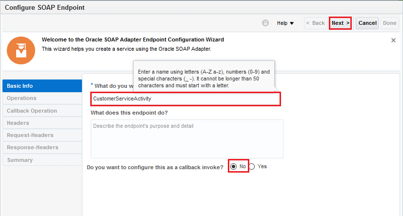
	
16. Do not change other values, click `Next` -> `Next` -> `Next` and finally `Done` buttons. You should have a similar integration flow as below.  
    We just finish defining an **Invoke** to call a CRM customer service SOAP endpoint.  
	
	Now, we are going to define how different data fields are being passed incoming from **Trigger** to outgoing **Invoke*.  
	Click the **Map to CustomerServiceActivty** node and then further click on the `pencil` icon to enter data mapper screen.

17. In the data mapper window, drag the `customerid` radio button on left **Source** pane, and then drop to the `customerId` radio button on right **Target** pane.

18. A 'Green' line linking source and target customerId is created.

19. Next, we want to send text data on the `activityName` field of *addCustomerActivity* target, in the format of: `Offer ID: <'offerid' field from Source> of acceptance <'accepted' field from Source>`.  
    In order to setup, click on the field `activityName` on the **Target** *addCustomerActivity* pane directly. The **Build Mappings** dialog window is shown.

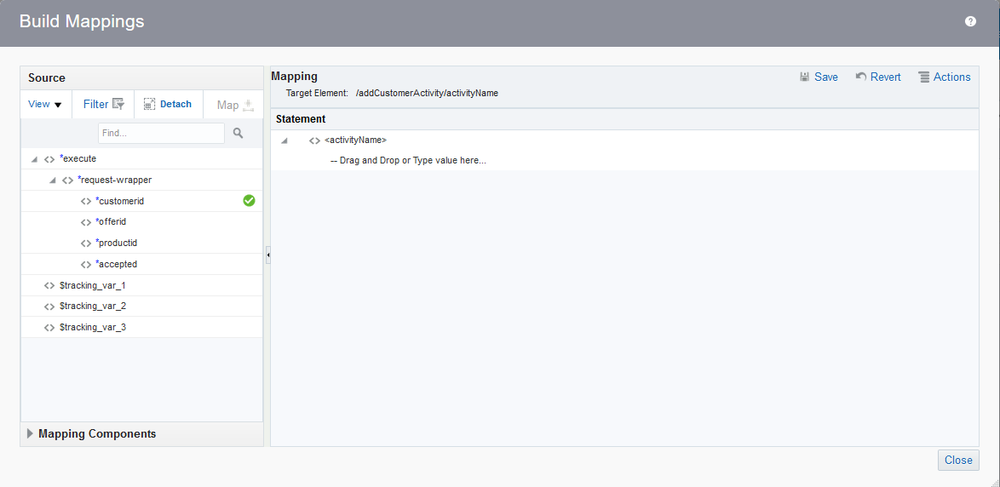

20. Expand `Mapping Components` from the left pane, then expand `Functions` -> `String`.  
    Drag the `f(x) concat` from left pane, to the location of `-- Drag and Drop or Type value here...` under <activityName> in the right pane.

21. Click on `string1`, enter `'Offer ID: '`, then **Enter**.  
    (\*Notice: Remember to put **`' '`**, i.e. the single quote to enclose `Offer ID` string)  
    Expand `Source` from the left pane, drag the `offerid` field and drop it onto `string2`. A string is automatically inserted. \(This is the XSLT variable representation of 'offerid'\)

22. Select on the last entry of concatenated string list, right click and select `Insert Sibling After`.

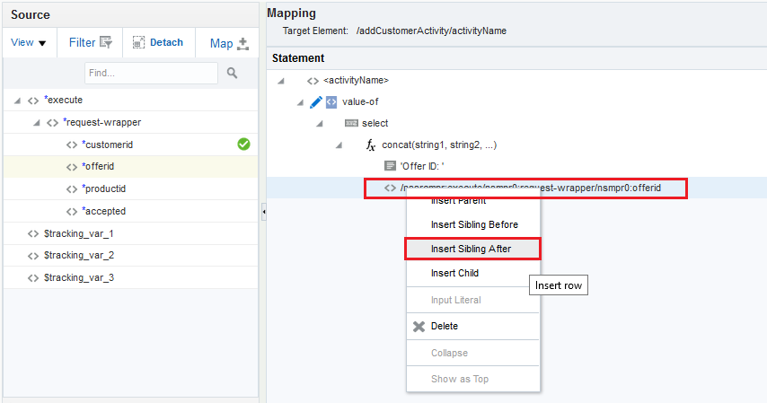

23. Click on the newly added entry `-- Drag and Drop or Type value surrounded with quotes here...`, enter `' of acceptance '`, then **Enter**.  
    Repeat last step 22 to add one more entry by `Insert Sibling After`.  
	Expand `Source` from the left pane, drag the `accepted` field and drop it on the last entry `-- Drag and Drop or Type value surrounded with quotes here...`. A string is automatically inserted. \(This is the XSLT variable representation of 'accepted'\)  
	Click `Save` on the top right corner to save your work, then click `Close` at the bottom to exit the **Build Mappings** window.

24. The `activityName` field is defined with **Mapping** `f(x), offerid, of acceptance, accepted`.  
    Next, click on `activityDetail` link to setup this field.

25. **(Simple Challenge)**  
    Follow the same steps as what you did to setup `activityName` field, setup the `activityDetail` field in the format of:  
    `'Offer for product ID: ' + <productid>`  
    Do not forget to click `Save` to save your work, before click `Close` at the bottom to exit the **Build Mappings** dialog window.

26. The `activityDetail` field is defined with **Mapping** `f(x), productid`.  
    Finally, click `activityDate` field to setup up this field.

27. The **Build Mappings** dialog window is shown. Expand `Mapping Components` from the left pane, then expand `Date`.  
    Drag the `f(x) current-date` from left pane, to the location of `-- Drag and Drop or Type value here...` under <activityDate> in the right pane.  
	Click `Save` to save your work and then click `Close` to exit the **Build Mappings** dialog window.

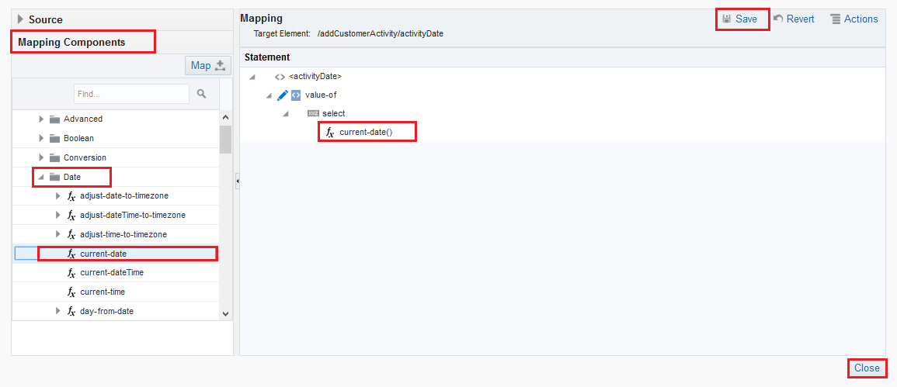

28. The *Data Mapping* for *CustomerService Activity* has just been completed.  
    Click `Validate`, the green banner `Mapping is valid and ready to use.` appears at the top.  
	(Optional) You can test the data mapping by click `Test` button on the right. Try it!  
	Click `Close` to return integration flow editor and click `Save` again to save your work.

29. Finally, we are going to define how to response data back to client consumer thru this integration flow.  
    The logic is based on the acceptance - **accepted** field of an offer from customer by:  
	- If **true**, means customer accepted the offer, then return the CRM logged *activityId* and the QR code image URL, which is generated based on *offerId*.
	- If **false**, means customer denied the offer, then return the CRM logged *activityId* (still required as a 'denied' customer action) and an empty QR code image URL, i.e. no QR code image will be displayed.  
	
    To do so, click `Actions` on the right side pane, then drag the `Switch` and drop it onto the integration flow, between **CustomerServiceActivity** node and **Map to ProcessOffer** node.
	

	
30. You should have a similar flow diagram as below. Adjust node and line position, zoom out or zoom in if necessary.

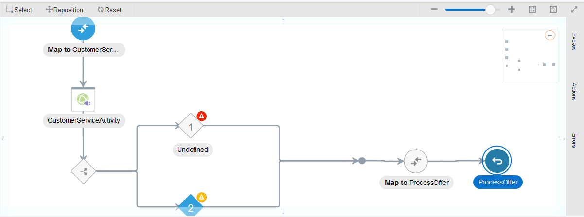

31. Click the newly added switch node - `Undefined`, click `Edit`.

32. The **Expression Editor** is shown. Perform the following step to setup a condition:
    1. Enter `Accept Offer` in the **Expression Name**.  
	2. Expand **Components** -> `Functions` -> `String`, drag the `fx lower-case` from left pane, and drop it onto the *New Condition* text area at right pane.  
	3. Expand **Source**, drag the `accepted` field from left pane, and drop it onto the newly added text `fn:lower-case(string)` at right pane.  
	4. Enter `"true"` in the text area under `=` drop down box.  
	5. Click `Expression Mode` button on the top left corner.

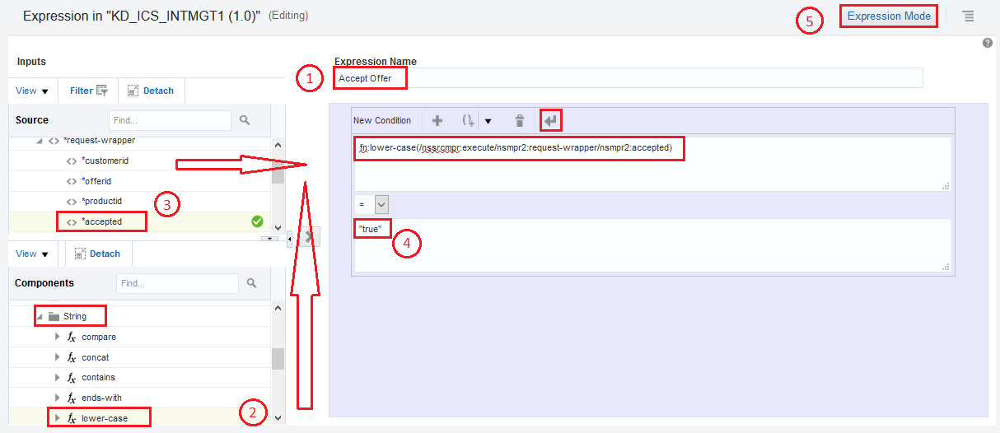

33. Verify the content in **Expression** and the **Expression Summary**, click `Validate` on the top left corner.  
    A green banner `Expression is valid and ready to use` is shown. Click `Close` to back integration flow editor.

34. Under *if* or *otherwise* condition, different response data will be returned. Here we delete the default `Map to ProcessOffer` response data mapping.  
    Click on the `Map to ProcessOffer`, click the hamburger icon, then click `Delete` to remove this node and confirm deletion on pop-up dialog.

35. click `Actions` on the right side pane, then drag the `Map` and drop it onto the integration flow, between **IF Accept Offer** node and the join point of two switch lines, which appears with `+` icon.

36. The **Data Mapping** dialog window is shown.  
    Expand the **Source** in left pane, drag the `return` field under `$CustomerServiceActivity` -> `addCustomerActivityResponse`, and drop it onto `activityid` in right pane.  
	Click `imgurl` to proceed advance data mapping.
    
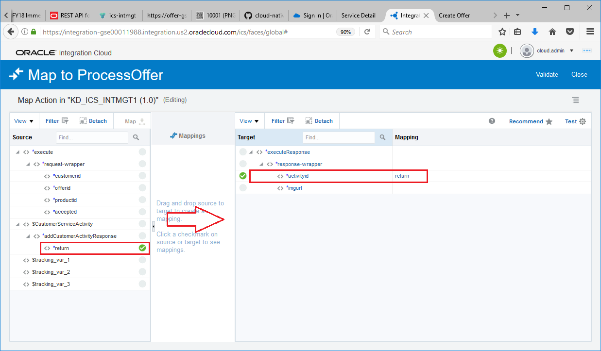

37. The **Build Mappings** window dialog is shown.  
    Expand **Mapping Components** under **Source** in left pane, and then expand `Functions` -> `String`.  
	Drag the function `fx concat` and drop it onto `- Drag and Drop or Type value here...` under **Mapping** in right pane.  
	Click `Save`.
	
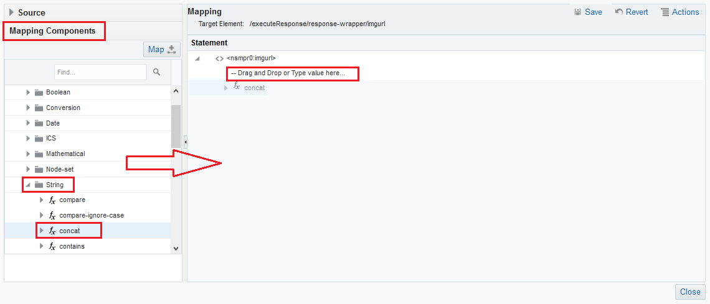

38. Click on `string1`, enter the QR code URL without the offer id including ' ' sign, i.e. `'https://qrcodegenerator-<Your Application Container Cloud Identity Domain Hostname>/ctdqr/v1/offer/'` (Hostname obtained from 'Microservices' lab)  
    Next, expand `Source` from the left pane, drag the `offerid` field and drop it onto `string2`. A string is automatically inserted. \(This is the XSLT variable representation of 'offerid'\)  
	Click `Save`, and then click `Close` button at the bottom to return previous screen.

39. *Data Mapping* should be the same as below. Click `Validate` and and then click `Close`.

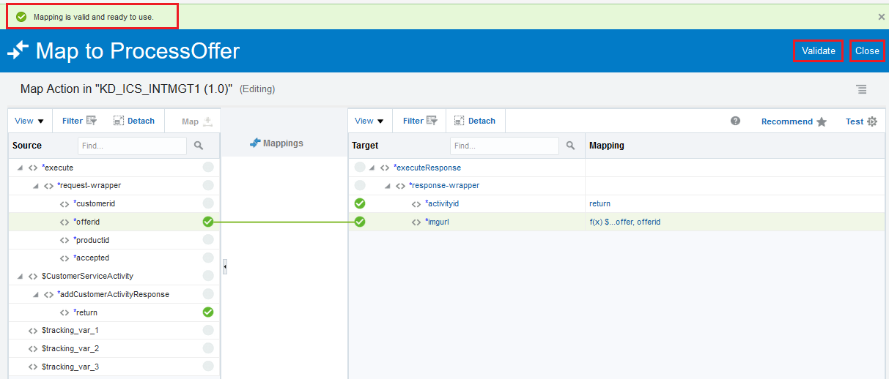

40. **(Simple Challenge)**  
    Complete the `Map to ProcessOffer` at the `Otherwise` path. The only different is:  
	Enter **''** for `imgurl`, i.e. 2 X single quote, such that an empty string will be returned. (Instead of *'https://qrcodegenerator-<Your Application Container Cloud Identity Domain Hostname\>/ctdqr/v1/offer/'* at the `IF Accept Offer` path)  
	The result should be the same as below.  
    **(\*Hints: Repeat step 35 to 39, and instructor will give you a quick demo here if needed)**

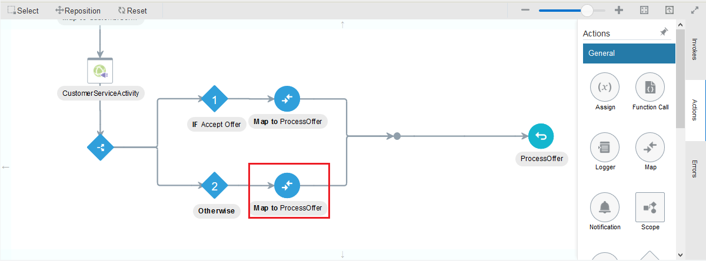

    The result of **Mapping** should look like this:
	
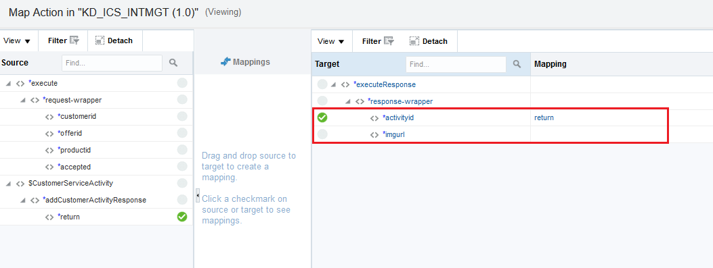
	
41. The *Process Offer* integration flow development is done.  
    However, there is an error showing at the top right corner, telling that **primary business identifier for Tracking** is needed. 

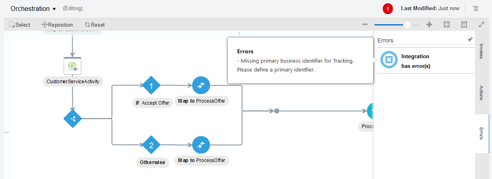

42. Click on the hamburger icon next to Error icon and **Last Modified: Just Now** at the top right.

43. The **Business Identifiers for Tracking** dialog window is shown.  
    Business identifier is required for runtime transaction tracking on messages, espeically when hundreds and thousands of messages running thru ICS.  
    Now, from the **Source** at left pane, drag the first `customerid` field, and drop it onto the first row of **Tracking Field** at right pane.  
	Repeat the same for `offerid` field and `productid` field respectively.  The result screen looks like below.  
	Click `Done` button at the bottom on completion of tracking setup, and then click `Close` to go back to ICS dashboard main screen.

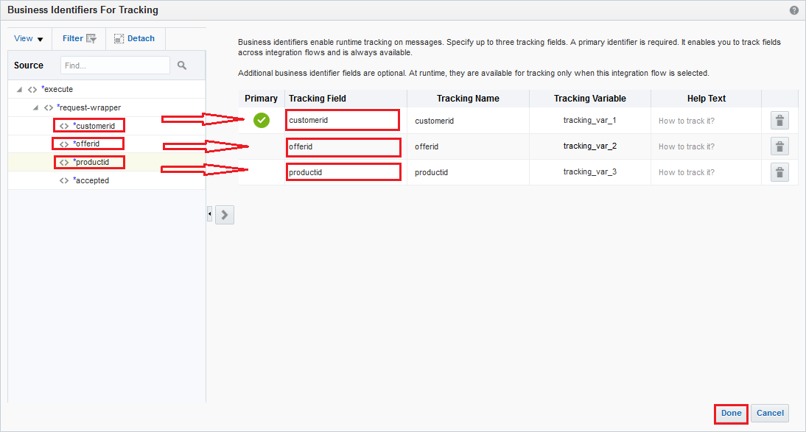

44. From the **Integrations** Summary page, click on the **Switch** button of your newly created `integration`, the `Activate Integration?` dialog window is shown.  
    Check `Enable tracing` and `Include payload` for testing later, although this is not recommended to turn on serving production traffic.  
	Click `Activate` button at the bottom.

45. Wait for a couple of minutes for the integration activation.  
    Once it is done, a green banner telling the integration was activated successfully and the result looks like below:

46. The integration service is now ready for testing.

[Procced to Next - 304: Testing the service and Monitoring with ICS Dashboards](304-IntegrationsLab.md)

or

[Back to Integrations Lab Home](README.md)
