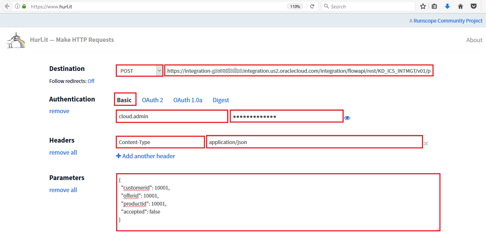
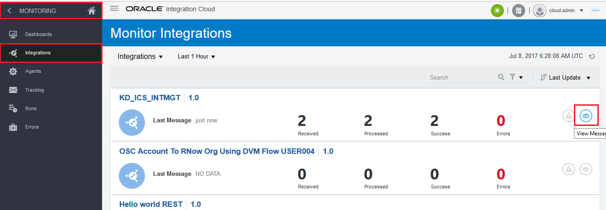
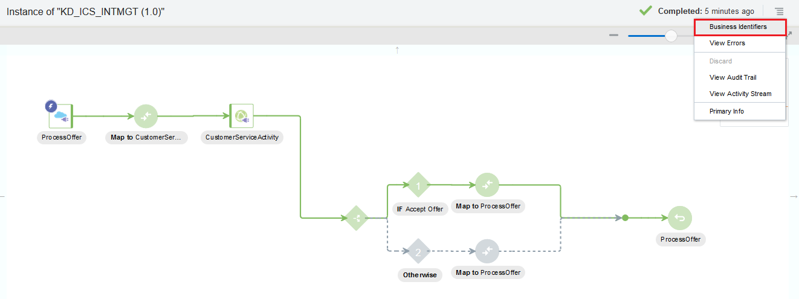

# ORACLE Cloud Test Drive #
-----
## 3. Rapid Connect Applications by Oracle Integration Cloud Service ##

### About this tutorial ###

#### 304: Testing the service and Monitoring with ICS Dashboards ####

1. Previously we have successfully deployed an integration flow which accepts a REST JSON request, route to a SOAP CRM customer service and then reply a REST JSON response. Let's test this service and monitor how it goes.  
	To do so, start a new browser window and visit to: `https://www.hurl.it/`, provide the following information:
	- **Destination**: Select `POST` and enter `https://integration-<Your ICS Identity Domain>.integration.us2.oraclecloud.com/integration/flowapi/rest/<Your Integration Service Name>/v01/processoffer`
	- **Authentication**: Add a new one, select `Basic` and enter your ICS username and password respectively.
	- **Headers**: Add a new one, enter `Content-Type` and `application/json` respectively.
	- **Parameters**: Add a new one by (Test 1 or Test 2):
	- Test 1: `{"customerid": 10001, "offerid": 10001, "productid": 10001, "accepted": true}`
	- Test 2: `{"customerid": 10001, "offerid": 10001, "productid": 10001, "accepted": false}`

2. Check `I'm not a robot`, and fill-in the required image questions, and then click `Launch Request` button.  
    On a successful ICS integration flow service setup and test call, you should find HTTP status `200 OK` and the result looks like:
	

3. Back to ICS, click the hamburger menu icon on top left corner, and then click `Monitoring`.

4. By default, the ICS Monitoring **Dashboard** is shown.
    The dashboard summarizes entire ICS traffic condition/trend amongst, *CONNECTIONS*, *INTEGRATIONS*, *SUCCESS*, *FAILURES* and other information, which are critical to integration monitoring.  
	(Optional) Notice on the right of dashboard, you can access to `Activity Stream`, `Download Diagnotics Logs` and `Download Incident`. Feel free to further explore.

5. Under `MONITORING`, click on `Integrations`, you can see the recently test messages fired previously.  
    Now click on `View Messages` icon on the right.

6. The **Track Instances** flow window for your particular integration is shown.  
    Click on one of your tested instance like below: 

7. The flow instance of the specific message transaction is shown.  
    The green path throughout the flow instance shows the normal/success flow of the message passing thru.  
	Now click on the hamburger menu icon on top right corner, and then click `Business Identifiers`.

8. The `Business Identifiers` dialog window is shown.  
    Notice the values of `customerid`, `offerid` and `productid` of this particular message are logged.  
	Click `OK`.

9. Click on the hamburger menu icon at top right corner, click `View Audit Trail`.  
    The **Audit Trail** of overall activity executed by the integration flow dialog window is shown.  
    Click `OK` button and then click `Close`.

You have finished this lab.

[Back to Integrations Lab Home](README.md)
