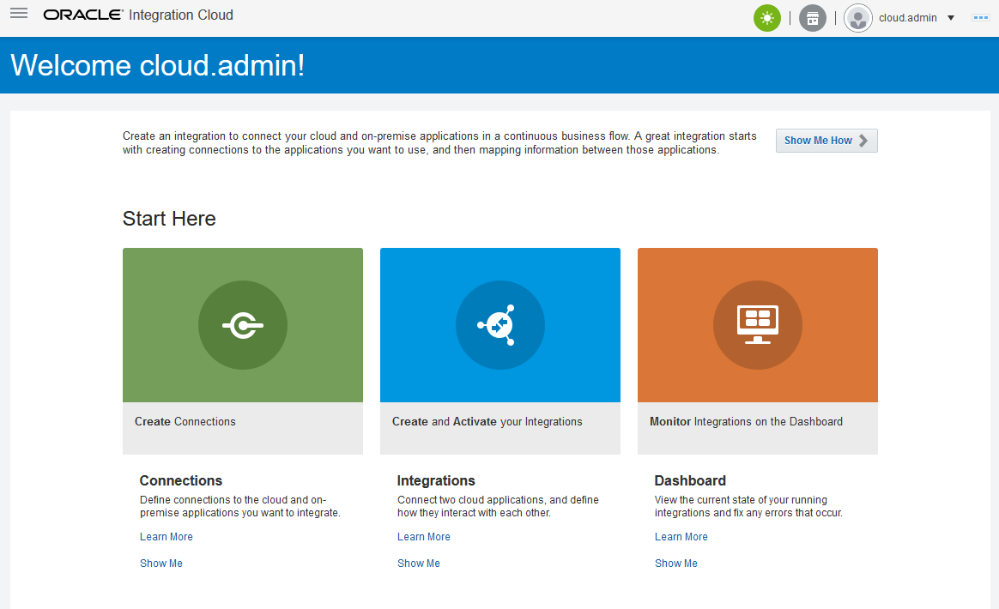
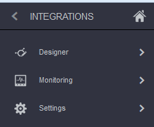
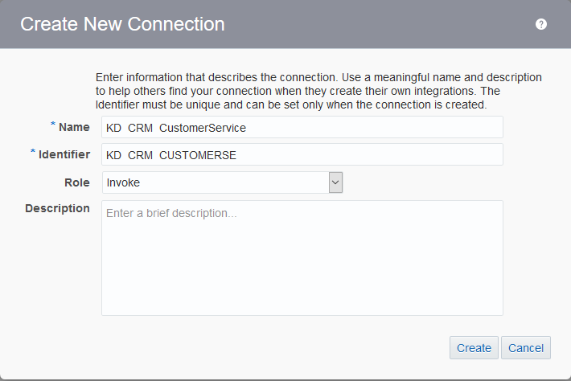
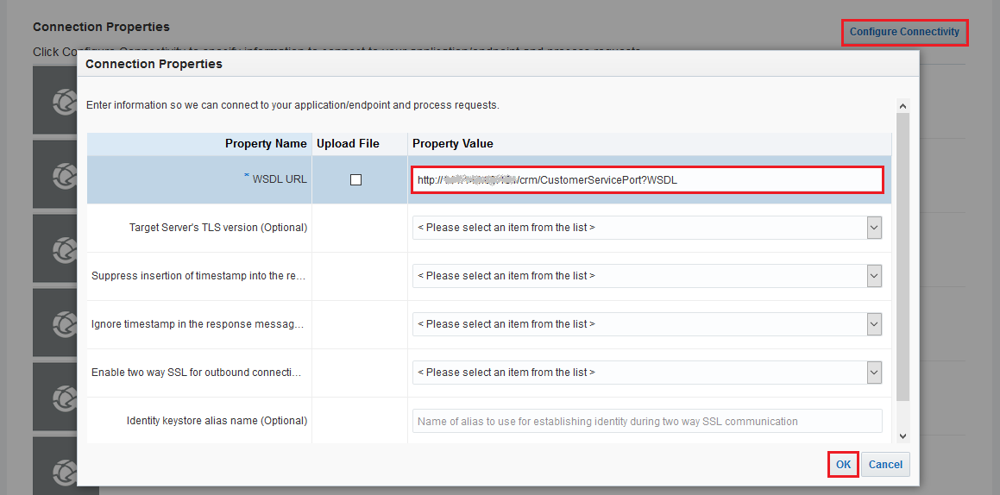

# ORACLE Cloud Test Drive #
-----
## Rapid Connect Applications by Oracle Integration Cloud Service ##

### About this tutorial ###
**Oracle Integration Cloud Service (ICS)** is a complete, secure, but lightweight integration solution that enables you to connect your applications in the cloud. It simplifies connectivity between your applications and connects both your applications that live in the cloud and your applications that still live on premises. Oracle Integration Cloud Service provides secure, enterprise-grade connectivity regardless of the applications you are connecting or where they reside.

Oracle Integration Cloud Service provides native connectivity to Oracle Software as a Service (SaaS) applications, such as Oracle Sales Cloud, Oracle RightNow Cloud, and so on. Oracle Integration Cloud Service adapters simplify connectivity by handling the underlying complexities of connecting to applications using industry-wide best practices. You only need to create a connection that provides minimal connectivity information for each system. Finally, the visual data mapper enables you to quickly create direct mappings between the trigger and invoke data structures. From the mapper.

Once you integrate your applications and activate the integrations to the runtime environment, the dashboard displays information about the running integrations so you can monitor the status and processing statistics for each integration. The dashboard measures and tracks the performance of your transactions by capturing and reporting key information. You can manage business identifiers that track fields in messages and manage errors by integrations, connections, or specific integration instances.

The key features of Oracle Integration Cloud Service include:

Project creation, configuration, and user management

1. **Connect**
    - Auto-Associated SaaS connections
	- Native SaaS Adaptors
	- Secure On-Premises Integration
	- Open Adapter SDK
2. **Design**
    - Intuitive Visual Designer and Mobile Ready - Rich Point and click browser-based designer to build integrations anywhere - on your computer or your favorite tablet
    - Oracle Recommends™ - Smart Data Mapper provides accurate recommendations using Oracle Recommends™
    - Business User Friendly - Business friendly terminology combined with videos and tutorials for ease of use
    - API-Ready - Publish your integrations as an API for external consumption
3. **Monitor and Manage**
    - End to End Visibility - Simple and powerful search to help you zero in on transactions of interest. Comprehensive drill-down capabilities for detailed auditing and analysis
    - Monitor KPIs - Real-time insight into key performance indicators on a high-performance visual dashboard
    - Robust Error Management - Rapidly detect and diagnose errors for corrective action
4. **Accelerate**
    - Pre-Built Integrations - Portfolio of pre-built integrations available for immediate use as-is, or customizable for your business requirements
    - Cloud Marketplace - Pre-built adapters and integrations, published by Oracle and Oracle partners

This tutorial shows how to connect to different applications to serve frontend mobile consumers using Oracle Integration Cloud Service. Once ICS receives a request from mobile consumer, it routes to CRM to perform customer activity log about acceptance of a product offer, and then it returns QR code image URL if user accepted the offer.

This tutorial demonstrates how to:

- Configure Connection definiton to a Simple Object Access Protocol (SOAP) based Customer Relationship Management (CRM) service and Expose into Representational State Transfer (REST) based service
- Configure Integration flow to interconnect service endpoints, mapping request and response data attributes and orchestrate decision logic
- Monitor integration flow transaction and endpoint status, performance statistics and business identifiers

### Prerequisites ###

- Oracle Public Cloud Service account including Integration Cloud Service

----

#### Navigating Oracle Integration Cloud Service ####

1. [Sign in](sign.in.to.oracle.cloud.md) to [https://cloud.oracle.com/sign-in](https://cloud.oracle.com/sign-in). First select your datacenter then provide the identity domain and credentials of **Integration Cloud Service \(ICS\)**. After a successful login you will see your Dashboard. Find the **integration** services tile and click the hamburger icon. In the dropdown menu click `Open Service Console`.

2. If you cannot find the **integration** services tile, click `Customize Dashboard` button at top right corner of browser, and then click `Show` button at the integration section of the **Customize Dashboard** dialog window.

3. On Service Console opened, the ICS home page is displayed as following:

  \*Close the **Guide Me** Quick Tour if running by click `Got it!` button at the bottom, we don't need it during the lab exercise.

4. The home page provides links to the primary development features of Oracle Integration Cloud Service: connections, integrations, monitoring, lookups, packages, agents, adapters, and libraries.

5. Using the Navigation Pane, click  in the upper left corner to show the navigation pane.

The navigation pane provides you with access to all the development features in the Oracle Integration Cloud Service.

#### Define Connections for CRM Customer Activity Service and REST Service Exposure ####

6. Go to **Connection** Summary Page by click on the `Connection` green icon.

Alternatively, you can go to **Connection** Summary Page by click the hamburger icon at the top left corner, click `Designer` and then `Connections`

7. In the home page of **Connection**, click `Create` button on the top left corner, the **Create Connection - Select Adapter** dialog window is shown.  
You could see different types of connection adapters are available, such as *Sales Cloud, E-Business Suite, Twitter, Salesforce and more*. However in this lab exercise, we will create a simple *SOAP* connection to connect a CRM Customer Activity Service interface.  
Now, do a search by entering `SOAP` in the search text box, then click `Select` button in the **SOAP** adapter connection box like below.

8. A new dialog window **Create New Connection** is shown, enter the following information to create our first *SOAP Connection*:
    * **Name:** Provide an unique and easily identified *Connection* Name, such as <Your Short Name>_<System_Name>_<Service_Name>. In our example, this is **KD_CRM_CustomerService**, while *KD* is short name of *Kelvin Durant*.
	* **Identifier:** The **Identifier** will be automatically filled-in while you type the **Name** above, however you can provide another unique identifier, suggest include your short name as prefix.
	* **Role:** Select **Invoke** from the drop-down list. (We are going to *Invoke* this service only)
	* **Description (Optional):** You can leave it empty or enter any meaningful text to describe this *SOAP Connection*.

9. Click `Create` button, the **SOAP Connection** with your provided **Name** in previous step is shown.

10. Scroll down to **Connection Properties** section, click `Configure Connectivity` button, the **Connection Properties** dialog window is shown. Fill in the **WSDL URL** by providing **Property Value** in the format of:
    * **http://\<Your Java Cloud Service Instance IP Address\>/crm/CustomerServicePort?WSDL**  
	*\*If you forget your JCS instance IP address, [Click Here!](../Java%20Apps/java.cloud.md)*  
	Leave other properties **empty** as they are optional and not required in this lab exercise.
	

11. Click `OK` button to save changes made.

#### Create an Integration - An Orchestration Integration Flow ####

#### Testing the service and Monitoring with ICS Dashboards ####

