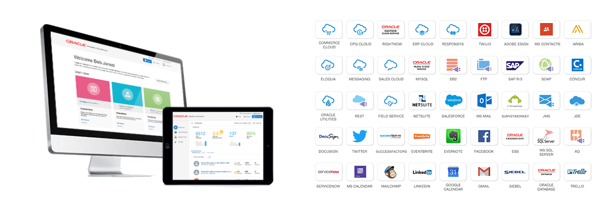

# ORACLE Cloud Test Drive #
-----
## 3. Rapid Connect Applications by Oracle Integration Cloud Service ##

### Introduction ###
This lab is part of the APAC Cloud Test Drive and is the third lab about connecting and integrating a JEE Application within an Agile project lifecycle.  
This section describes deploying and undeploying applications to an Oracle Java Cloud Service instance by using the WebLogic Server Administration Console.

#### About the Exercise Today ####

In this exercise, we will connect to backend application and serve frontend mobile consumer request using Oracle Integration Cloud Service. When ICS receives a request from mobile consumer, it routes to CRM to perform customer activity log about acceptance of a product offer, and then it returns QR code image URL if user accepted the offer.

**Lab Assumption**
+ You are an 'Integration Architect' who integrates CRM system rapidly
+ The CRM system and required service endpoint are ready to be connected and consumed
+ QR Code service is ready in Application Container Cloud Service after second lab

**Oracle Integration Cloud Service (ICS)** is a complete, secure, but lightweight integration solution that enables you to connect your applications in the cloud. It simplifies connectivity between your applications and connects both your applications that live in the cloud and your applications that still live on premises. Oracle Integration Cloud Service provides secure, enterprise-grade connectivity regardless of the applications you are connecting or where they reside.

Oracle Integration Cloud Service provides native connectivity to Oracle Software as a Service (SaaS) applications, such as Oracle Sales Cloud, Oracle RightNow Cloud, and so on. Oracle Integration Cloud Service adapters simplify connectivity by handling the underlying complexities of connecting to applications using industry-wide best practices. You only need to create a connection that provides minimal connectivity information for each system. Finally, the visual data mapper enables you to quickly create direct mappings between the trigger and invoke data structures from the mapper.  
Once you integrate your applications and activate the integrations to the runtime environment, the dashboard displays information about the running integrations so you can monitor the status and processing statistics for each integration. The dashboard measures and tracks the performance of your transactions by capturing and reporting key information. You can manage business identifiers that track fields in messages and manage errors by integrations, connections, or specific integration instances.  
The key features of Oracle Integration Cloud Service include:
1. **Connect**
    - Auto-Associated SaaS connections
	- Native SaaS Adaptors
	- Secure On-Premises Integration
	- Open Adapter SDK
2. **Design**
    - Intuitive Visual Designer and Mobile Ready - Rich Point and click browser-based designer to build integrations anywhere - on your computer or your favorite tablet
    - Oracle Recommends™ - Smart Data Mapper provides accurate recommendations using Oracle Recommends™
    - Business User Friendly - Business friendly terminology combined with videos and tutorials for ease of use
    - API-Ready - Publish your integrations as an API for external consumption
3. **Monitor and Manage**
    - End to End Visibility - Simple and powerful search to help you zero in on transactions of interest. Comprehensive drill-down capabilities for detailed auditing and analysis
    - Monitor KPIs - Real-time insight into key performance indicators on a high-performance visual dashboard
    - Robust Error Management - Rapidly detect and diagnose errors for corrective action
4. **Accelerate**
    - Pre-Built Integrations - Portfolio of pre-built integrations available for immediate use as-is, or customizable for your business requirements
    - Cloud Marketplace - Pre-built adapters and integrations, published by Oracle and Oracle partners

### This tutorial demonstrates how to: ###
- Configure Connection definiton to a Simple Object Access Protocol (SOAP) based Customer Relationship Management (CRM) service and Expose into Representational State Transfer (REST) based service
- Configure Integration flow to interconnect service endpoints, mapping request and response data attributes and orchestrate decision logic
- Monitor integration flow transaction and endpoint status, performance statistics and business identifiers

### Prerequisites ###
- Oracle Public Cloud Service account including Integration Cloud Service

# Lab Exercise: #

## 301: Navigating Oracle Integration Cloud Service ##

[Click Here.](301-IntegrationsLab.md)

## 302: Define Connections for CRM Customer Activity Service and REST Service Exposure ##

[Click Here.](302-IntegrationsLab.md)

## 303: Create an Integration - An Orchestration Integration Flow ##

[Click Here.](303-IntegrationsLab.md)

## 304: Testing the service and Monitoring with ICS Dashboards ##

[Click Here.](304-IntegrationsLab.md)

or

[Back to Cloud Test Drive Home](../README.md)
