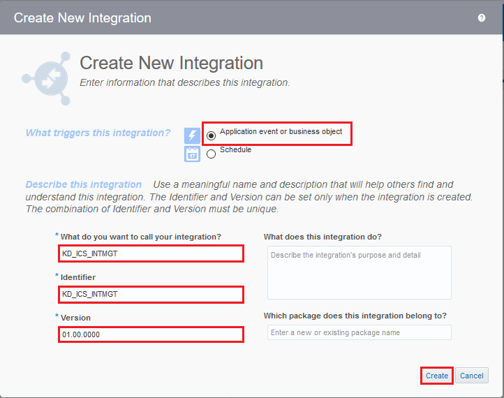
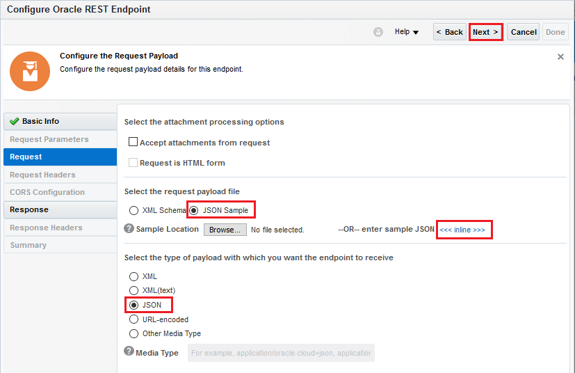
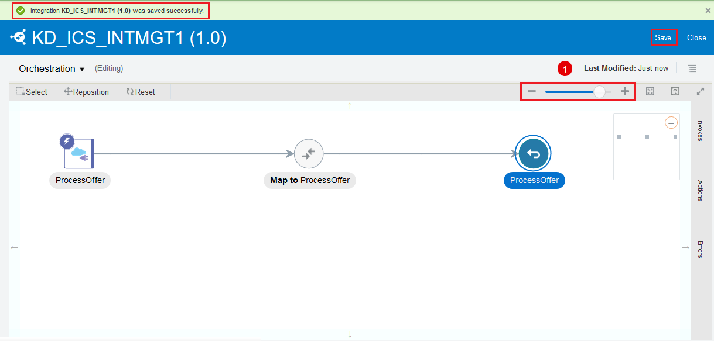
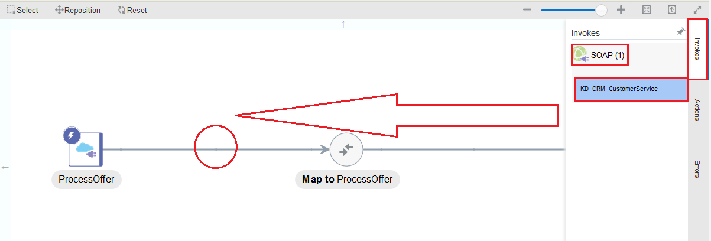
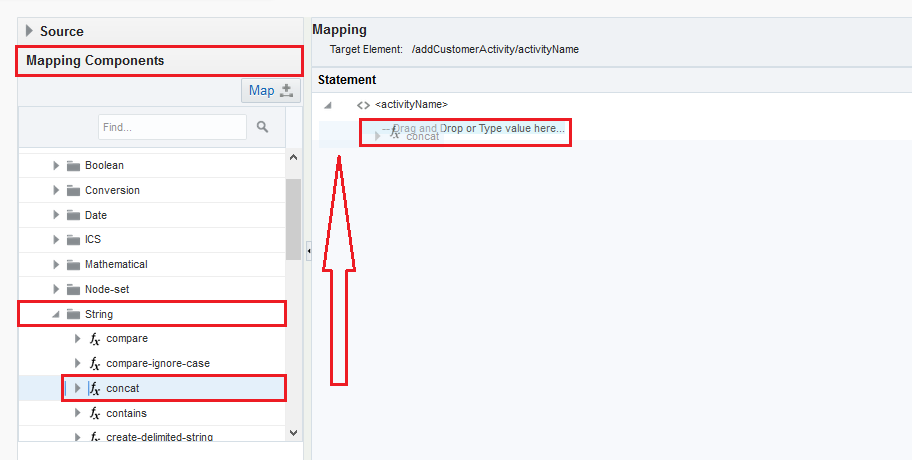
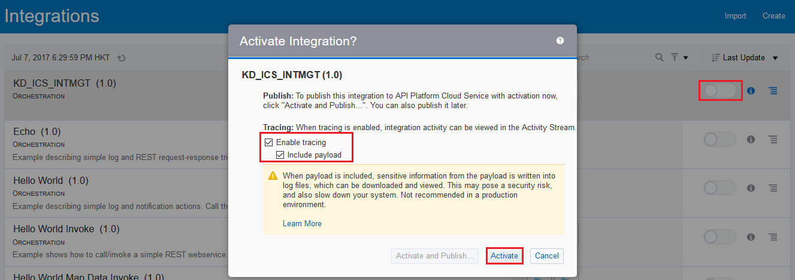

# 오라클 클라우드 테스트 드라이브 #
-----
## 303 : 통합 만들기 - 오케스트레이션 통합 흐름 ##


### 소개 ###
이 튜토리얼에서는 다음 작업을 수행하는 방법을 보여줍니다. 
- 통합 클라우드 서비스 (ICS) 

### 오늘 Practice에 대하여 ###
이 연습에서는 다음을 수행합니다. 
- REST 및 SOAP 끝점을 사용하여 ICS 통합 흐름을 탐색 및 구성하고 통합 흐름에 따라 데이터 매핑을 정의합니다. 
- 웹 기반 클릭을 사용하여 ICS 대시 보드의 데이터 매핑 및 통합 통합 리소스 세부 정보를 정의하는 기술을 구성, 끌어서 놓기 

### 선수 과목 ###

- 통합 클라우드 서비스를 포함한 Oracle Public Cloud Service 계정 
- 이미 구성된 ICS의 SOAP 및 REST 연결 (302- 통합 라이브러리 .md) 

#### '오케스트레이션' 통합 만들기 

1. 탐색 창을 사용하여 왼쪽 상단에있는 햄버거 메뉴 아이콘을 클릭하여 탐색 창을 표시 한 다음 `통합`을 클릭하십시오. 


2. **Integrations**홈페이지가 나타나면 왼쪽 상단의 Create 버튼을 클릭하십시오. 


3. 통합 작성 - 스타일 선택 \ / 패턴**대화 상자 창이 표시됩니다. 오케스트레이션,지도 데이터, ICS에 게시 및 ICS에 가입*과 같은 다양한 통합 유형을 사용할 수 있습니다. 그러나이 실습에서 우리는*Orchestration*통합을 만들 것입니다.*Orchestration*상자에서 `선택`버튼을 클릭하십시오. 


4. 새 대화 상자 창**새 통합 작성**이 표시되면 다음 정보를 입력하여 통합*을 작성하십시오.***이 통합을 트리거하는 것은 무엇입니까?**기본 선택 유지*응용 프로그램 이벤트 또는 비즈니스 오브젝트*.***당신의 통합을 무엇이라고 부릅니까?**독특하고 쉽게 식별 된*통합*이름을 제공하십시오. <Your Short Name>\_<System_Name>\_<Service_Name> . 이 예에서는**KD_ICS_INTMGT**이며,*KD*는 Kelvin Durant*의 약식 이름입니다. 
	* **Identifier** The **Identifier** will be automatically filled-in while you type the **Name** above, however you can provide another unique identifier, suggest include your short name as prefix.
	* **Version** Select Keep the default value. (Change only if you are going to create a new *versioned* integration)
	* **What does this integration do? (Optional)** You can leave it empty or enter any meaningful text to describe this *Integration*.
	* **Which package does this integration belong to? (Optional)** You can leave it empty or enter any meaningful package name to collectively group with other integrations.
	

	
5. '생성'버튼을 클릭하면 통합 오케스트레이션 편집기가 나타납니다. 


6. 먼저,**Trigger**를 설정하여이 통합 플로우가 클라이언트 고객에게 노출되는 방법을 정의 할 것입니다. 이제 오른쪽 사이드 바에서 `트리거`를 클릭하면 오른쪽의 팔레트 제목이**트리거**로 변경됩니다. `REST`를 선택하면 사용 가능한*REST 트리거 연결*목록이 표시됩니다. 새롭게 생성 된*트리거 연결*(예 : `KD_ICSINTMGT_ProcessOffer`)을*START*아래의 큰*원 안의 흐름 다이어그램의 &quot;+&quot;아이콘으로 끌어 놓습니다. 


7. **Oracle REST Endpoint 구성**대화 상자 창이 표시됩니다. 다음 정보를 제공하십시오.**종점을 어떻게 호출 하시겠습니까?**ProcessOffer를 입력하십시오. 
	* **What is the endpoint's relative resource URI?** Enter `/processoffer`
	* **What action does the endpoint perform?** Select `POST`
	* Check to select **Configure a request payload for this endpoint**
	* Check to select **Configure this endpoint to receive the response**
	* Leave others empty or unselect.
	
	Click `Next` button.


8. **요청 페이로드 구성**페이지가 표시되면 다음을 확인하십시오.***요청 페이로드 파일 선택**JSON 샘플 
	* **Select the type of payload with which you want the endpoint to receive** `JSON`
	
	Click `<<< inline >>>` link next to **--OR-- enter sample JSON**
	



9. **Request Sample Json Payload**페이지가 표시됩니다.**이 텍스트를**JSON 입력**아래의 텍스트 영역에`{ &quot;customerid&quot;: 21767684, &quot;offerid&quot;: 49531393, &quot;productid&quot;: 28916305, &quot;accepted&quot;: true}`복사하십시오. 하단의 `확인`버튼을 클릭하십시오. 


10. `다음`버튼을 클릭하여 다음으로 진행합니다.**응답 페이로드 구성**페이지에서 다음을 확인합니다.***응답 페이로드 파일 선택**`JSON Sample` 
	* **Select the type of payload with which you want the endpoint to reply** `JSON`
	
	Click `<<< inline >>>` link next to **--OR-- enter sample JSON**


11. **Response Sample Json Payload**페이지가 표시됩니다. 이 텍스트를`**&quot;activityid&quot;: &quot;10001-43513-v1.0&quot;, &quot;imgurl&quot;: &quot;tmptext&quot;}`**JSON 입력 샘플**아래의 텍스트 영역에 복사하십시오. 하단의 `확인`버튼을 클릭하십시오. 


12. 다음,**Oracle REST Endpoint Configuration Summary**페이지로 가려면 `다음`버튼을 클릭하십시오. 설정은 아래와 같으며, `완료`버튼을 클릭하십시오. 이 통합 플로우를 클라이언트 고객에게 공개하기 위해 REST**트리거**정의를 마무리합니다. 
	


13. 통합 오케스트레이션 편집기*로 돌아가서 다음을 수행 할 수 있습니다.*끌어서 놓기를 통해 통합 오케스트레이션 흐름의 각 노드를 다른 위치로 재배치합니다.*왼쪽 위 모서리에있는 `-`또는 `+`버튼을 클릭하여 화면 해상도에 맞게 흐름도의 크기를 조정하십시오. 
	* As best practice, regularly click `Save` button at the top left corner to store your work from time to time.
	



14. 다음으로 **Invoke** 종점 서비스 - CRM 고객 서비스에 서비스 콜 아웃을 정의합니다. 이제 오른쪽 사이드 바에서`Invokes`를 클릭하면 오른쪽 팔레트 제목이**Invokes**로 변경됩니다. `SOAP`을 선택하면 사용 가능한*SOAP Invoke Connection*목록이 표시됩니다. 새로 생성 된*Invoke Connection*(여기서는 `KD_CRM_CustomerService`)을 통합 흐름의 중간에**ProcessOffer**와**Map to ProcessOffer**활동 사이에 끌어다 놓습니다. 




15. **SOAP 엔드 포인트 구성 대화 상자가 표시됩니다. 다음 정보를 제공하십시오.***엔드 포인트를 어떻게 호출 하시겠습니까?**`CustomerServiceActivity`를 입력하십시오. 
	* **What does this endpoint do?** Optional
	* **Do you want to configure this as a callback invoke?** Select `No`


	
16. 다른 값을 바꾸지 말고, `다음`-> `다음`-> `다음`그리고 마지막으로 `완료`버튼을 클릭하십시오. 다음과 같은 통합 플로우가 있어야합니다. CRM 고객 서비스 SOAP 끝점을 호출하려면**Invoke**정의를 마무리하면됩니다. 
	
	Now, we are going to define how different data fields are being passed incoming from **Trigger** to outgoing **Invoke*.  
	Click the **Map to CustomerServiceActivty** node and then further click on the `pencil` icon to enter data mapper screen.


17. 데이터 맵퍼 창에서 왼쪽의**소스**분할 창에있는`customerid` 라디오 버튼을 드래그 한 후 오른쪽**Target**분할 창에있는`customerId` 라디오 버튼으로 드롭하십시오. 


18. 소스 및 대상 고객 ID를 연결하는 `그린`라인이 생성됩니다. 


다음으로, 우리는*addCustomerActivity*target의`activityName` 필드에 텍스트 데이터를 보내고 싶습니다 :`Offer ID : &lt; `offerid`Source from source> of acceptance &lt; `accepted`from Source>` . 설정하려면**Target***addCustomerActivity*창에서`activityName` 필드를 직접 클릭하십시오.**Build Mappings**대화 상자 창이 표시됩니다. 


왼쪽 된 창에서`Mapping Components`를 확장 한 다음`Functions` ->`String`을 확장하십시오. 왼쪽 창의 `f (x) concat`을`- 드래그 앤 드롭 또는 여기에 값 입력 ...`의 위치로 드래그하십시오. <activityName> 오른쪽 창에. 




21. `string1`을 클릭하고, `Offer ID :``를 입력 한 다음,**Enter**를 입력하십시오. (\*주의 :** ` ```**를 쓰십시오. 즉, 작은 따옴표로`Offer ID` 문자열을 묶으십시오) 왼쪽 창에서`Source`를 확장하고`offerid` 필드를 드래그하여`string2 `. 문자열이 자동으로 삽입됩니다. \ ( `offerid`\의 XSLT 변수 표현입니다.) 


22. 연결 문자열 목록의 마지막 항목을 선택하고 마우스 오른쪽 버튼을 클릭하고 `다음에 형제 추가`를 선택하십시오. 


23. 새로 추가 된 항목`- 드래그 앤 드롭 또는 따옴표로 묶인 값 입력 ... `을 클릭하고`수용 `,`**입력**`을 입력하십시오. 마지막 단계 22를 반복하여 `Insert Sibling After`에 의해 항목을 하나 더 추가하십시오. 
	Expand `Source` from the left pane, drag the `accepted` field and drop it on the last entry `-- Drag and Drop or Type value surrounded with quotes here...`. A string is automatically inserted. \(This is the XSLT variable representation of 'accepted'\)  
	Click `Save` on the top right corner to save your work, then click `Close` at the bottom to exit the **Build Mappings** window.


24. `activityName`필드는**매핑**`f (x), offerid, acceptance, accepted`로 정의됩니다. 다음으로, `activityDetail` 링크를 클릭하여이 필드를 설정하십시오. 


25. `(간단한 도전)**`activityName `필드를 설정하기 위해했던 것과 같은 단계를 따르고,`activityDetail` 필드를 다음 형식으로 설정하십시오 :``제품 ID 제공 : `+ <productid> `저장 `을 클릭하여 작업을 저장하고, 하단의`닫기 `를 클릭하여**Build Mappings**대화 상자 창을 종료하십시오. 


26. `activityDetail` 필드는**매핑**`f (x), productid`로 정의됩니다. 마지막으로,`activityDate` 필드를 클릭하여이 필드를 설정하십시오. 


27. **Build Mappings**대화 상자 창이 나타납니다. 왼쪽 된 창에서`Mapping Components`를 확장 한 다음`Date`를 확장하십시오. 왼쪽 창에서`f (x) current-date`를`- 드래그 앤 드롭 또는 타입 값 here ... `의 위치로 드래그하십시오. <activityDate> 오른쪽 창에. 
	Click `Save` to save your work and then click `Close` to exit the **Build Mappings** dialog window.


28. *CustomerService 활동*에 대한*데이터 맵핑*이 완료되었습니다. `확인`을 클릭하면 녹색 배너 `매핑이 유효하고 사용 준비가되었습니다.`가 상단에 나타납니다. 
	(Optional) You can test the data mapping by click `Test` button on the right. Try it!  
	Click `Close` to return integration flow editor and click `Save` again to save your work.


29. 마지막으로이 통합 흐름을 통해 고객에게 데이터를 응답하는 방법을 정의 할 것입니다. 이 논리는 고객의 제안에 대한 수락 - **허용**필드를 기반으로합니다. 
	- If **true**, means customer accepted the offer, then return the CRM logged *activityId* and the QR code image URL, which is generated based on *offerId*.
	- If **false**, means customer denied the offer, then return the CRM logged *activityId* (still required as a 'denied' customer action) and an empty QR code image URL, i.e. no QR code image will be displayed.  
	
이렇게하려면 오른쪽 창에서`Actions`를 클릭 한 다음 `Switch`를 드래그하여**CustomerServiceActivity**노드와**ProcessOffer**노드 사이의 통합 플로우로 드롭하십시오. 
	

	
30. 다음과 비슷한 흐름도가 있어야합니다. 필요한 경우 노드 및 라인 위치를 조정하거나 축소하거나 확대하십시오. 


31. 새로 추가 된 스위치 노드 - `정의되지 않음`을 클릭하고 `편집`을 클릭하십시오. 


32. 표현 편집기**가 표시됩니다. 조건을 설정하려면 다음 단계를 수행하십시오. 1.**표현식 이름**에`Accept Offer`를 입력하십시오. 
	2. Expand **Components** -> `Functions` -> `String`, drag the `fx lower-case` from left pane, and drop it onto the *New Condition* text area at right pane.  
	3. Expand **Source**, drag the `accepted` field from left pane, and drop it to replace the 'string' in newly added function `fn:lower-case(string)` at right pane.  
	It should become or similar to `fn:lower-case(/nssrcmpr:execute/nsmpr2:request-wrapper/nsmpr2:accepted)`  
	*(Namespace may be different)  
	4. Enter `"true"` in the text area under `=` drop down box.  
	5. Click `Expression Mode` button on the top left corner.


33. **Expression**및**Expression Summary**의 내용을 확인하고 왼쪽 상단의 `Validate`를 클릭하십시오. 녹색 배너 `표현이 유효하고 사용할 준비가되었습니다`라는 메시지가 표시됩니다. 통합 흐름 편집기를 되 돌리려면`닫기 `를 클릭하십시오. 


34. *if*또는*otherwise*조건에서 다른 응답 데이터가 리턴됩니다. 여기서 우리는 디폴트`Map to ProcessOffer` 응답 데이터 매핑을 삭제합니다. `Map to ProcessOffer`를 클릭하고 햄버거 아이콘을 클릭 한 다음`Delete`를 클릭하여이 노드를 제거하고 팝업 대화 상자에서 삭제를 확인하십시오. 


35. 오른쪽 창에서`Actions`를 클릭하고`Map`을 드래그하여**IF Accept Offer**노드와`+`와 함께 나타나는 두 개의 스위치 라인의 연결 지점 사이의 통합 흐름으로 드롭하십시오. 상. 


36. **데이터 맵핑**대화 상자 창이 표시됩니다. 왼쪽 창에서**Source**를 확장하고`$ CustomerServiceActivity` ->`addCustomerActivityResponse` 아래에`return` 필드를 드래그하고 오른쪽 창에있는`activityid`에 놓습니다. 
	Click `imgurl` to proceed advance data mapping.


37. **Build Mappings**창 대화 상자가 나타납니다. 왼쪽 된 창에서**Source**아래의**Mapping Components**를 확장 한 다음,`Functions` ->`String`을 확장하십시오. 
	Drag the function `fx concat` and drop it onto `- Drag and Drop or Type value here...` under **Mapping** in right pane.  
	Click `Save`.
	


38. `string1`을 클릭하고,` `sign, ie`https : // qrcodegenerator-`를 포함하는 쿠폰 ID없이 QR 코드 URL을 입력하십시오. <Your Application Container Cloud Identity Domain Hostname> / ctdqr / v1 / offer / ``(`Microservices `랩에서 얻은 호스트 이름) 다음으로 왼쪽 창에서`Source`를 확장하고`offerid` 필드를 드래그하여`string2`에 놓습니다. 문자열이 자동으로 삽입됩니다. \ ( `offerid`\의 XSLT 변수 표현입니다.) 
	Click `Save`, and then click `Close` button at the bottom to return previous screen.


39. *데이터 맵핑*은 아래와 같아야합니다. `확인`을 클릭 한 다음 `닫기`를 클릭하십시오. 


40. **(Simple Challenge)**`otherwise` 경로에서`ProcessOffer에 맵핑`을 완료하십시오. 유일한 차이점은 다음과 같습니다. 
	Enter **''** for `imgurl`, i.e. 2 X single quote, such that an empty string will be returned. (Instead of *'https://qrcodegenerator-<Your Application Container Cloud Identity Domain Hostname\>/ctdqr/v1/offer/'* at the `IF Accept Offer` path)  
	The result should be the same as below.  
**(\*힌트 : 35 ~ 39 단계를 반복하십시오. 강사가 필요한 경우 여기에서 간단한 데모를 제공합니다)**


**매핑**의 결과는 다음과 같아야합니다. 
	

	
41.*공정 제안*통합 흐름 개발이 완료되었습니다. 그러나 오른쪽 상단에 추적**에 대한 기본 비즈니스 식별자**가 필요하다는 오류가 표시됩니다. 


42. 오른쪽 상단에있는 오류 아이콘 및**마지막 수정 : 방금**을 옆에있는 햄버거 아이콘을 클릭하십시오. 


43. **추적 용 비즈니스 식별자**대화 상자 창이 표시됩니다. 비즈니스 식별자는 메시지에 대한 런타임 트랜잭션 추적, 특히 ICS를 통해 실행되는 수십만 개의 메시지가 필요한 경우 필요합니다. 이제**Source**왼쪽 창에서 첫 번째`customerid` 필드를 드래그하여 오른쪽 창에있는**Tracking Field**의 첫 번째 행에 놓습니다. 
	Repeat the same for `offerid` field and `productid` field respectively.  The result screen looks like below.  
	Click `Done` button at the bottom on completion of tracking setup, and then click `Close` to go back to ICS dashboard main screen.


44. **Integrations**Summary 페이지에서, 새로 생성 된`integration`의**Switch**버튼을 클릭하면,`Activate Integration? `대화 상자가 나타납니다. 프로덕션 트래픽 처리를 사용하도록 설정하는 것은 좋지 않지만 나중에 테스트 할 수 있도록 `추적 사용`및 `페이로드 포함`을 선택하십시오. 
	Click `Activate` button at the bottom.





45. 통합 활성화를 위해 2 분 정도 기다리십시오. 완료되면 통합을 알리는 녹색 배너가 성공적으로 활성화되었으며 그 결과는 다음과 같습니다. 


46. ​​이제 통합 서비스가 테스트 준비가되었습니다. 

[Procced to Next - 304: Testing the service and Monitoring with ICS Dashboards](L304-IntegrationsLab.md) 

또는 

[Back to Integrations Lab Home](README.md)

