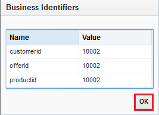
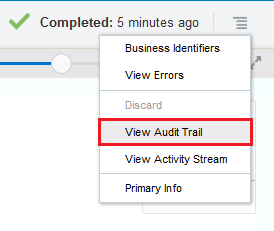
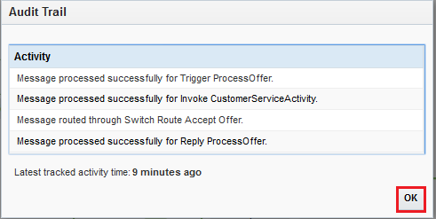

# 오라클 클라우드 테스트 드라이브 #
-----
## 304 : 서비스 테스트 및 ICS 대시 보드로 모니터링 ##

### 소개 ###
이 자습서에서는 다음 작업을 수행하는 방법을 보여줍니다. 
- ICS (통합 클라우드 서비스)에 의해 노출 된 서비스 소비 및 모니터링 

### 이 자습서 정보 ###
이 연습에서는 다음을 수행합니다. 
- REST 트리거 연결이 노출 된 상태에서 통합 흐름 테스트 
- 검사 결과는 ICS 모니터링 시설에 따라 다릅니다. 

### 선수 과목 ###

- 통합 클라우드 서비스를 포함한 Oracle Public Cloud Service 계정 
- 이미 구성된 ICS에서 SOAP 및 REST 연결 및 오케스트레이션 흐름 (303- 통합 라이브러리 .md) 

#### ICS에서의 작업 테스트 및 모니터링 

1. 이전에는 REST JSON 요청을 받아들이고 SOAP CRM 고객 서비스로 라우팅 한 다음 REST JSON 응답에 응답하는 통합 플로우를 성공적으로 배치했습니다. 이 서비스를 테스트하고 어떻게 진행되는지 모니터링 해보자. 
	To do so, [install Postman and use Google Chrome browser to access here](https://chrome.google.com/webstore/detail/postman/fhbjgbiflinjbdggehcddcbncdddomop), launch it after installation.

2. 우편 배달부에서 다음 정보를 제공하십시오. 
- HTTP 메소드 드롭 다운 목록에서**POST**를 선택하십시오. 
- **요청 URL 입력**텍스트 상자에 URL을 입력하십시오. &quot;https : // integration- <Your ICS Identity Domain> .integration.us2.oraclecloud.com / integration / flowapi / rest / <Your Integration Service Name> / v01 / processoffer` 
- **인증**탭 : 드롭 다운 목록에서 기본 인증을 선택하고 ICS 사용자 이름과 비밀번호를 각각 입력하십시오. 

3. **헤더**탭으로 이동하십시오.**Key**아래에`Content-Type`을 입력하고**Value**아래에는`application / json`을 입력하십시오. 

4. **Body**tab : body 형식으로 raw, JSON (application / json)을 내용 유형으로 선택하고 본문 텍스트를 다음 중 하나로 입력하십시오 : 
- 테스트 1 :`{ &quot;customerid&quot;: 30001, &quot;offerid&quot;: 10001, &quot;productid&quot;: 20001, &quot;accepted&quot;: true}` 
- 테스트 2 :`{ &quot;customerid&quot;: 30002, &quot;offerid&quot;: 10002, &quot;productid&quot;: 20002, &quot;accepted&quot;: false}` 

(\*주의 : 위의 테스트는 실제 데이터를 사용하지 않고 단지 ICS에서 API의 가용성을 테스트하는 것을 목표로합니다) 

5. &#39;보내기&#39;버튼을 클릭하여 요청을 실행하면 아래의 &#39;200 OK&#39;상태와 응답 본문 내용이 수신됩니다. 

6. ICS로 돌아가서 왼쪽 상단에있는 햄버거 메뉴 아이콘을 클릭 한 다음 &#39;모니터링&#39;을 클릭하십시오. 

7. 기본적으로 ICS 모니터링**대시 보드**가 표시됩니다. 대시 보드는 통합 모니터링에 중요한 ICS 트래픽 상태 / 추세,*연결*,*통합*,*성공*,*실패*및 기타 정보를 요약합니다. 
	(Optional) Notice on the right of dashboard, you can access to `Activity Stream`, `Download Diagnotics Logs` and `Download Incident`. Feel free to further explore.

8. `MONITORING` 아래에서`Integrations`를 클릭하면, 이전에 실행 된 최근 테스트 메시지를 볼 수 있습니다. 이제 오른쪽에있는`View Messages` 아이콘을 클릭하십시오. 

9. 특정 통합을위한**트랙 인스턴스**흐름 창이 표시됩니다. 테스트 된 인스턴스 중 하나를 클릭하십시오 : 

10. 특정 메시지 트랜잭션의 플로우 인스턴스가 표시됩니다. 플로우 인스턴스 전체의 녹색 경로는 통과하는 메시지의 정상 / 성공 흐름을 표시합니다. 
	Now click on the hamburger menu icon on top right corner, and then click `Business Identifiers`.

11. &#39;비즈니스 식별자&#39;대화 상자가 표시됩니다. 이 특정 메시지의`customerid`,`offerid` 및`productid`의 값이 로그됨을 주목하십시오. 
	Click `OK`.

12. 오른쪽 상단에있는 햄버거 메뉴 아이콘을 클릭하고 &#39;감사 추적보기&#39;를 클릭하십시오. 통합 플로우 대화 상자 창에 의해 실행 된 전체 활동의**감사 추적**이 표시됩니다. &#39;확인&#39;버튼을 클릭하고 &#39;닫기&#39;를 클릭하십시오. 

이 Lab을 끝냈습니다. 

[Back to Integrations Lab Home](README.md) 

