# ORACLE Cloud Test Drive #
-----
## Define Continuous Integration 'Build' and 'Deploy' Configuration in Oracle Developer Cloud Service ##

### About this tutorial ###
**Oracle Developer Cloud Service** is a cloud-based software development Platform as a Service (PaaS) and a hosted environment for your application development infrastructure. It provides an open-source standards-based solution to manage the application development life cycle effectively through integration with Hudson, Git, Maven, issues, and wikis. Using Oracle Developer Cloud Service, you can commit your application source code to the Git repository on the Oracle Cloud, track assigned issues and defects online, share information using wiki pages, peer review the source code, and monitor project builds. After successful testing, you can deploy the project to Oracle Java Cloud Service - SaaS Extension, publicly available Oracle Java Cloud Service instances, Oracle Application Container Cloud Service instances, or to an on-premise production environment.

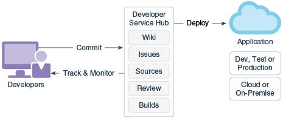

The key features of Oracle Developer Cloud Service include:

Project creation, configuration, and user management

+ Version control and source code management with Git
+ Storage of application dependencies and libraries with Maven
+ Continuous build integration with Hudson
+ Wiki for document collaboration
+ Issue tracking system to track tasks, defects, and features
+ Repository branch merge after code review
+ Deployment to Oracle Java Cloud Service - SaaS Extension, Oracle Java Cloud Service, and Oracle Application Container Cloud Service

Oracle Developer Cloud Service is available as a web interface accessible from a web browser and from Integrated Development Environments (IDEs) such as Oracle Enterprise Pack for Eclipse (OEPE), Oracle JDeveloper, and NetBeans IDE.

This tutorial shows how to deploy Loyalty Management application to Java Cloud Services using Oracle Developer Cloud Services.

The Loyalty Management application is a JEE web application serving simple JSP pages.

This tutorial demonstrates how to:

- Configure Build Job for the Loyalty Management - A JEE application
- Configure Java Cloud Service - WebLogic Server deployment in Developer Cloud Service
- Build and Deploy Loyalty Management Application using Developer Cloud Service

### Prerequisites ###

- Oracle Public Cloud Service account including Developer Cloud Service and Java Cloud Service

----

#### Open Oracle Developer Cloud Service Project ####

1. [Sign in](sign.in.to.oracle.cloud.md) to [https://cloud.oracle.com/sign-in](https://cloud.oracle.com/sign-in). First select your datacenter then provide the identity domain and credentials. After a successful login you will see your Dashboard. Find the Developer services tile and click the hamburger icon. In the dropdown menu click **Open Service Console**.

2. Select your Oracle Developer Cloud Service Project which was created using inital Git repository and contains Loyalty Management application's sources.

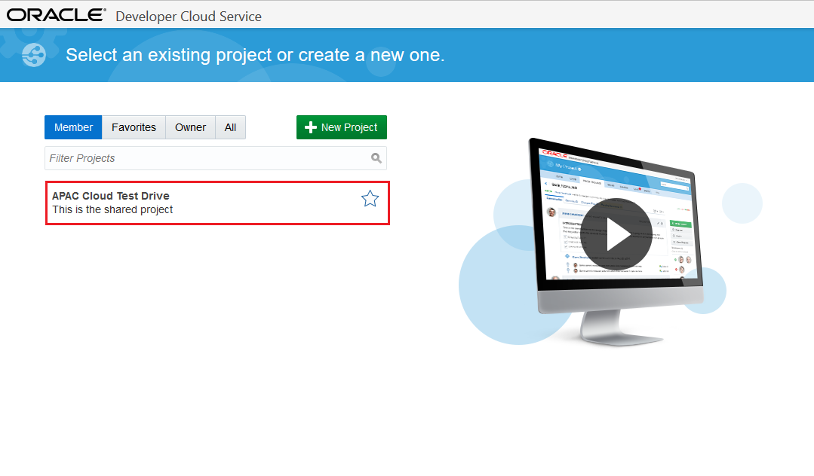

### Configure build job for Loyalty Management application ###

3. Once the project provisioning is ready let's create the build job to compile and package the Loyalty Management - JEE application to the desired format for Java Cloud Services.

4. Select **Build** item on the left side menu and click the **New Job** button.

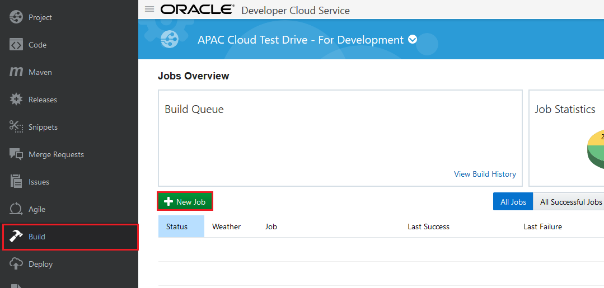

5. Enter name *LoyaltyManagementBuild* for the new job. Select the *Create a free-style job* option and save.
On the Main configuration page of the newly created job make sure **Default (The default Java version in the executing environment)** is the selected JDK.

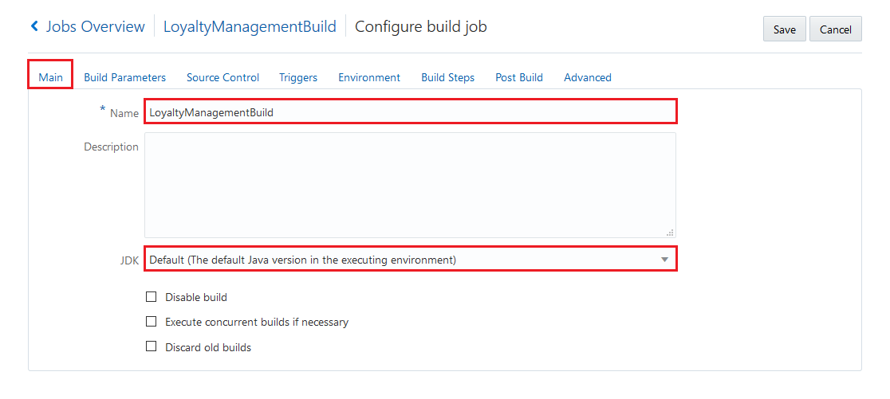

6. Change to the **Source Control** tab and select **Git**. 
In the git's properties section select the only one available Git repository which is provided in the list.
In the Branches section, add and select **master** option in the list. This is to make sure only **master** branch version will be used.
Leave the advanced settings default.

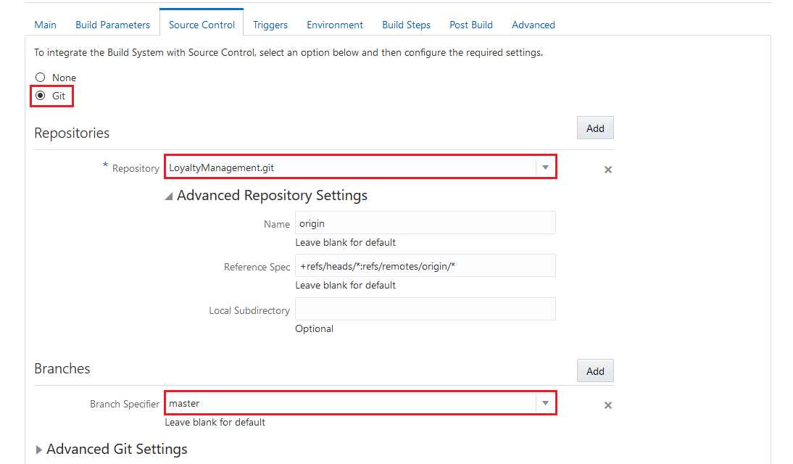

7. Click **Triggers** tab to configure *SCM polling*. Select **Based on SCM polling schedule**. This ensures if any files in the source code repository has changed then the build will be fired.

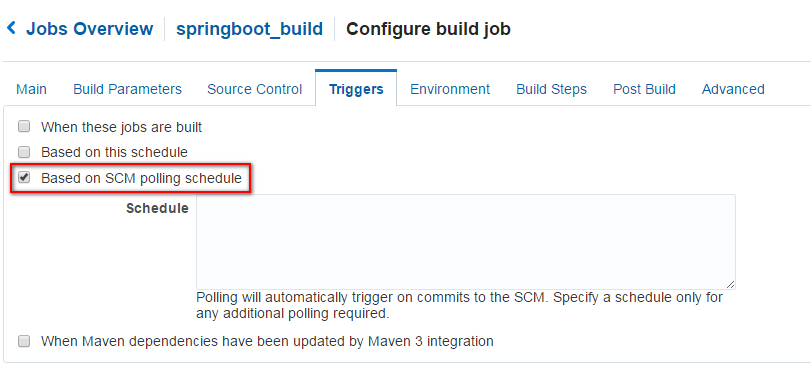

8. Change to **Build Steps** tab and add **Maven 3** build step. Enter **clean install** as Goals and **loyalty/pom.xml** to POM File field. (In case if Build Steps tab just shows **Loading...** for a long time, save the Build configuration then re-open and continue.)

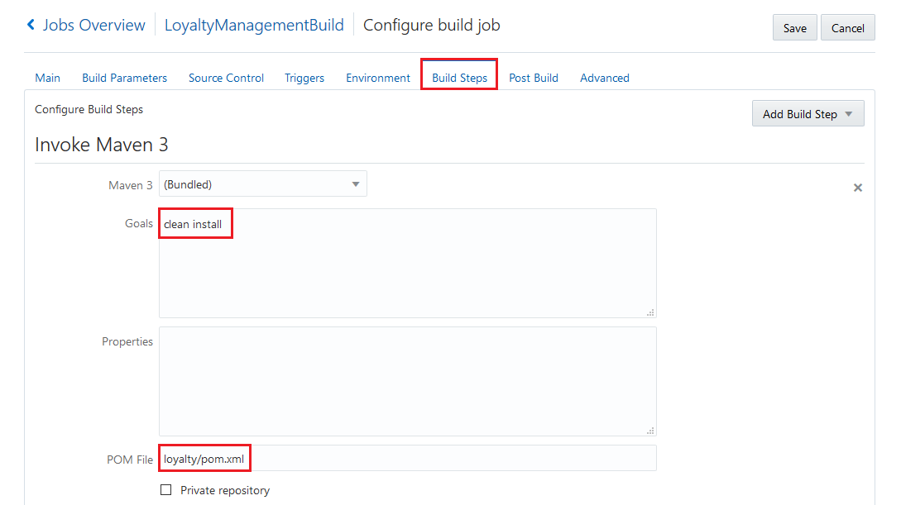

9. Finally change to Post Build tab and check in the **Archive the artifacts** option. Enter **loyalty/target/\*.war** into **Files To Archive** field.

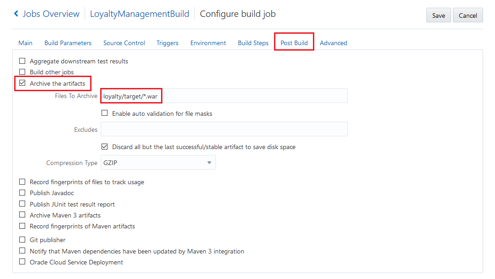

10. Click on **Save** to update the new job configurations. To check the build job click on **Build Now** on the job's detail page. Once the job is done check the archived artifacts. It should be the following: `loyalty.war`

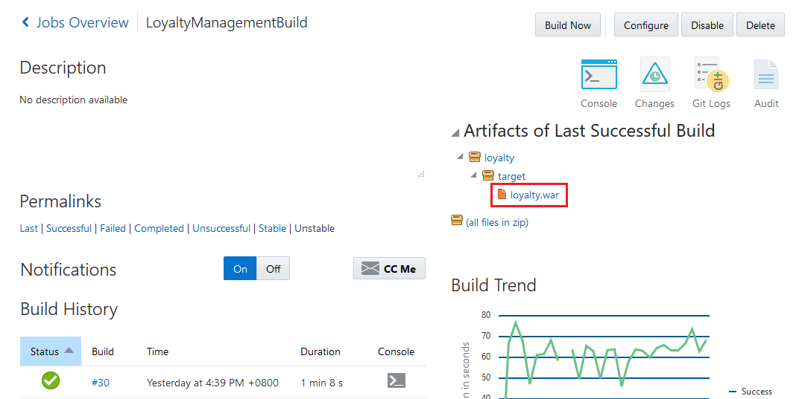

Please note the build job contains an extra build step which packs the master loyalty management webapp source artifact into a JEE Web Application Archive (WAR) file loyalty.war. This archive is the desired format to deploy a Java Web application to JCS.

### Configure Java Cloud service deployment ###

11. Now create deployment configuration which enable direct deployment to Java Cloud services after a successful build job.
Change to **Deploy** page in DevCS and create **New Configuration** 

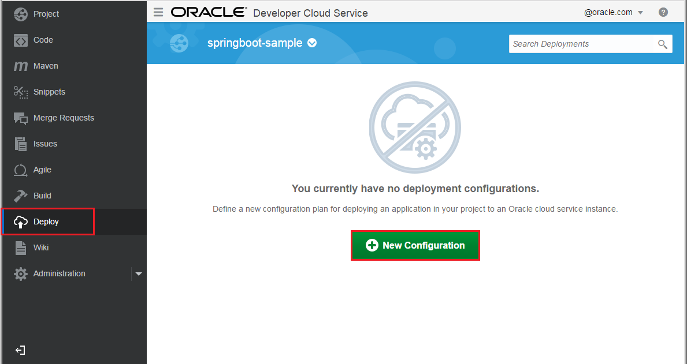

12. Set the following properties.

- **Configuration Name**: any name to identify deployment configuration - we use **loyalty**.
- **Application Name**: application name in JCS. This will determine the application's URL context path - we use **loyalty**.
- **Deployment Target**: click **New** and select Java Cloud Service and define connection properties such as **Version**, **Protocol**, **Host**, **HTTPS Port** and **credentials**.
  [\(Find out the Java Cloud Service Host and HTTPS Port.\)](java.cloud.md).
  Java Cloud Service - WebLogic Admin Username and Password should be provided by instructor separately.
- **Type**: select **Automatic** which means auto deploy after a successful execution of the build job. Select your previously created job and its artifact to deploy.
- **Job**: The **LoyaltyManagementBuild** Build Step defined in early stage of this lab.
- **Arifact**: **loyalty/target/loyalty.war**, this is the only option available after **Job** is selected.

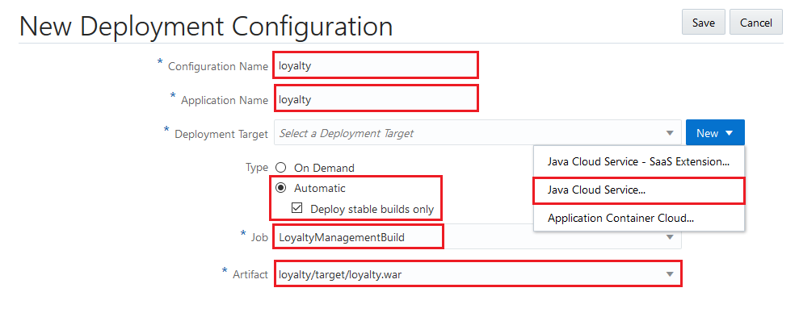

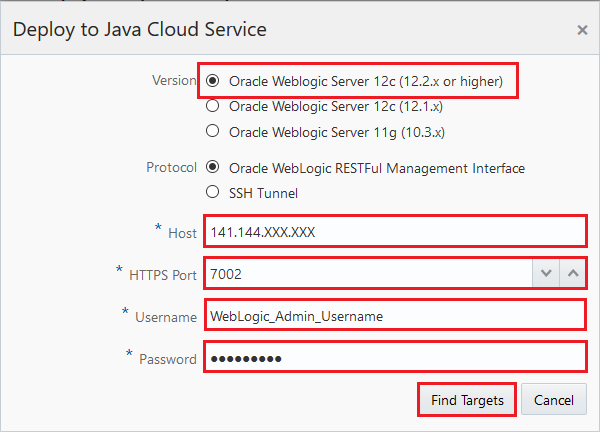

13. Click **Save**. 

### Build and deploy the Loyalty Management Application ###

14. To initiate a deployment to Java Cloud Service now there are two options. You can Start deployment process using the newly created Deployment configuration. Click gear icon and select **Start**.

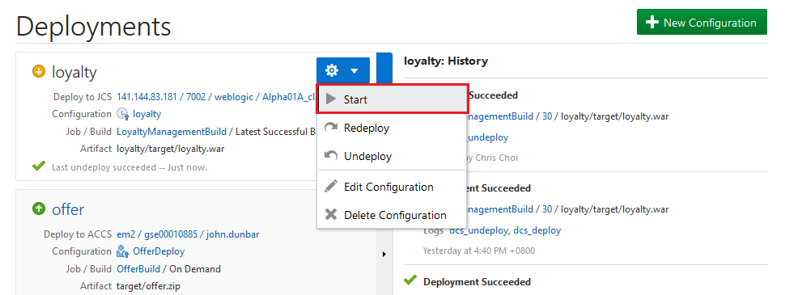

15. Other option is to fire a new Build Job execution which will deploy artifact after a successfull build. Go back to **Build** page and click the wrench icon belongs to Loyalty Management application build job.

 

16. Both way deploys JEE application on Java Cloud Service. You can check the deployment result on the **Deploy** page. Once the deploy is ready (this may take a while) click the **Deploy to JCS** link.

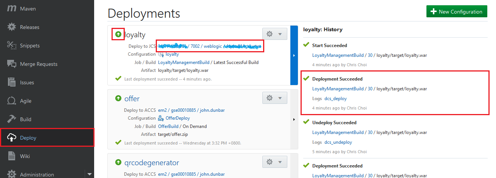

17. This opens the WebLogic Server Administration Console. Login with provided WebLogic Admin Username and password.

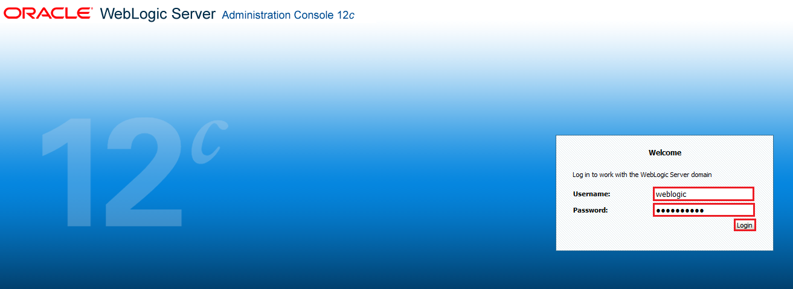"WebLogic Console")

18. Once logged on, click **Deployments** on left navigation menu. You should see your Loyalty Management application **loyalty** in the Summary of Deployments list.

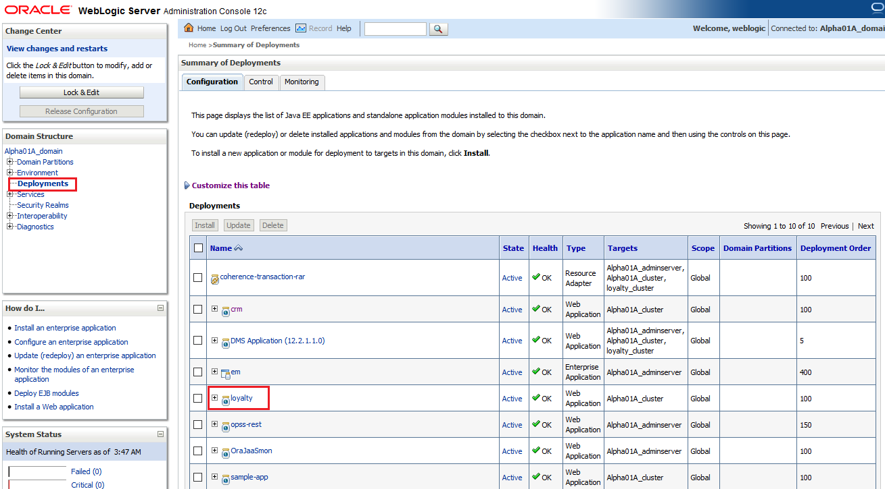

19. The Loyalty Management application URL should be in the format of:
https://**JCS WLS instance IP Address**/loyalty/jsp/welcome.jsp, the WLS instance IP address is the same as **Deploy to JCS** target in DevCS.

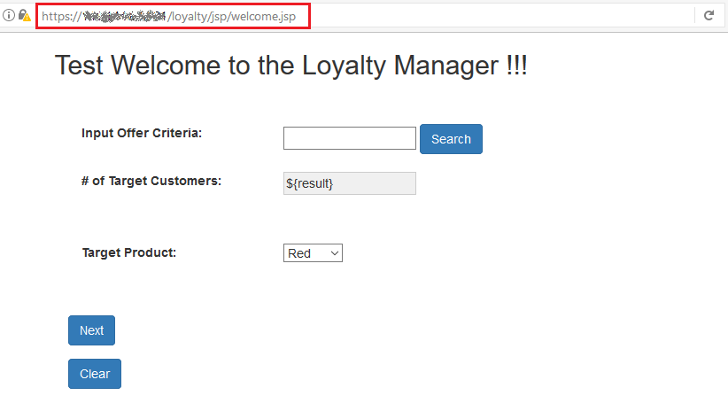

There are many other option to trigger this deploy process. For example build can be triggered by source changes or can be scheduled to specific time of the day.

You have finished this lab section.

[Procced to Next - Continuous Integration & Delivery (CICD): Using Eclipse IDE, Commit and Push Code Change to Oracle Developer Cloud Service](03.md)
or
[Back to Home](../JavaAppsLab.md)
