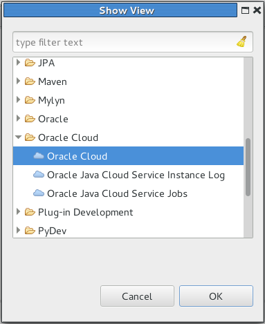
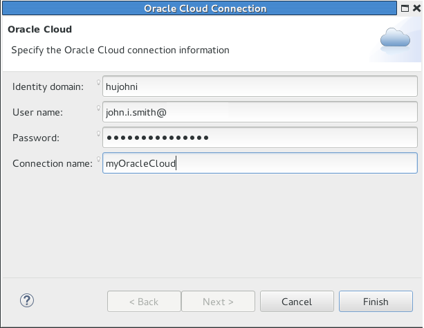
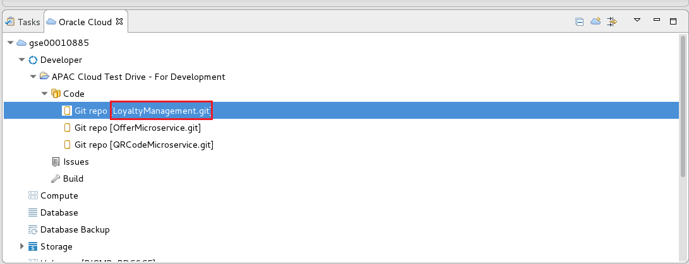
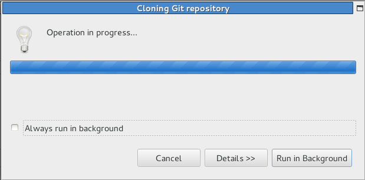
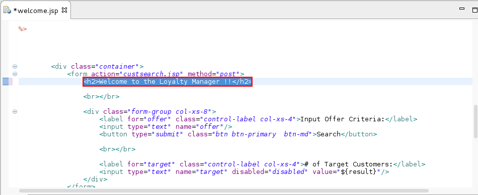
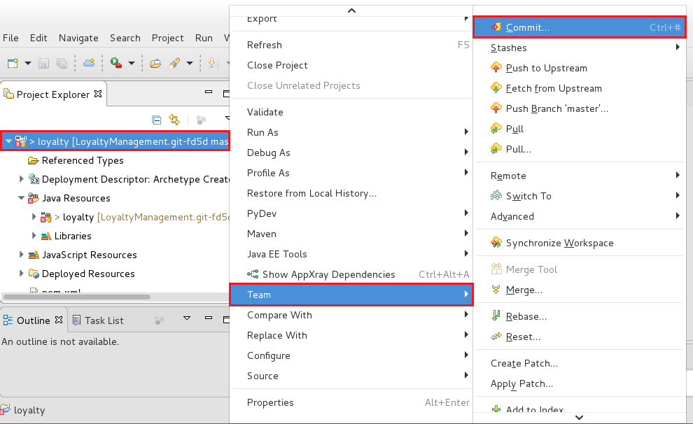
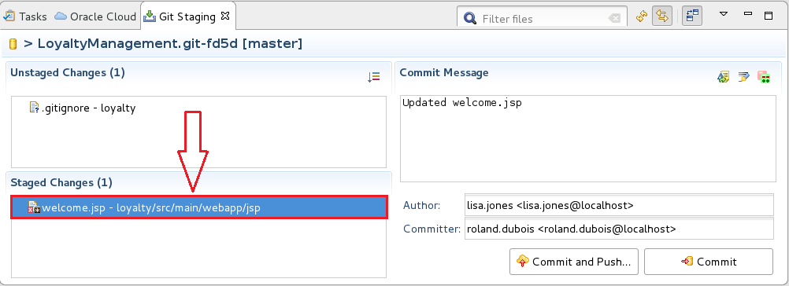

# ORACLE Cloud Test Drive #
-----
## Using Eclipse IDE (Oracle Enterprise Pack for Eclipse) with Oracle Developer Cloud Service ##

### Introduction ###
You can access Oracle Developer Cloud Service projects from Integrated Development Environments (IDEs) such as Oracle Enterprise Pack for Eclipse (OEPE), Oracle JDeveloper, and NetBeans IDE. The Eclipse IDE and the Oracle Enterprise Pack for Eclipse (OEPE) includes integration for Oracle Developer Cloud Service, which conveniently exposes the most common Cloud development tasks from within the IDE.

Oracle Developer Cloud Service integration with the Eclipse IDE includes the following:

+ A dedicated Oracle Cloud view that displays Oracle Developer Cloud Service projects of which you are a member
+ Integration with Oracle Developer Cloud Service and the Mylyn Issues system
+ Source control system integration with the Oracle Developer Cloud Service Git repository

Instructor should have provided you VirtualBox Installer and the Virtual Machine image which consists of Linux and Eclipse IDE pre-installed.
You can download the Eclipse IDE from [http://www.eclipse.org/](http://www.eclipse.org/) and OEPE from [http://www.oracle.com/technetwork/developer-tools/eclipse/downloads/index.html](http://www.oracle.com/technetwork/developer-tools/eclipse/downloads/index.html).

If you are using the Eclipse IDE, download and install the Oracle Cloud Tools plugin from the Eclipse IDE marketplace. In OEPE, the plugin is installed by default.

### About this tutorial ###
This tutorial demonstrates how to:
  
+ Setup Eclipse IDE (Oracle Enterprise Plugin for Eclipse)

### Prerequisites ###

+ [Create Oracle Developer Cloud Service project for Loyalty Management JEE application](01.md)
+ Installed VirtulBox, Copied VM image from instructor and started VM. [TBD]

### Steps ###

#### Verify and Configure Cloud Tools Plugin ####

1. Open OEPE (using desktop icon ) and set (leave the default, `home/oracle/workspace`) workspace location. Close the Welcome page. To open the *Oracle Cloud* view from the Window menu, click *Show View* and then *Other*.

2. From the list open *Oracle Cloud* and select *Oracle Cloud*.

3. If you are connecting to Oracle Developer Cloud Service for the first time, click the Connect link.

4. In the Oracle Cloud Service Connection dialog, enter the following:
+ **Identity Domain**: Enter the identity domain of Oracle Developer Cloud Service.
+ **Username** and **Password**: Enter the user name and password.
+ **Connection Name**: Enter a name for the service instance, if necessary. By default, the connection name is set to the identity domain name.

5. Provide a master password to store securely your credentials, so in the future you don't need to enter every time when you open OEPE. Don't forget to note the master password.

6. After your credentials have been validated, you are logged in to Oracle Developer Cloud Service and the Oracle Cloud view displays all projects that are assigned to you. Open the tree view myOracle Cloud(Cloud connection name) -> Developer -> LoyaltyManagement(DevCS project name) -> Code and there you can see the Git repository hosted on Oracle Developer Cloud Service.

7. To clone the Git repository to your machine double click or right click -> Activate on the Git repository and clone will start.

8. After the successful clone your local copy will be available in your workspace.

9. To import a Maven based project right click on the Project Exporer area and will pop up the menu where you can select Import projects -> Import...

10. Select Existing Maven Projects and click Next.

11. Browse the location of the cloned repository in `/home/oracle/workspace/` folder and select `acc/springboot-sample` subfolder. If the workspace location is the default it should look like similar to the following: `/home/oracle/workspace/springboot.git-9534/springboot-sample`
Please note, that you need to give one of the subfolder of the local repository.
Click Finish.

12. OEPE now starts to validate and build the project which can take few seconds. Finally you can see the imported project in the Project Explorer area.

#### Change code and test using continuous integration ####

The project hosted on Oracle Developer Cloud Service has build job which ensures that new application build and deployment to Application Container Cloud Service happens when any developer push code changes to Git repository.

Check the process modifying small piece on the application. First check the default page of the application. Open the tree view myOracleCloud -> Applications -> springboot-demo. Right click on springboot-demo and select Open In Browser menu item.

New browser is opened and you should see the application's home page.

Go back to OEPE and in the Project Explorer area find the *springbootdemo* project and open the **Deployed Resources -> webapp -> WEB-INF -> views -> welcome.jsp**

Modify the following part:

  	 SpringBoot application demo. Current server time: <%= new java.util.Date() %>  

To what you would like to see on the page. For example:

	 SpringBoot application demo. MODIFIED IN OEPE. Current server time: <%= new java.util.Date() %>    	

Save the changes. To commit and push changes to Git right click on project and select Team -> Commit...
 

Git Staging view is displayed. First make sure the `welcome.jsp` is in the *Staged Changes* area. Type a commit message e.g. 'Home page modified in OEPE'. Optionally enter your name or cloud username and give a (valid or fake) email address in the following format as the screenshot shows. Click **Commit and Push...**

In the Push dialog leave the default branch and click OK.

Now change back to the browser and check the Build page in the Oracle Developer Cloud Service project. You should see that a new build (in our case: *springboot_build*) has been fired by the Git changes.

Once the job is done change to the tab to Deploy and you can see that a new deployment has been started too. If you remember the Deployment was configured to redeploy every time when a new successful build artifact is ready.

Now check the changes of the home page of the application. Open the tree view myOracleCloud -> Applications -> springboot-demo. Right click on springboot-demo and select Open In Browser menu item.

New browser (tab) is opened and you should see the changes (red text) on the application's home page.

7. [Procced to Next - Commit and push completed source code from Eclipse IDE back to Oracle Developer Cloud Service](04.md)