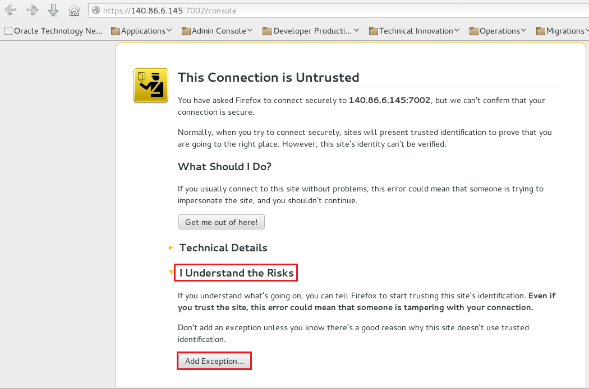
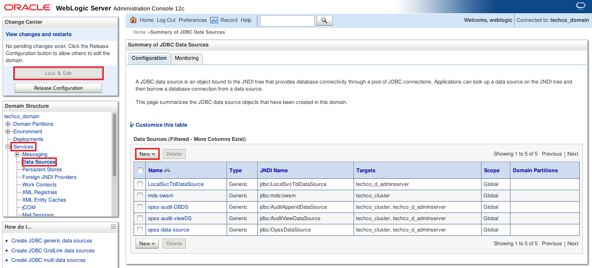
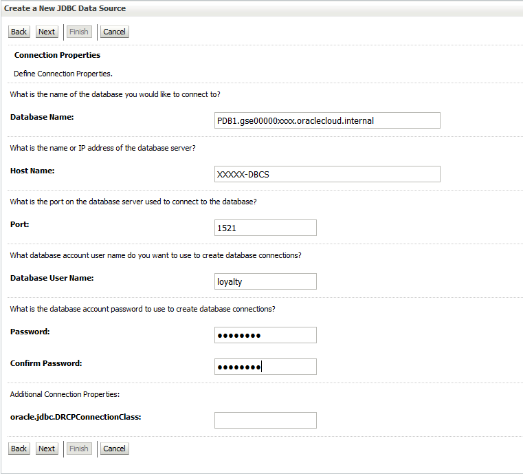
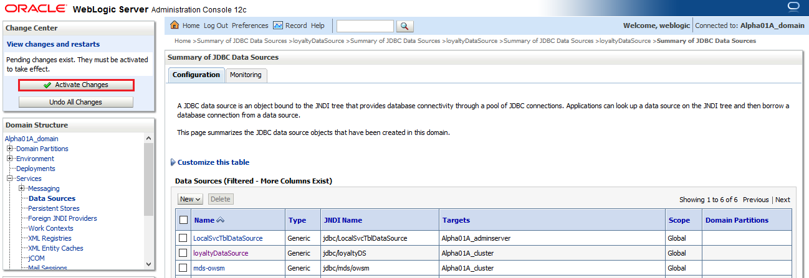

# ORACLE Cloud Test Drive #
-----
## 100: Create Database Connectivity for Loyalty Management Application [TBD] ##

### About this tutorial section ###
This tutorial demonstrates how to:
- Create Loyalty Management Database Connectivity on WebLogic Server in which associated tables will be used by a JEE Application later.

### Prerequisites ###
- Oracle Public Cloud Service account including Developer Cloud Service and Java Cloud Service (Check with instructor if you don't have one)
- [Loyalty Management Database connectivity for WebLogic Server instance in Java Cloud Serivce](100-JavaAppsLab.md)

----

#### Create Database Connectivity on WebLogic Server ####

1. [Sign in](sign.in.to.oracle.cloud.md) to [https://cloud.oracle.com/sign-in](https://cloud.oracle.com/sign-in) by provided **Java Cloud Service \(JCS\)** identity domain Id and credential. Using the dashboard open the Java Cloud Service Console.

2. Click on the hamburger icon located at the right top corner of the service summary. From the 
menu select Open WebLogic Server Console

3. A new browser opens and you are redirected to the selected console’s log-in page. If the server is protected with a self-signed certificate, you will be warned that this certificate is not trusted. This is the default configuration and you can configure your certification. Select I Understand the Risk, and Add Exception (accept certificate). 

4. When dialog appears select Confirm Security Exception.

5. When the console log-in page appears, enter the log-in credentials you entered for WebLogic Administrator, i.e:
   -**Username**: `weblogic`
   -**Password**: `Welcome_1`

6. After a successful login the WebLogic Server Administration Console is displayed. Click Lock & Edit and Service -> Data Sources. Create New **Generic Data Source**

7. Configure the data source with the following parameters:
+ **Name**: loyaltyDataSource
+ **Scope**: Global (default)
+ **JNDI Name**: jdbc/loyaltyDS
+ **Database type**: Oracle (default)

8. Click Next.

9. Leave the default Database Driver and click Next.

 

10. Leave the default Transactions Options and click Next.

11. Configure the database service connection descriptor.
+ **Database Name**: `PDB1.<Your Identity Domain>.oraclecloud.internal`
+ **Host Name**: the Database Cloud Service to run the application, i.e. `apacctddb.compute-<Your Identity Domain>.oraclecloud.internal` or `(Provided by instructor)`
+ **Port**: leave the default 1521
+ **Database User Name**: loyalty
+ **Password**: Database User 'loyalty' password, i.e. `Welcome_1` or `(Provided by intructor)`
+ **oracle.jdbc.DRCPConnectionClass**: leave empty

12. Click Next.

13. Test the data source by click **Test Configuration**

14. Select the servers or clusters to which you want to deploy the application. For this tutorial, choose to deploy the application to all the servers in the cluster, and then click Finish.

15. **Activate Changes** and check the acknowledgement: `All changes have been activated. No restarts are necessary`

You have finished this lab section.

[Procced to Next - 101: Create Oracle Developer Cloud Service Loyalty Management application project using initial GitHub repository](101-JavaAppsLab.md)

or

[Back to JavaAppsLab Home](README.md)
