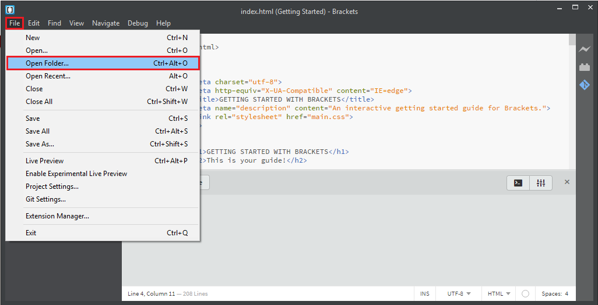
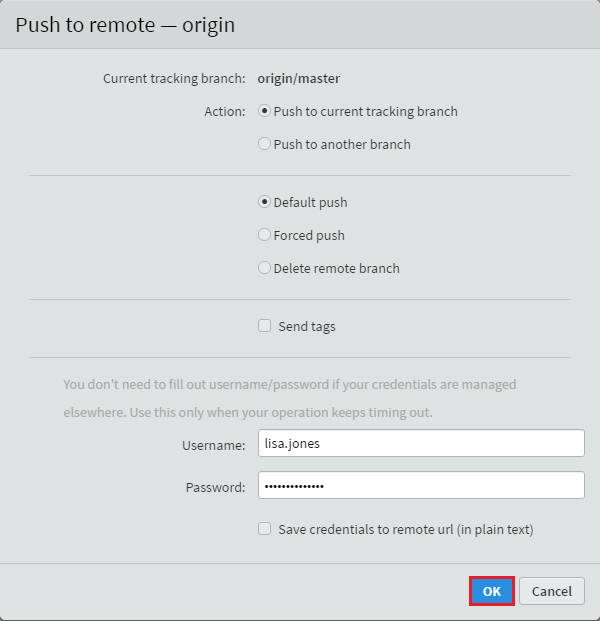
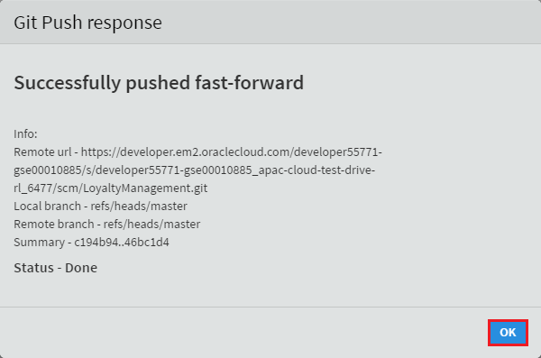
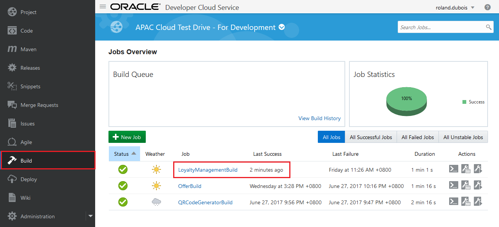
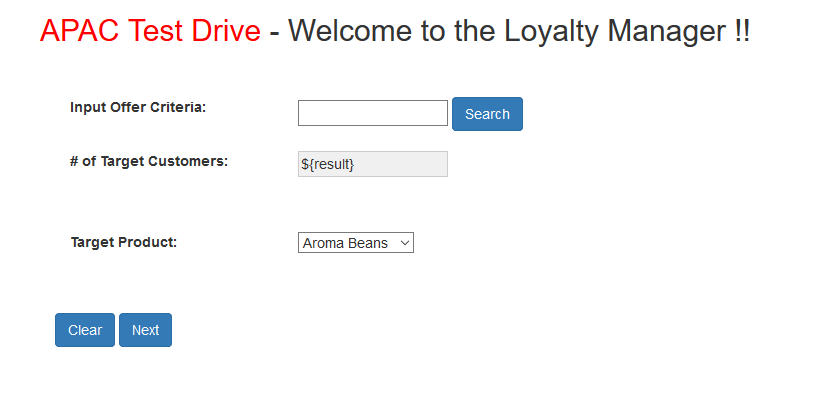

# 오라클 클라우드 테스트 드라이브 #
-----
## 103 : CICD (Continuous Integration &amp; Delivery) : Oracle Developer Cloud Service에 괄호 사용, 코드 변경 및 푸시 코드 변경 ##

### 소개 ###
Oracle Developer Cloud Service 프로젝트는 IDE (Integrated Development Environments) 또는 Eclipse 용 Oracle Enterprise Pack (OEPE), Oracle JDeveloper 및 NetBeans IDE와 같은 텍스트 편집기에서 액세스 할 수 있습니다. 브래킷은 Oracle Developer Cloud Service와 연결하여 교환 할 수 있습니다.이 서비스는 편집기에서 가장 일반적인 클라우드 개발 태스크를 편리하게 제공합니다. 

이 자습서에서는 다음 작업을 수행하는 방법을 보여줍니다. 
- Oracle Developer Cloud Service (대괄호 포함)를 사용하여 간단하게 지속적인 통합 및 전달 수행 

### 오늘 Practice에 대하여 ###
이 연습에서는 다음을 수행합니다. 
- Brackets에서 Oracle Developer Cloud Service를 연결하고 프로젝트 소스 코드를 체크 아웃 및 업데이트합니다. 
- 업데이트 된 소스 코드를 대괄호에서 개발자 클라우드 서비스로 다시 보냅니다. 
- 개발자 클라우드 서비스의 지속적인 통합 및 제공 결과 검토 

### 선수 과목 ###
+ [Create Oracle Developer Cloud Service project for Loyalty Management JEE application and deployed to Java Cloud Service WebLogic Server Container](102-JavaAppsLab.md)
+ [Installed Brackets and Git extension](brackets.md)

----

#### 개발자 클라우드 서비스에서 소스 코드 연결 및 가져 오기 

1. 대괄호 텍스트 편집기를 시작하고, &#39;파일&#39;풀다운 메뉴에서 &#39;폴더 열기&#39;를 선택하십시오. 

2. JEE 소스 코드를 저장할 대상 디렉토리를 선택하십시오 (예 :`D:\oracle`). 새 폴더를 작성한 후 새 폴더의 이름을 LoyaltyManagement로 지정하십시오. `LoyaltyManagement` 폴더를 선택한 상태에서 &#39;Select Folder` 버튼을 클릭하십시오. 

3. 개발자 클라우드 서비스 대시 보드로 돌아가서**LoyaltyManagement**Git 저장소에 있습니다. HTTP를 클릭하여 Git HTTP URL을 표시하고 오른쪽에있는 &#39;Copy&#39;버튼을 클릭하여 URL을 복사하십시오. 

4. 브라켓 편집기로 돌아가서 편집기의 오른쪽에있는 GIT 아이콘을 클릭하십시오. 

5. Git 패널에서 Clone을 클릭하십시오. 

6. 개발자 클라우드 서비스에서 복사 한 GIT URL을 붙여 넣습니다. 사용자 이름은 자동으로 채워 져야합니다. 비밀번호를 입력하고 &#39;원격 URL에 자격증 명 저장&#39;을 선택하십시오. 하단의 &#39;확인&#39;버튼을 클릭하십시오. 

7. 브래킷이 원격 프로젝트를 로컬 폴더에 복제 할 때까지 기다립니다. 

8. 이제 Git 저장소의 로컬 사본이 있습니다. 

#### 코드 변경 사항 적용 및 푸시 

9. 좌측 존속 트리를 확장하고`welcome.jsp` 파일을 엽니 다 (loyalty-> src-> main-> webapp-> jsp). 기본 창에서 welcome.jsp 소스 코드 73 행을 찾으십시오. 

14. 다음 부분을 수정하십시오. 

  	<h2>Welcome to the Loyalty Manager !!</h2>

당신이 페이지에서보고 싶은 것. 예 : 

	<h2>APAC Test Drive - Welcome to the Loyalty Manager !!</h2>

15. 파일을 저장하십시오. ( &#39;Ctrl-S&#39;누르거나 &#39;File`>`Save` 풀다운 메뉴에서 선택하십시오) 

16. Commit 옆에있는 상자를 선택하여 수정 된 모든 파일을 선택하십시오. 이는 아래의 체크 박스 (welcome.jsp)가 자동으로 선택되었음을 의미합니다. `Commit` 버튼을 클릭하십시오. 

17. 팝업창에 &#39;변경된 헤더&#39;를 입력하고 &#39;확인&#39;버튼을 클릭하십시오. 이것은 귀하의 LOCAL GIT REPOSITORY에 변경 사항을 적용합니다. 

18. &#39;Git Push&#39;아이콘을 클릭하십시오. 

19. 팝업 창에서 기본값을 모두 그대로두고 하단의 &#39;확인&#39;버튼을 누릅니다. 

20. Git Push가 완료되면 &#39;OK&#39;버튼을 클릭하십시오. 

#### CICD (Continuous Integration &amp; Delivery) 

18. 이제 브라우저로 돌아가서 Oracle Developer Cloud Service 프로젝트의 Build 페이지를 확인하십시오. 새로운 빌드 (우리의 경우 :*LoyaltyManagementBuild*)가 Git 변경을 감지하여 자동으로 실행되었음을 알 수 있습니다. 

19. 작업이 완료되면 배포 탭으로 변경하여 새 배포가 시작되었는지 확인할 수 있습니다. 새로운 성공적인 빌드 이슈가 준비 될 때마다 배포가 다시 배포되도록 구성되었습니다. 

20. 이제 로열티 관리 응용 프로그램의 홈 페이지 변경 사항을 확인하십시오. 응용 프로그램의 홈 페이지에서 변경 사항 (빨간색 텍스트)을 확인해야합니다. 로열티 관리 애플리케이션 URL은 다음 형식이어야합니다. 
	`https://**<JCS WLS instance IP Adress>**/loyalty/jsp/welcome.jsp`, the JCS WLS instance IP address is the same as **Deploy to JCS** target in DevCS.

이 Lab 섹션을 마쳤습니다. 

[Back to JavaAppsLab Home](README.md) 

