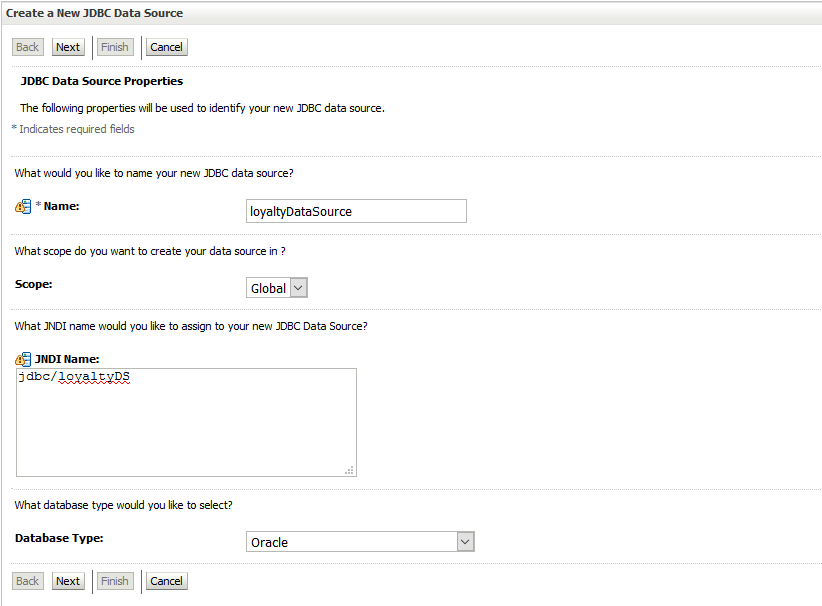
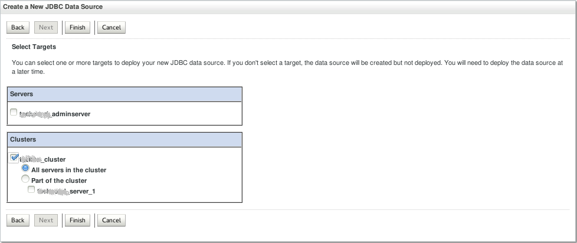

Update: July 3, 2017

# Introduction
This lab is part of the APAC Cloud Test Drive and is the 1st lab about creating, building and deploying a JEE Application within an Agile project lifecycle.
This section describes deploying and undeploying applications to an Oracle Java Cloud Service instance by using the WebLogic Server Administration Console. 

# Objectives

## This tutorial demonstrates how to: 
- *Create Database connectivity Loyalty Management Application [TBD]
- Clone Loyalty Management [Java Enterprise Edition](https://docs.oracle.com/javaee/7/) application project source code from Github to Developer Cloud Service (DevCS)
- Checkout make code changes in an Integration Development Environment (IDE) - Eclipse
- Commit and push completed source code from Eclipse IDE back to DevCS
- Create 'Build' and 'Deploy' configuration and monitor audit trace in DevCS

# Prerequisites
- The following lab requires an Oracle Public Cloud account that will either be applied by yourself thru [trial registration](https://cloud.oracle.com/en_US/tryit) or supplied by your instructor. You will need to install a [VirtualBox](https://www.virtualbox.org/) Virtual Machine image which consists of a pre-installed Eclipse IDE environment and GIT client in your local lab computer.

# Lab Exercise:

## Create Database connectivity for Loyalty Management Application [TBD]
[Sign in](sign.in.to.oracle.cloud.md) to [https://cloud.oracle.com/sign-in](https://cloud.oracle.com/sign-in). Using the dashboard open the Java Cloud Service Console.

Click on the hamburger icon located at the right top corner of the service summary. From the 
menu select Open WebLogic Server Console

A new browser opens and you are redirected to the selected console’s log-in page. If the server is protected with a self-signed certificate, you will be warned that this certificate is not trusted. This is the default configuration and you can configure your certification. Select I Understand the Risk, and Add Exception (accept certificate). 

When dialog appears select Confirm Security Exception.

When the console log-in page appears, enter the log-in credentials you entered for WebLogic Administrator when you created the service instance.

After a successful login the WebLogic Server Administration Console is displayed. Click Lock & Edit and Service -> Data Sources. Create New **Generic Data Source**

Configure the data source with the following parameters:

+ **Name**: jdbc-OE
+ **Scope**: Global (default)
+ **JNDI Name**: jdbc/OE
+ **Database type**: Oracle (default)

Click Next.

Leave the default Database Driver and click Next.

 

Leave the default Transactions Options and click Next.

Configure the database service connection descriptor.

+ **Database Name**: `PDB1.<identitydomain>.oraclecloud.internal`
+ **Host Name**: the Database Cloud Service [prepared](../dbcs-prepare/README.md) to run sample.  application. If you followed the instructions its name likely is `techcoDB`
+ **Port**: leave the default 1521
+ **Database User Name**: oe
+ **Password**: password you entered for DBA (Database Cloud Service adminsitrator - sys) account
+ **oracle.jdbc.DRCPConnectionClass**: leave empty

Click Next.

Test the data source by click **Test Configuration**

Select the servers or clusters to which you want to deploy the application. For this tutorial, choose to deploy the application to all the servers in the cluster, and then click Finish.

Activate Changes and check the acknowledgement: `All changes have been activated. No restarts are necessary`

## Clone loyalty JEE Application project source code from Github to Developer Cloud Service (DevCS)

- Login to Developer Cloud Service if you haven't done so.
- In the left hand navigation panel, click **Project**
- On the right side in the **REPOSITORIES** section, click on **New Repository** to create a new Git Repository.
- In the New Repository wizard enter the following information and click **Create**.

	**Name:** `OfferMicroservice`

	**Description:** `Microservice to provide REST API of Offer Details`

	**Initial content:** `Import existing repository`

	**Enter the URL:** `https://github.com/APACTestDrive/OfferMicroservice.git`

- You have now created a new Git repository stored within the Developer Cloud Service that is based on an existing repository

## Checkout make code changes in an Integration Development Environment (IDE) - Eclipse

Now that we have the source code in our Developer Cloud Service managed Git Repository, we need to create a build process that will be triggered whenever a commit is made to the master branch. We will setup a **shell script** build process in this section.

### Create Default Build Process

- Click **Build** on the navigation panel to access the build page and click **[+ New Job]**

- In the New Job popup window, enter `Offer REST API Build` for Job Name and click **Save**.

- You are now placed into the job configuration screen.

- Click the **Source Control** tab. Select **Git** radio button. In the Repositories section, select **OfferMicroservice.git** from the URL drop down.

	**Note:** Make sure you select the Git repository for the Offer REST API Microservice.

- Click **Triggers** tab. Check **Based on SCM polling schedule**.

- Click the **Build Steps** tab, click **Add Build Step** and select **Execute shell**.

- In the Command textarea, enter: `npm install`

- Click the **Post Build** tab. Check **Archive the artifacts**. For File to Archive, enter `**/target/*` and verify **GZIP** is chosen as the Compression Type.

- Click **Save** to complete the configuration. A build should start automatically within 1-2 minutes. If it dows not start automatically, click on the **[ Build Now ]** button. The status will change to something similar to the following diagram.

- The build will take serval minutes to complete. Wait for the build to complete before continue to the next step - ** as we need the build artifact to create the deployment configuration**.

### Create Default Deployment Process

- Click **Deploy** to access the Deployments page and click the **[+ New Configuration]** button.

- Enter the following data:

	**Configuration Name:** OfferAPIDeploy

	**Application Name:** offer

- Next to the right hand side of **Deployment Target**, click the **[New]** button and select **Application Container Cloud...**

- Enter the following information and click **Test Connection**. If successful, click **[Use Connection]** button  

	**Data Center:** `your datacenter, e.g. em2, em3, etc`

	**Identity Domain:** `your identity domain, e.g. gse00012345, etc`

	**Username:** `username to login to MyService, e.g. cloud.admin, etc`

	**Password:** `password of the cloud user`

- In the ACCS Properties, set

	**Runtime** to `Node`

 	**Subscription** to `Hourly`

- Set **Type** to `Automatic` and **CHECK** Deploy stable build only

- Select from the **Job**, this name should match the build job above, e.g. `Offer REST API Build`

- Select from the **Artifact**, this name should match the archive artifact above and the package.json of your source code, e.g. `target/offer.zip`  

- After fill in the above information, click **Save** button.

- In your deployment job, click the gear drop down and select **Start**

- The deployment job will be put into a queue for process. Wait until the message **Starting application** changes to **Last deployment successded**. Ask for help from your instructor if the deployment fails.

### Login to Oracle Application Container Cloud Service

- Navigate back to the Oracle Public Cloud tab. Click **Dashboard** to return back to main Cloud Service Dashboard.

- On the Application Container Cloud Service (ACCS) click the humburger button and select **Open Service Console**

- On the ACCS Service Console you can view all the deployed applications including our newly create **Offer**.

- Click on URL or copy and paste the URL into the address bar of a new tab to bring up the application.

  Be reminded that you will need the REST endpoint and the **offer id** in order to generate a QR code.

  The final URL should looks like this
		https://offer-{your-identity-domain}.apaas.em3.oraclecloud.comm/ptmgt/v1/offers/10001

## Commit and push completed source code from Eclipse IDE back to DevCS

- Login to Developer Cloud Service if you haven't done so.
- In the left hand navigation panel, click **Project**
- On the right side in the **REPOSITORIES** section, click on **New Repository** to create a new Git Repository.
- In the New Repository wizard enter the following information and click **Create**.

	**Name:** `QRCodeMicroservice`

	**Description:** `Microservice to generate Offer QR Code. The QR Code will contains an URL of the actual Offer.`

	**Initial content:** `Import existing repository`

	**Enter the URL:** `To be confirmed by Chol Ho`

- You have now created a new Git repository stored within the Developer Cloud Service that is based on an existing repository

## Create 'Build' and 'Deploy' configuration and monitor audit trace in DevCS

Now that we have the source code in our Developer Cloud Service managed Git Repository, we need to create a build process that will be triggered whenever a commit is made to the master branch. We will setup a **shell script** build process in this section.

### Create Default Build Process

- Click **Build** on the navigation panel to access the build page and click **[+ New Job]**

- In the New Job popup window, enter `QR Code Generator Build` for Job Name and click **Save**.

- You are now placed into the job configuration screen.

- Click the **Source Control** tab. Select **Git** radio button. In the Repositories section, select **QRCodeMicroservice.git** from the URL drop down.

	**Note:** Make sure you select the Git repository for the QR Code Microservice.

- Click **Triggers** tab. Check **Based on SCM polling schedule**.

- Click the **Build Steps** tab, click **Add Build Step** and select **Execute shell**.

- In the Command textarea, enter: `npm install`

- Click the **Post Build** tab. Check **Archive the artifacts**. For File to Archive, enter `**/target/*` and verify **GZIP** is chosen as the Compression Type.

- Click **Save** to complete the configuration. A build should start automatically within 1-2 minutes. If it dows not start automatically, click on the **[ Build Now ]** button. The status will change to something similar to the following diagram.

- The build will take serval minutes to complete. Wait for the build to complete before continue to the next step - ** as we need the build artifact to create the deployment configuration**.

### Create Default Deployment Process

- Click **Deploy** to access the Deployments page and click the **[+ New Configuration]** button.

- Enter the following data:

	**Configuration Name:** QRCodeGeneratorDeploy

	**Application Name:** qrcodegenerator

- **As you have created the deployment in the Offer REST API
Microservice, you can REUSE the same target**.

  In the **Deployment Target**, choose the **SAME** one you created above. It should be something similar to `Application Container Cloud` **em2 / your-identity-domain / your-user-name**

- A window **Deploy to Application Container Cloud** will popup, confirm the information and **ENTER the password**, then click **[Test Connection]** button.   

	**Data Center:** `your datacenter, e.g. em2, em3, etc`

	**Identity Domain:** `your identity domain, e.g. gse00012345, etc`

	**Username:** `username to login to MyService, e.g. cloud.admin, etc`

	**Password:** `password of the cloud user`

- In the ACCS Properties, set

	**Runtime** to `Node`

 	**Subscription** to `Hourly`

- Set **Type** to `Automatic` and **CHECK** Deploy stable build only

- Select from the **Job**, this name should match the build job above, e.g. `QR Code Generator Build`

- Select from the **Artifact**, this name should match the archive artifact above and the package.json of your source code, e.g. `target/qrcodegenerator.zip`  

- After fill in the above information, click **Save** button.

- In your deployment job, click the gear drop down and select **Start**

- The deployment job will be put into a queue for process. Wait until the message **Starting application** changes to **Last deployment successded**. Ask for help from your instructor if the deployment fails.

### Login to Oracle Application Container Cloud Service

- Navigate back to the Oracle Public Cloud tab. Click **Dashboard** to return back to main Cloud Service Dashboard.

- On the Application Container Cloud Service (ACCS) click the humburger button and select **Open Service Console**

- On the ACCS Service Console you can view all the deployed applications including our newly create **JETFrontEndApp**.

- Click on URL or copy and paste the URL into the address bar of a new tab to bring up the application.

  Be reminded that you will need the REST endpoint and the **offer id** in order to generate a QR code.

  Finally, you can access to the following deployed application URL to verify build and deployment:
		https://{Your-JCS-WLS-Address}/loyalty/jsp/welcome.jsp

### [Optional] Create a New Offer Campaign to Target Customer
