업데이트 : 2017 년 7 월 5 일 

## 0.1 소개


이 Lab은 APAC 클라우드 테스트 드라이브의 일부이며 마이크로 서비스를 만드는 방법에 관한 두 번째 Lab입니다. 

## 0.2 목표


- 외부 Git 저장소에서 코드 가져 오기 
- 개발자 클라우드 서비스 및 Oracle Application Container 클라우드 서비스를 사용하여 프로젝트 빌드 및 배포 

## 0.3 필수 아티팩트


- 다음 실습에서는 귀하가 직접 신청하거나 강사가 제공 한 Oracle Public Cloud 계정이 필요합니다. 
- **이전 연구실**에서 로컬 컴퓨터의 IDE 환경 및 GIT 클라이언트. 지침에서는 로컬 호스트 컴퓨터에서 Brackets 편집기를 사용한다고 가정합니다.**Brackets Editor 설치에 대한 자세한 내용은 이전 연구**에서 다루 었으며 [here](../Java%20Apps/brackets.md)을 찾을 수도 있습니다. 

## 0.4 특별주의 사항


- 복사하여 붙여 넣을 때주의하십시오. 추가**WHITE SPACE***이전*또는**복사 한 정보로 인해 오류가 발생할 수 있습니다. 

# 1. 제안 REST API 마이크로 서비스 만들기


## 1.1 초기 Git 저장소 생성 - REST API 제공


1. 아직 수행하지 않았다면 개발자 클라우드 서비스에 로그인하십시오. Cloud Dashboard에있는 경우 개발자 클라우드 서비스 햄버거 메뉴를 사용하여 DevCS로 이동할 수 있습니다. 


2. 개발자 클라우드 서비스 방문 페이지에는 이전 Lab에서 생성 한 프로젝트가 표시되어야합니다. 프로젝트 이름을 클릭하고 프로젝트 기본 페이지로 이동하십시오. 


3. 이미 개발자 클라우드 서비스에 가입되어있는 경우 왼쪽 탐색 패널의 `프로젝트`를 클릭하여 프로젝트 기본 페이지로 이동할 수 있습니다**


4. **REPOSITORIES**섹션의 오른쪽에서**New Repository**를 클릭하여 새로운 Git 저장소를 만듭니다. 

5. 새 저장소 마법사에서 다음 정보를 입력하고**작성**을 클릭합니다. 

	- **Name:** `OfferMicroservice`
	- **Description:** `Microservice to provide REST API of Offer Details`
	- **Initial content:** `Import existing repository`
	- **Enter the URL:** `https://github.com/APACTestDrive/OfferMicroservice.git`


```diff
-Please BE CAREFUL that you have not added extra white space before or after the information when copy-n-paste
```


6. 기존 저장소를 기반으로하는 개발자 클라우드 서비스 내에 저장된 새로운 Git 저장소를 만들었습니다 


## 1.2 기본 빌드 및 배포 프로세스 만들기 - REST API 제공


개발자 클라우드 서비스에서 관리하는 Git Repository에 소스 코드가 있으므로 마스터 분기를 커밋 할 때마다 트리거되는 빌드 프로세스를 만들어야합니다. 이 섹션에서는**쉘 스크립트**빌드 프로세스를 설정합니다. 

### 1.2.1 기본 빌드 프로세스 만들기 - REST API 제공


1. 탐색 패널에서**Build**를 클릭하여 빌드 페이지에 액세스하고**[+ 새 작업]**을 클릭하십시오. 


2. New Job (새 작업) 팝업 창에서 Job Name에 대해 Offer REST API Build를 입력하고**Save**를 클릭하십시오. 

```diff
-Please BE CAREFUL that you have not added extra white space before or after the information
```


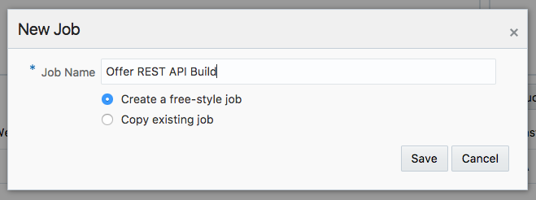


3. 이제 작업 구성 화면에 배치됩니다. 


4. **소스 제어**탭을 클릭하십시오.**Git**라디오 버튼을 선택하십시오. 리포지토리 섹션의 URL 드롭 다운에서**OfferMicroservice.git**를 선택하십시오. 


**참고 :** Offer REST API Microservice의 Git 저장소를 선택해야합니다. 

5. **트리거**탭을 클릭하십시오. 확인**SCM 폴링 일정에 따라**. 

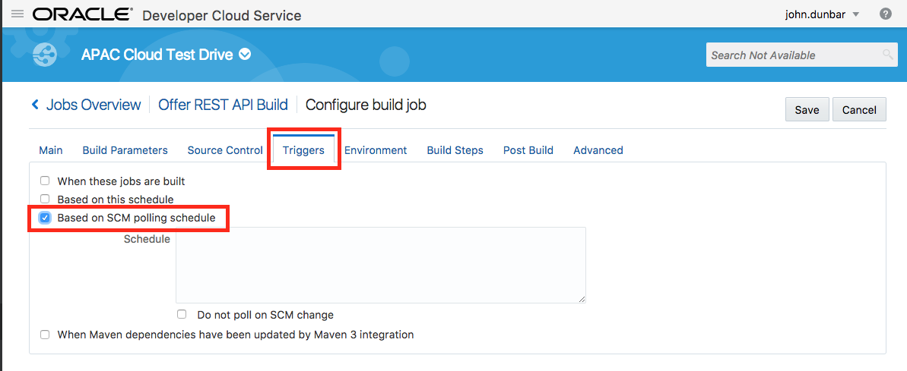


6. **빌드 단계**탭을 클릭하고**빌드 단계 추가**를 클릭 한 다음**셸 실행**을 선택합니다. 


7. Command textarea에 다음을 입력하십시오 :`npm install` 


8. **Post Build**탭을 클릭하십시오.**이슈 보관**을 ​​선택하십시오. 아카이브 할 파일에`**/ target /*`을 입력하고 압축 유형으로**GZIP**가 선택되어 있는지 확인하십시오. 


9. **저장**을 클릭하여 구성을 완료하십시오. 


10. 빌드는 1-2 분 내에 자동으로 시작됩니다. 자동으로 시작되지 않으면**[지금 빌드하십시오]**버튼을 클릭하십시오. 

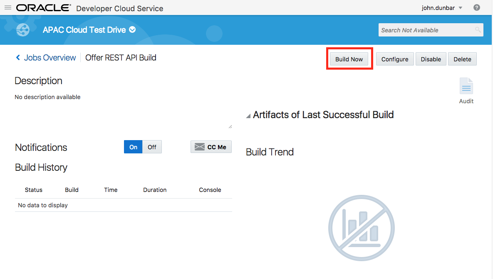


11. 상태는 다음 다이어그램과 유사하게 바뀝니다. 


빌드 작업을 시작하려면 몇 분 정도 기다려야합니다. 

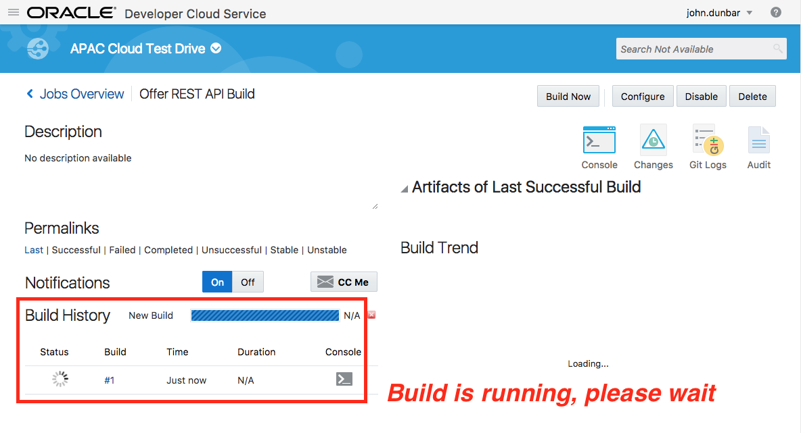


12. 빌드가 완료 될 때까지 serval 분이 소요됩니다. 다음 단계로 진행하기 전에 빌드가 완료 될 때까지 기다리십시오 - **배포 구성을 생성하기 위해 빌드 아티팩트가 필요하므로**. 

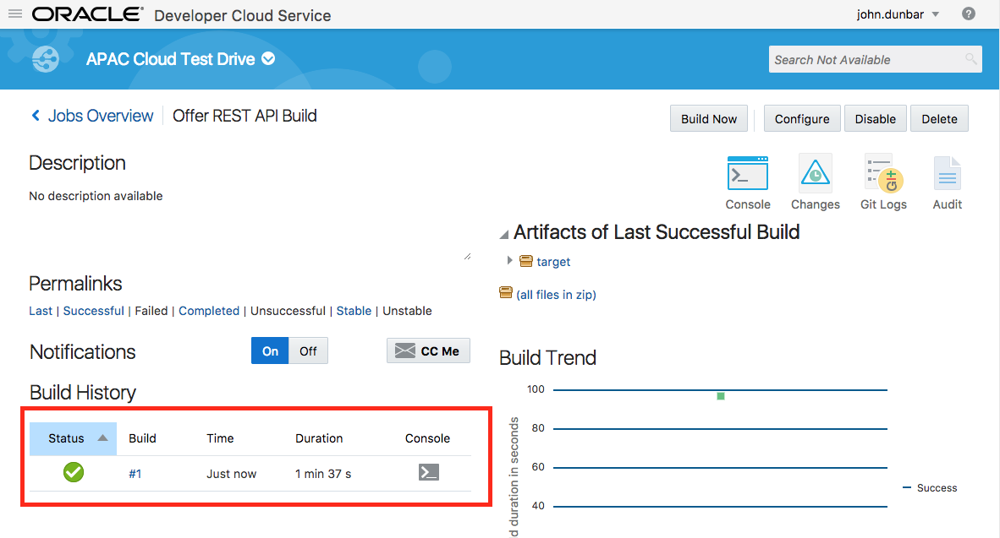


### 1.2.2 기본 배포 프로세스 만들기 - REST API 제공


1. **배포**를 클릭하여 배포 페이지에 액세스하고**[+ 새 구성]**버튼을 클릭하십시오. 


2. 다음 데이터를 입력하십시오. 

	- **Configuration Name:** OfferAPIDeploy
	- **Application Name:** offer


```diff
-Please BE CAREFUL that you have not added extra white space before or after the information when copy-n-paste
```


3. **Deployment Target**의 오른쪽 옆에있는**[New]**버튼을 클릭하고**Application Container Cloud ...를 선택하십시오.**

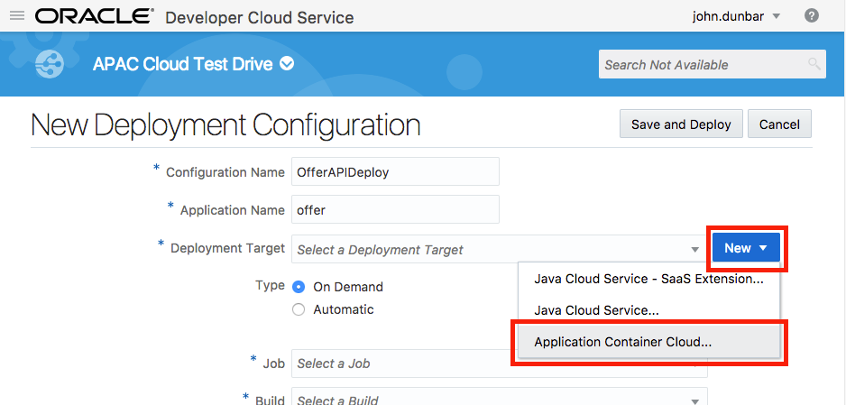


4. 다음 정보를 입력하고**연결 테스트**를 클릭하십시오. 

	- **Data Center:** `your datacenter, e.g. em2, em3, etc`
	- **Identity Domain:** `your identity domain`, e.g. gse00012345, etc
	- **Username:** `username to login to MyService`, e.g. lisa.jones, etc - that is the username you are using.
	- **Password:** `password of the cloud user`, that is the password you are using


5. 성공하면**[연결 사용]**버튼을 클릭하십시오. 

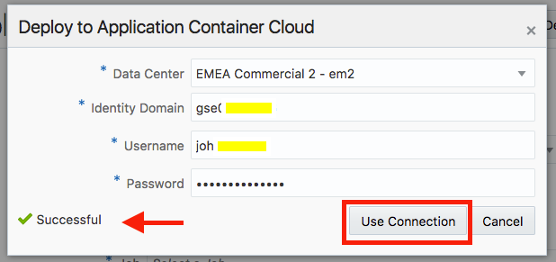


6. ACCS 속성에서 다음을 설정합니다. 

	- **Runtime** to `Node`
	- **Subscription** to `Hourly`
	- Set **Type** to `Automatic` and **CHECK** Deploy stable build only


**DOUBLE 런타임이 노드인지 확인**


7. **Job**에서 선택하십시오.이 이름은 위의 빌드 작업과 일치해야합니다 (예 :`Offer REST API Build`). 

8. **Artifact**에서 선택하십시오.이 이름은 위의 아카이브 아티펙트와 소스 코드의 package.json과 일치해야합니다 (예 :`target / offer.zip`). 

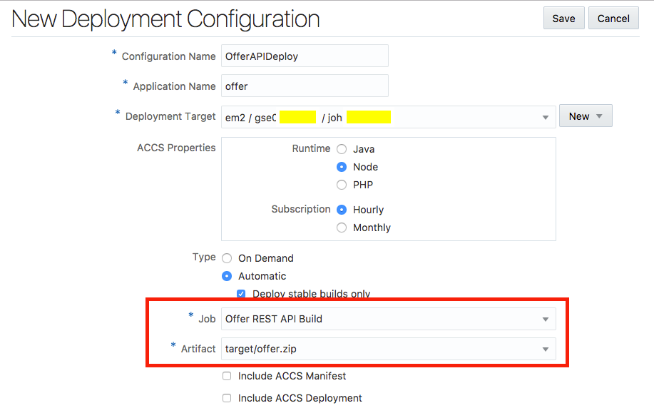


9. **Include ACCS Deployment 상자를 체크하고 다음 json을 추가하십시오. 

```json
{
	"memory":"1G",
	"instances":"1",
	"services": [
	{
	  "identifier": "DBService",
	  "type": "DBAAS",
	  "name": "apacctddb",
	  "username": "loyalty",
	  "password": "Welcome_1"
	}
	]
```


## 1.3 Oracle Application Container Cloud Service에 로그인하십시오.


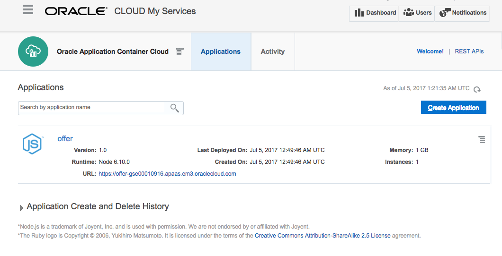
## 1.4 DBCS에 바인드 ACCS 서비스 바인딩 확인
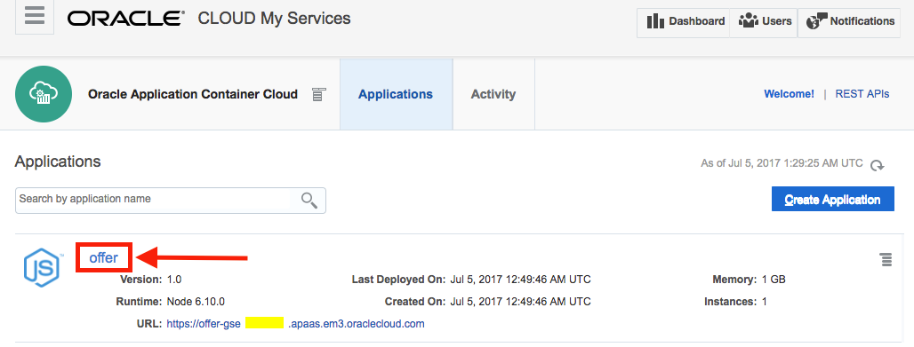

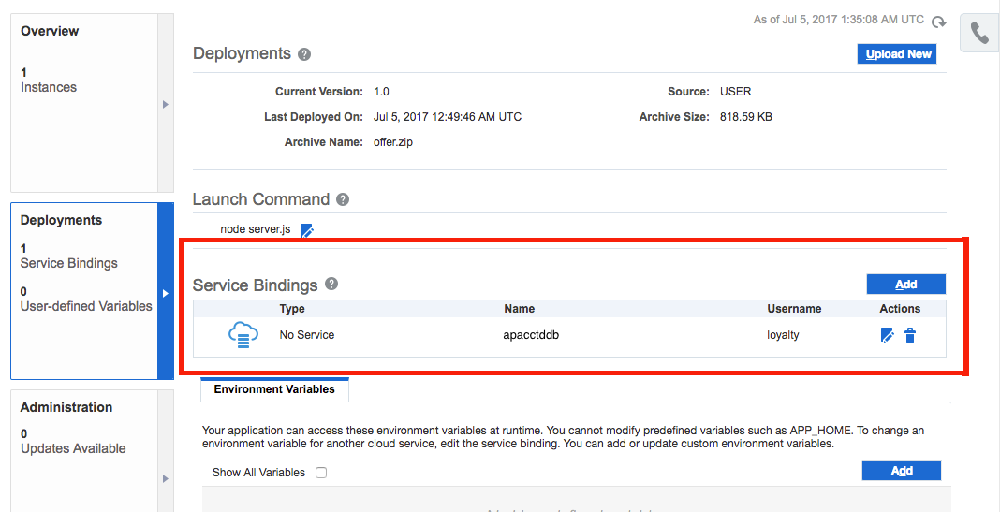
## 1.5 워킹 서비스 확인
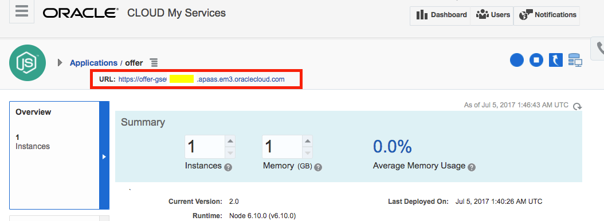

```diff
+ you might want to copy your OWN URLs for Offer API, e.g.
+   https://offer-{your-identity-domain}.apaas.{your-data-center}.oraclecloud.com/ptmgt/v1/offers/
+   https://offer-{your-identity-domain}.apaas.{your-data-center}.oraclecloud.com/
+ and put it in, e.g. Notepad
+   You will need to use it later, e.g. Lab 401.
```


3. Microservice에서 제공하는 세부 정보를 얻을 수 있어야합니다. 


4. 구성! 프리스트 마이크로 서비스가 완료되었습니다. 실제로이 Part 1과 매우 유사한 QR 코드 마이크로 서비스로 이동합시다. 

# 2. QR 코드 생성기 마이크로 서비스 생성


## 2.1 초기 Git 저장소 생성 - QR 코드 생성기


1. 아직 수행하지 않았다면 개발자 클라우드 서비스에 로그인하십시오. 2. 왼쪽 탐색 패널에서**프로젝트**를 클릭하십시오. 


3. **REPOSITORIES**섹션의 오른쪽에서**New Repository**를 클릭하여 새로운 Git 저장소를 만듭니다. 


4. 새 저장소 마법사에서 다음 정보를 입력하고**작성**을 클릭합니다. 

- **이름 :** `QRCodeMicroservice` 
- **설명 :** `제안 QR 코드를 생성하는 마이크로 서비스. QR 코드에는 실제 제공되는 URL이 포함됩니다 .` 
- **초기 내용 :** `기존 저장소 가져 오기` 
- **URL을 입력하십시오 :** `https://github.com/APACTestDrive/QRCodeMicroservice.git` 

```diff
-Please BE CAREFUL that you have not added extra white space before or after the information when copy-n-paste
```


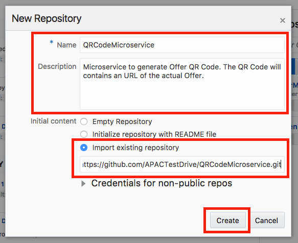


5. 기존 저장소를 기반으로하는 개발자 클라우드 서비스 내에 저장된 새로운 Git 저장소를 만들었습니다 


## 2.2 자신의 환경을 반영하도록 샘플 프로그램 코드 수정


### 2.2.1 Bracket Text Editor에 프로젝트 복제


본 실습실에서는 귀하가 공공 인터넷에 직접 연결되어 있다고 가정합니다 (예 : 프록시 사용 불가**). 

1. Brackets 텍스트 편집기를 시작하려면**Brackets**바탕 화면 아이콘, [시작] 메뉴 단추 또는 해당 컴퓨터의 바로 가기를 두 번 클릭하십시오. 

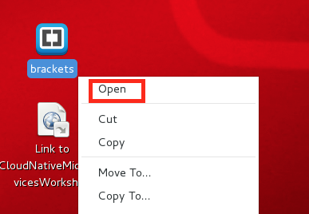


2. **파일**풀다운 메뉴에서**폴더 열기**를 선택하십시오. 


3. 로컬 하드 디스크에 소스 코드를 저장할 폴더를 선택하십시오. 예를 들어 왼쪽에**d : \ oracle**을 입력하고 오른쪽 상단에**[폴더 만들기]**를 클릭하십시오. - `this will 선택한 폴더 아래에 새 폴더를 만듭니다. 


4. 폴더 이름으로**QRCodeMicroservice**를 입력하십시오. 그런 다음 이름 옆의 공백 (예 : 크기 열)을 클릭하십시오. 


5. **[열기]**버튼을 클릭하여 새로 생성 된 프로젝트 폴더를 엽니 다. 


6. **QRCodeMicroservice Git 저장소의**개발자 클라우드 서비스**로 돌아 가기**.**HTTP**를 클릭하여 Git HTTP URL을 표시하고**복사**버튼을 클릭하여 URL을 복사하십시오. 


7. 브라켓 편집기로 돌아가서 편집기의 오른쪽에있는**GIT**아이콘을 클릭하십시오. 


8. Git 패널에서**[Clone]**을 클릭하십시오. 


9. Developer Cloud Service에서 복사 한 GIT URL을 붙여 넣습니다. 사용자 이름은 자동으로 채워 져야합니다. 비밀번호를 입력하고**원격 URL에 자격 증명 저장**을 선택하십시오. 

10. **[확인]**버튼을 클릭하십시오. 


11. 브래킷이 원격 프로젝트를 로컬 폴더에 복제 할 때까지 기다립니다. 


12. 이제 Git 저장소의 로컬 사본이 있습니다. 


### 2.2.2 환경에 맞게 소스 코드 편집


1. Brackets로 server.js 파일을 엽니 다 (더블 클릭). 


2. 12 행에서 ID 도메인으로 URL을 변경하십시오. 예를 들어,**1.5 절**에서 사용한 내용을 변경하십시오. 보시다시피,**제공되는 REST API 마이크로 서비스**의 URL입니다. 


3. 파일을 저장하십시오. (**Ctrl-S**또는 풀다운 메뉴**파일> 저장**중에서 선택하십시오.) 


### 2.2.3 새 분기 만들기 및 커밋


1. 왼쪽 탐색 패널에서**마스터**를 선택하고**새 분기 만들기 ...를 클릭하십시오.**


2. 팝업 창에서 분기 이름에`ChangeURL`을 입력하고**확인**을 클릭하십시오.**


3. **Commit**옆의 확인란을 선택하여 수정 된 모든 파일을 선택하십시오. 이는 아래의 확인란 (server.js)이 자동으로 선택되었음을 의미합니다. 


4. **Commit**을 클릭하십시오. 


5. 팝업에서**주석**`올바른 URL을 사용하도록 소스 코드 수정 `을 입력하고**확인**을 클릭하십시오. 이것은 귀하의 LOCAL GIT REPOSITORY에 변경 사항을 적용합니다. (코드 검사 문제는 무시할 수 있습니다. 확인하기 전에 코드 변경 사항을 검토 할 수 있습니다) 


6. **Git Push**아이콘을 클릭하십시오. 


7. 팝업 창에서 모든 기본값을 그대로두고**확인**을 클릭하십시오. 


8. Git Push가 완료되면**Ok**를 클릭하십시오. 


9. 변경 사항을 개발자 클라우드 서비스로 푸시해야합니다. 원하는 경우**개발자 클라우드 서비스**로 이동하여 푸시 된 분기를 확인할 수 있습니다. 너는이 같은 것을 할 것이다. 


### 2.2.4 개발자 클라우드 서비스에서 병합 요청을 작성하여 코드 이해하기


1. 개발자 클라우드 서비스에서**코드**탭을 클릭하십시오. QRCodeMicroservice Repo가 보이지 않으면 QRCode Repo로 변경하십시오. 


2. ChangeURL 분기를 선택하십시오. 


3. 일단 ChangeURL 브랜치에 있습니다. Brackets로 분기하기 위해 만든 최근 커밋을 볼 수 있어야합니다. 


4. 이제 병합 요청을 작성하여 코드를 병합하십시오 - **병합 요청**을 클릭하여 병합 요청 패널로 이동하십시오. 


5. **새 병합 요청**버튼을 클릭하십시오. 


6. 새 병합 요청에 다음 정보를 입력하고**다음**을 클릭하십시오.**

- **저장소 :** `QRCodeMicroservice.git` 
- **대상 지점 :** `마스터 ` 
- **검토 분기 :** `ChangeURL` 


7. 세부 정보**에 다음 정보를 입력하고**다음을 클릭하십시오**

- **요약 :** `지점 ChangeURL에 대한 병합 요청` 
- **리뷰 작성자 :** `당신이 일하고있는 사용자 선택`(예 : 클라우드 관리자, 존 던바 등) 


8. 요청을 검토하고**[+ 생성]**버튼을 클릭하십시오. 


9. 이제 병합 요청이 생성되었습니다. 우리는 다음 섹션에서 요청을 승인 할 것입니다. 

### 2.2.5 지점 합병


1. **병합 요청**을 클릭하십시오. 방금 생성 한 요청을 선택하면 요청을 검토 할 수 있습니다. 


2. 요청이 로드되면 **파일 변경** 탭을 선택하십시오. 변경 사항을 검토하십시오. 요청을 승인하기 전에 의견을 추가 할 수 있습니다. 


3. 원하는 경우**[승인]**버튼을 클릭하여 의견을 추가 할 수 있습니다 


4. `승인 됨` 과 같은 몇 가지 설명을 입력하고 **확인**을 클릭하십시오. 


5. 요청이 검토 자에게 승인되었음을 알 수 있습니다. 병합을 진행하려면 **병합**버튼을 클릭하십시오. 


6. 기본값을 그대로 사용하거나 원하는 설명을 입력하십시오. **지점 삭제**를 선택하면 병합 후 ChangeURL 지점이 삭제됩니다.**Merge Commit**버튼을 클릭하십시오. 


7. 이제 코드 병합이 커밋되어 마이크로 서비스를 만들 수 있습니다. 


## 2.3 기본 빌드 및 배포 프로세스 만들기 - QR 코드 생성기


개발자 클라우드 서비스에서 관리하는 Git Repository에 소스 코드가 있으므로 마스터 분기를 커밋 할 때마다 트리거되는 빌드 프로세스를 만들어야합니다. 이 섹션에서는**쉘 스크립트**빌드 프로세스를 설정합니다. 

### 2.3.1 기본 빌드 프로세스 생성 - QR 코드 생성기


1. 탐색 패널에서**빌드**를 클릭하여 빌드 페이지에 액세스하십시오. 


2. **[+ 새 작업]**을 클릭하십시오.**


3. New Job 팝업 창에서 작업 이름에 대해`QR Code Generator Build`를 입력하고**저장**을 클릭하십시오. 

```diff
-Please BE CAREFUL that you have not added extra white space before or after the information when copy-n-paste
```


4. 이제 작업 구성 화면에 배치됩니다. 


5. **소스 제어**탭을 클릭하십시오.**Git**라디오 버튼을 선택하십시오. 리포지토리 섹션의 URL 드롭 다운에서**QRCodeMicroservice.git**를 선택하십시오. 

	**Note:** Make sure you select the Git repository for the QR Code Microservice.


6. **트리거**탭을 클릭하십시오. 확인**SCM 폴링 일정에 따라**. 


7. **빌드 단계**탭을 클릭하고**빌드 단계 추가**를 클릭 한 다음**셸 실행**을 선택합니다. 


8. Command textarea에 다음을 입력하십시오 :`npm install` 


9. **Post Build**탭을 클릭하십시오.**이슈 보관**을 ​​선택하십시오. 아카이브 할 파일에`**/ target /*`을 입력하고 압축 유형으로**GZIP**가 선택되어 있는지 확인하십시오. 


10. **저장**을 클릭하여 구성을 완료하십시오. 


11. 빌드는 1-2 분 내에 자동으로 시작됩니다. 자동으로 시작되지 않으면**[지금 빌드하십시오]**버튼을 클릭하십시오. 


12. 상태가 다음 다이어그램과 비슷하게 바뀝니다. 


구축 단계 : 잠시 기다려주십시오. - 작업 변경 양식이 실행 대기열로 들어가기까지 몇 분이 걸릴 수 있습니다. 


13. 빌드를 완료하려면 serval 분이 소요됩니다. 다음 단계로 진행하기 전에 빌드가 완료 될 때까지 기다리십시오 - **배포 구성을 생성하기 위해 빌드 아티팩트가 필요하므로**. 


### 2.3.2 기본 배포 프로세스 만들기 - QR 코드 생성기


1. **배포**를 클릭하여 배포 페이지에 액세스합니다. 


2. **[+ 새 구성]**버튼을 클릭하십시오. 


3. 다음 데이터를 입력하십시오. 

- **구성 이름 :** QRCodeGeneratorDeploy 
- **응용 프로그램 이름 :** qrcodegenerator 


**Offer REST API Microservice에서 배포를 만들었으므로 동일한 대상**을 다시 사용할 수 있습니다. 

**배포 대상**에서 **위에서 만든 **동일**을 선택하십시오. 그것은`Application Container Cloud`와 비슷한 것이어야 합니다. **em2/your-identity-domain/your-user-name**


5. 응용 프로그램 컨테이너 클라우드에 배포**창이 나타나고 정보를 확인하고**암호를 입력 한 다음**[연결 테스트]**버튼을 클릭하십시오. 

- **데이터 센터 :** `귀하의 데이터 센터 (예 : em2, em3 등) 
- **신원 도메인 :** `신원 도메인, 예 : gse00012345, etc.` 
- **사용자 이름 :** `MyService에 로그인 할 사용자 이름 (예 : cloud.admin 등)` 
- **비밀번호 :** `클라우드 사용자의 비밀번호` 

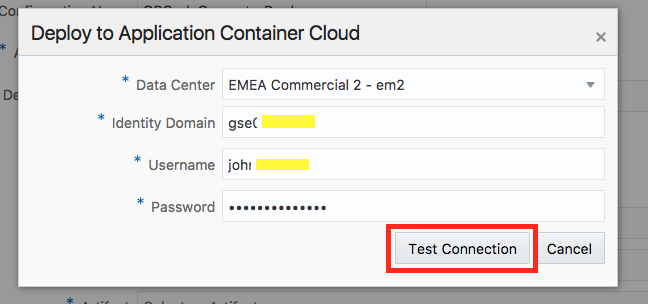


6. 테스트가 성공하면 **연결 사용**을 클릭하십시오. 


7. ACCS 속성에서 다음을 설정합니다. 

- **Runtime**-`Node` 
- **`시간별`구독**
- **유형**을 `자동`으로 설정하고**확인**`안정적인 빌드 만 배포` 

**런타임으로 노드를 선택하십시오**

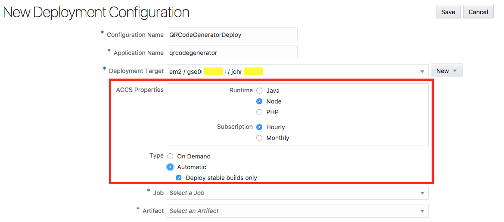


8. **Job**에서 선택하십시오.이 이름은 위의 빌드 작업과 일치해야합니다 (예 :`QR Code Generator Build`).**이슈**에서 선택하십시오.이 이름은 위의 아카이브 아티펙트와 소스 코드의 package.json과 일치해야합니다 (예 :`target / qrcodegenerator.zip`). 

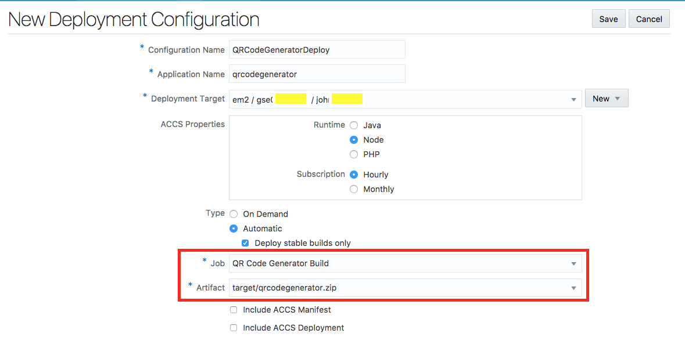


9. `Include ACCS Deployment` 박스를 체크하고 다음 json을 입력하십시오 

```json
{
	"memory":"1G",
	"instances":"1"
```


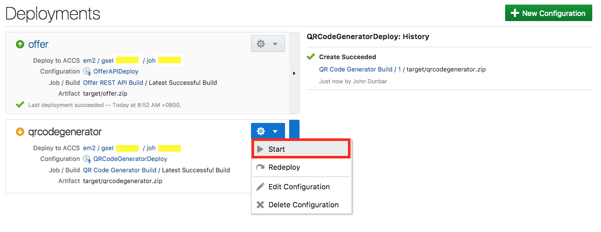

## 2.4 Oracle Application Container Cloud 서비스에 로그인


	https://qrcodegenerator-{your-identity-domain}.apaas.{your-data-center}.oraclecloud.com/ctdqr/v1/offer/10001
		

```diff
+ you might want to copy your OWN URLs for QR Code API
+   https://qrcodegenerator-{your-identity-domain}.apaas.{your-data-center}.oraclecloud.com/ctdqr/v1/offer/
+   https://qrcodegenerator-{your-identity-domain}.apaas.{your-data-center}.oraclecloud.com
+ and put it in, e.g. Notepad
+   You will need to use it later, e.g. Lab 304 Step 27.
```


**선택 단계 :** QR 코드 판독기 (예 : 모바일 앱)를 사용하는 경우 QR 코드를 디코딩 할 수 있습니다 

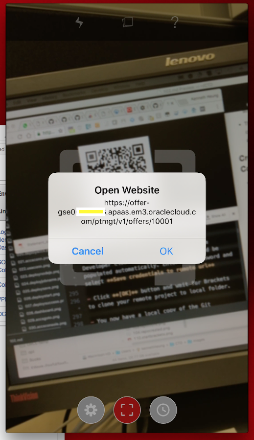


# 축하! Microservice Lab을 완료했습니다.


[go back to the Cloud Test Drive Main Page](../README.md) 

