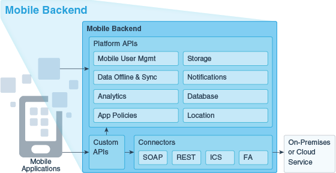
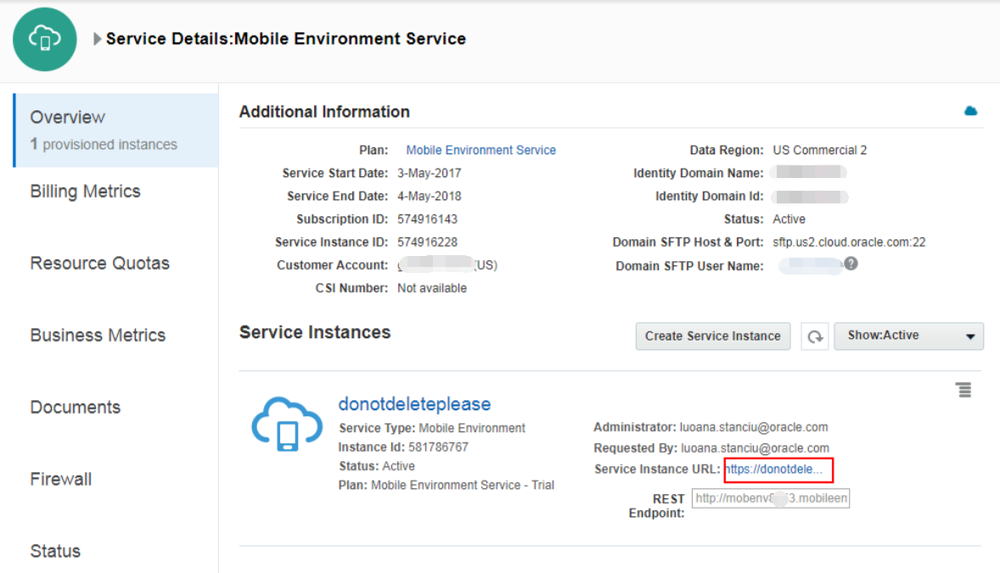

# ORACLE Cloud Test Drive #
-----
## 400: Create MBE (Mobile Back End) for mobile applications ##

### Introduction ###
This tutorial demonstrates how to create a MBE (Mobile Back End) to support the mobile applications. Mobile backends are server-side groupings of APIs (Platfomr & Custom APIs) and other resources that you create to support a specific set of applications. 

### About the Exercise Today ###
In this exercise, you will create your MBE for a mobile application called "Cafe Supremo" to support APIs for loyalty management and mobile client. By doing this, Cafe Supremo mobile application interacts with the created MBE to get offer push, query offer details and accept or reject the offer.

### Prerequisites ###
Oracle Public Cloud Service account for Mobile Cloud Service (Check with instructor if you don't have one)

----

#### Create MBE (Mobile Back End) for Cafe Supremo application ####

1. Sign in to Mobile Cloud Service by provided **Mobile Cloud Service \(MCS\)** identity domain Id and credential in the Access Document. Using the dashboard open the Mobile Cloud Service Console. 

2. In the dashboard screen, click on "Mobile Environment Service".

3. In the service details screen, click on "Service Instance URL".

4. Click on the hamburger icon located at the left top corner of the service introduction page. From the navigation bar, select “Applications” -> “Mobile Backends” and click on the “+ New Mobile Backend” green button.

5. Configure MBE with the following parameters:
+ **Name**: APAC_Test_Drive_Loyalty_Management_MBE0X (0X is the sequence number assigned to you by instructor.)
+ **Description**: APAC_Test_Drive_Loyalty_Management_MBE0X (Any value is okay.)

6. Check 
The Mobile Backend is now created and it will bring you to the “Settings” tab of the newly created MBE where you will see the mobile backend ID, client ID, etc, which you will need to use when interacting with the MBE. Click on the two “Show” links to see the “Anonymous Key” and “Client Secret”. **Please take a note on the mobile backend ID, client ID, Anonymous Key and Client Secret for laster use.** You are going to use them for the integration between Java Application to  this mobile service in order to push offer information.

You have finished this lab section.

[Procced to Next - 401: Set up Push Notification and Test Push Notification to mobile app](401-MobileLab.md)

or

[Back to Mobile Serivce and Application Home](README.md)
