# ORACLE Cloud Test Drive #
-----
## 401: Import MBE package and configure connectors for external services ##

### Introduction ###
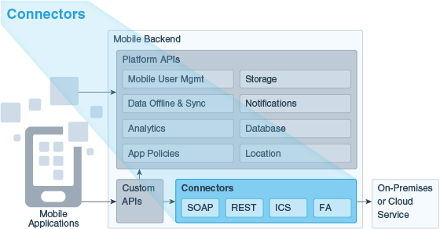

Connectors allow you to declaratively create APIs that simplify access to and standardize use of backend systems (such as enterprise middleware) and web services. Oracle MCS provides different types of connectors to simplify integration with different types of backend systems, including REST connector, SOAP connector, Oracle Integration Cloud Service (ICS) connector, and Oracle Fusion Application connector. In this lab, you will use the REST connector to integrate with the three REST services that are created in the microservices and integration labs.

Once connectors have been created, they can be used in custom APIs (e.g. the Loyalty Mgmt APi that you will create later), and exposed to mobile applications.

### About the Exercise Today ###
There are 3 connectors to be created in this lab, 2 of them integrate with the microservices on ACCS to query offers and generate QR code, while the last connector integrates with the service on ICS to accept or reject offer and update the existing CRM.

To create the above 3 Connectors, you will:
- Import the MBE package, which include the 3 connectors, together with the custom API and mobile backend that you will verify and configure later.
- Configure the connectors to use the correct URLs and credential to integrate with the backend services.
- Take "Process Offer" connector as an example, test and verify the result of the connector

### Prerequisites ###
- Completed 'microservices' and 'integration' labs to expose services on ACCS and ICS respectively.

#### Import the MBE package ####

1. Sign in to Mobile Cloud Service by using the **Mobile Cloud Service \(MCS\)** identity domain Id and credential in the Access Document. 

2. In the dashboard screen, click on "Mobile Environment Service".

3. In the service details screen, click on the link of "Service Instance URL" to access the MCS Portal.

4. In MCS Portal, click on the hamburger icon located at the left top corner of the service introduction page. From the navigation pane, select “Applications” -> “Packages”, and click on the “New Import” green button.
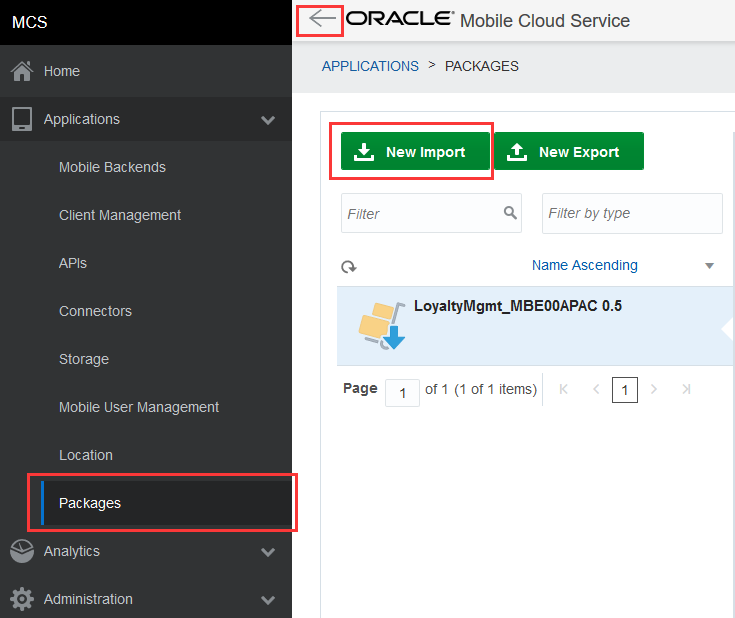

5. Click on "Choose a package file " and select the MBE package file "package-LoyaltyMgmt_MBE0X.zip" with the correct postfix assigned to you.

6. Once the file has been uploaded, click 'Next'.
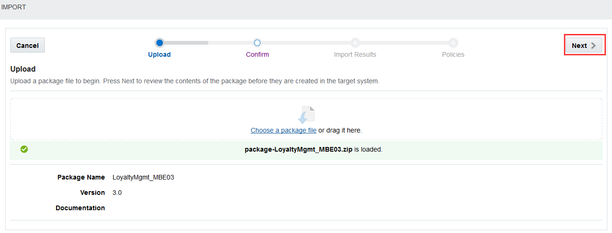

7. On the 'confirm' step, the contents of the package are shown. The package should include Mobile Backend 'LoyaltyMgmt_MBE0X', Client 'MyAndroidClient0X', API 'LoyaltyMgmt0X', API implementation 'LoyaltyMgmt03', and 3 connectors 'GenerateQRCode0X', 'ProcessOffer0X', and 'QueryOffers03'. Make sure the postfix is correct in each object to be imported. Click 'Next'
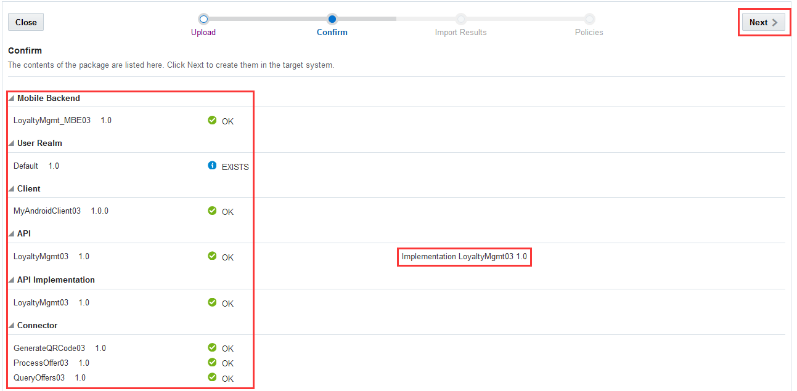

8. On the 'Import Results' step, verify all objects have been imported successully, except the user realm 'Default' which already exists. Click 'Next'.
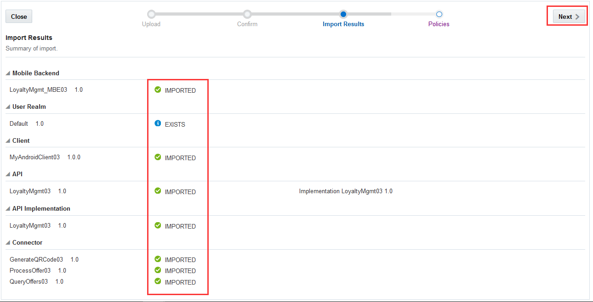

9. On the 'Policies' step, select the policy '*.connector/GenerateQRCode0X(1.0).Connector_Endpoint' and click on 'Edit'.
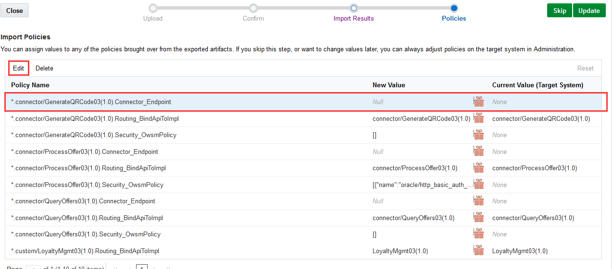

10. Set a custom value as the Host URL of the QR code service deployed on ACCS, e.g. `https://qrcodegenerator-<ACCS_DOMAIN_NAME>.apaas.em3.oraclecloud.com`. Click 'Save'.
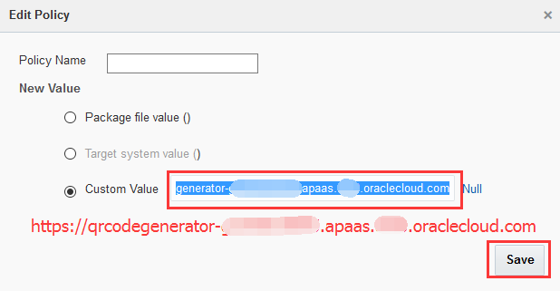

11. Back in the 'Policies' step, select the policy '*.connector/QueryOffers0X(1.0).Connector_Endpoint' and click on 'Edit'.

12. Set a custom value as the Host URL of the offer service deployed on ACCS, e.g. `https://offer-<ACCS_DOMAIN_NAME>.apaas.em3.oraclecloud.com`. Click 'Save'.
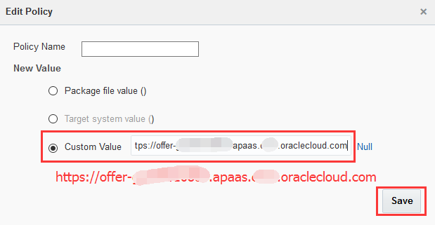

13. Back in the 'Policies' step, select the policy '*.connector/ProcessOffer0X(1.0).Connector_Endpoint' and click on 'Edit'.
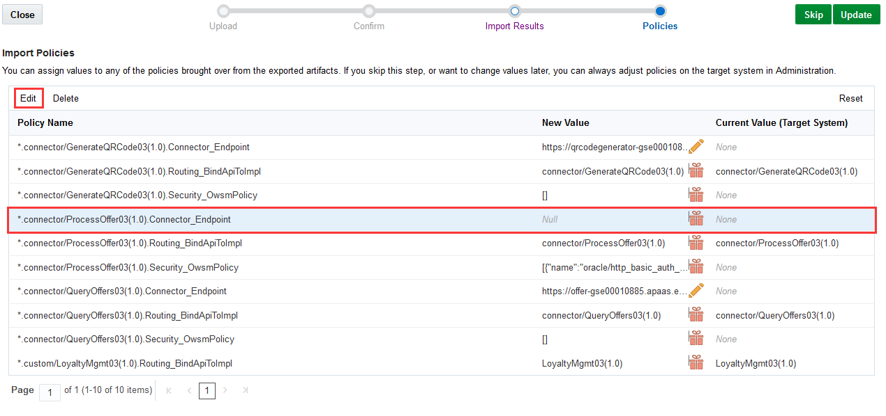

14. Set a custom value as the full service URL of the 'Process Offer' service deployed on ICS, e.g. `https://integration-<ICS_DOMAIN_NAME>.integration.us2.oraclecloud.com/integration/flowapi/rest/C0X_ICS_INTMGT/v01/processoffer`. Click 'Save'.
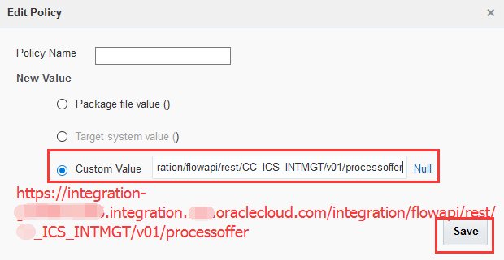

15. Back in the 'Policies' step, verify that you have successfully set new values for all three connector endpoint policies, and clieck 'Update' to complete importing the package.
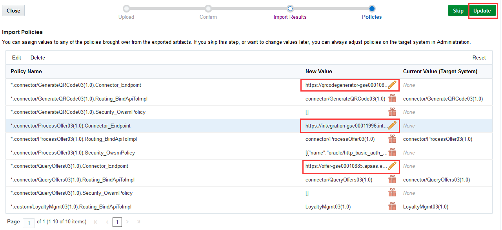

#### Configure credential to access 'Process Offer' service on ICS ####
The 'Process Offer' service deployed on ICS is configured to use 'Basic Authentication' in the 'integrations' lab. To integrate with the 'Process Offer' service, you should configure the ICS credential on MCS so that the connector on MCS is authorzied to access the 'Process Offer' on ICS.

1. From the navigation pane, click on “Administration” to open the "Administration" page. Scroll down to the bottom and click on "Keys & Certificates" to open the "CSF Keys & Certificates" box.
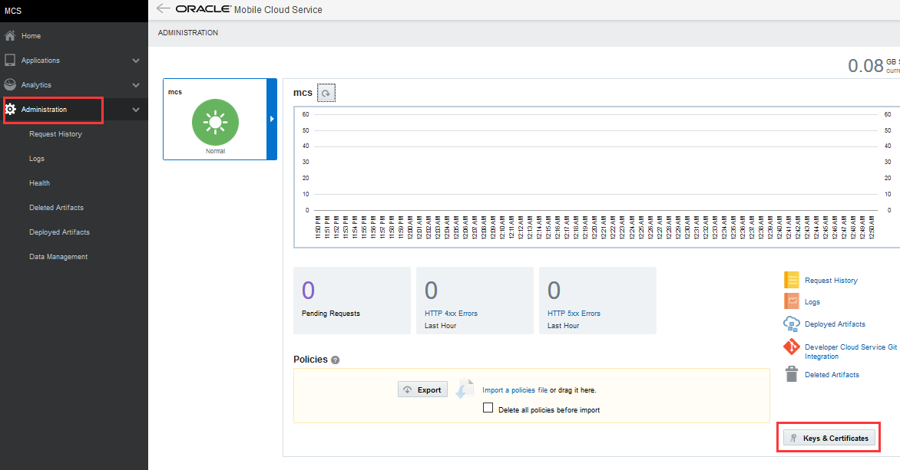

2. In the "CSF Keys & Certificates" box, under tab "CSF Keys", select the key "ICS0X" (0X is the postfix assigned to you), set "Short Description" to be "ICS0X" (0X is the postfix assigned to you), and set the user name and password to be the credential of the ICS domain, that you use in the "integrations" lab. Click "Save and Close" button.
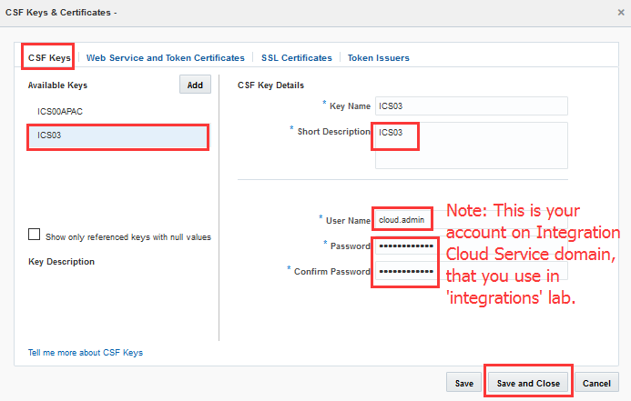

#### Test the connector 'Process Offer' ####

Once the connectors have been imported and configured completely, you can test the connector. In this lab, you will test the connector 'Process Offer'.

1. On the navigation pane, select “Applications” -> “Connectors”. Enter "0X" (0X is the postfix assigned to you) to search for the connectors created by you. Select "Process Offer 0X" (0X is the postfix assigned to you) and click on "Open".
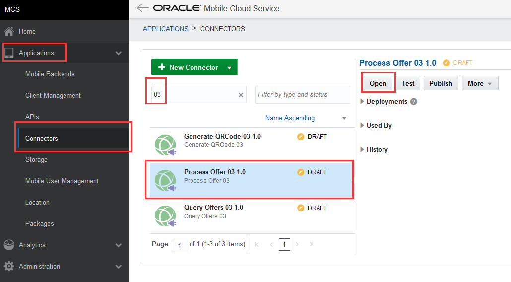

2. In 'General' step, make sure that the 'API Name' is set as 'ProcessOffer0X' (0X is the postfix assigned to you), and click 'Next'.
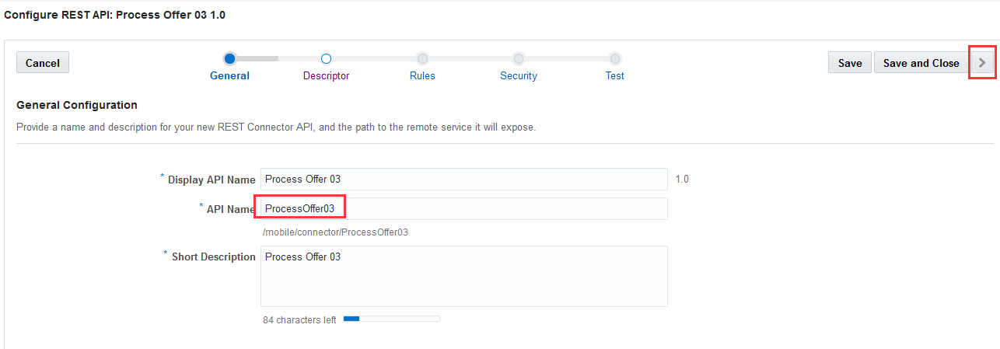

3. In 'Descriptor' step, make sure that the 'Remote URL' is set to the full service URL of the 'Process Offer' service on ICS, e.g. `https://integration-<ICS_DOMAIN_NAME>.integration.us2.oraclecloud.com/integration/flowapi/rest/C0X_ICS_INTMGT/v01/processoffer`. Click 'Next'.

4. In 'Rules' step, click 'Next' as no rule is used. 

5. In 'Security' step, make sure that security policy "oracle/http_basic_auth_over_ssl_client_policy" is selected, and the csf-key is set to 'ICS0X' (0X is the postfix assigned to you). Click 'Next'.
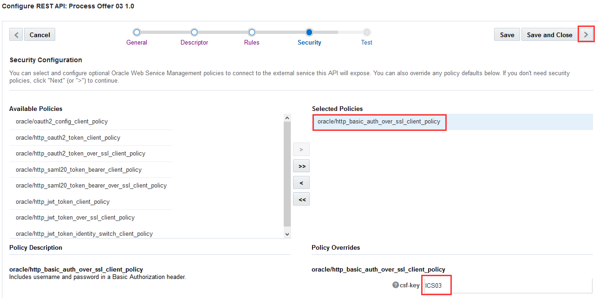

6. Click 'Yes' to save.

   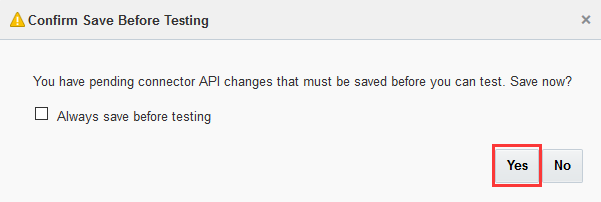

7. In 'Test' step, select `POST` as the HTTP method, enter `{"customerid": 66890169,  "offerid": 10001,  "productid": 20001,  "accepted": false}` into the "HTTP Body".
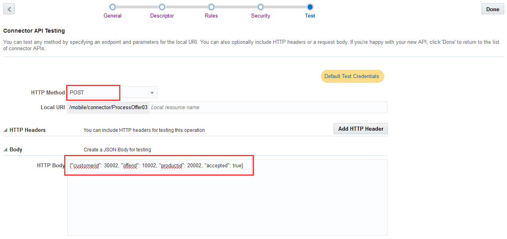

8. Select your mobile backend (e.g.: `LoyaltyMgmt_MBE0X`) you created from the dropdown list in the “Authentication” section, and click on “Test Endpoint”.
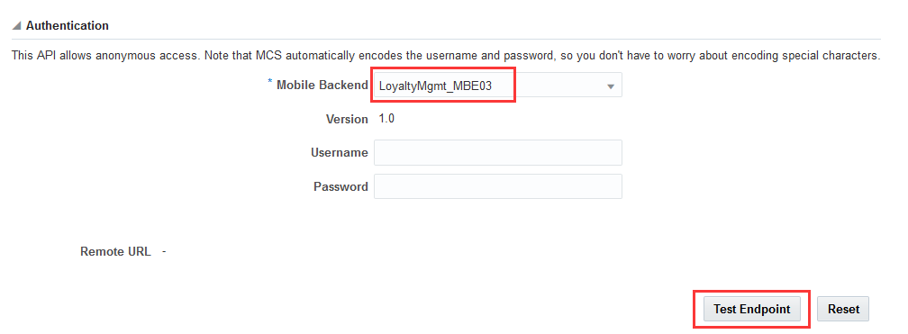

9. You shall see an HTTP 200 OK response at the bottom of the page and it is all set.
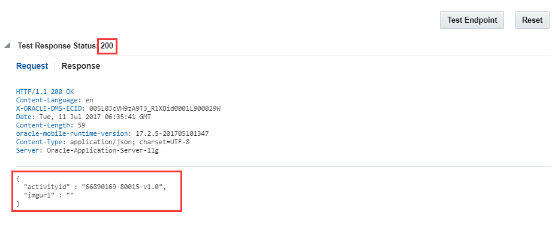

You have finished this lab successfully.

[Procced to Next - 402: Verify and test custom APIs and implementation](402-MobileLab.md)

or

[Back to Mobile Service and Application Home](README.md)
