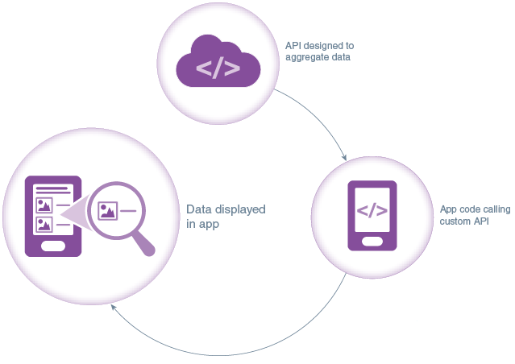
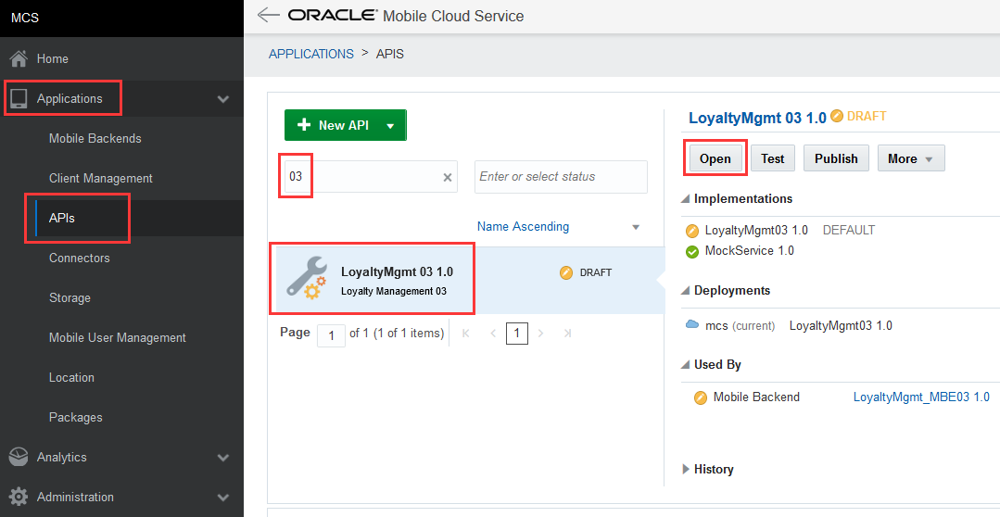
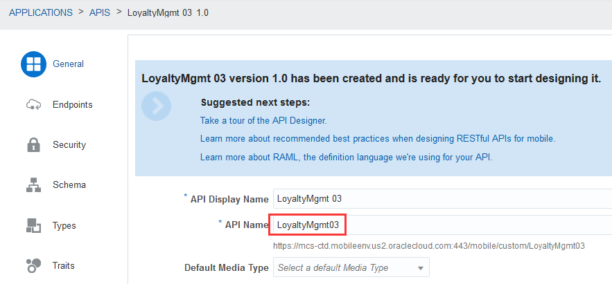
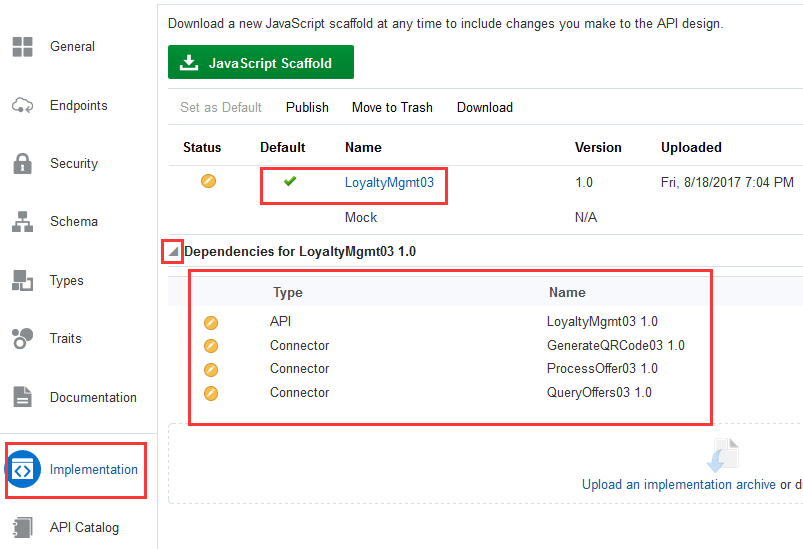
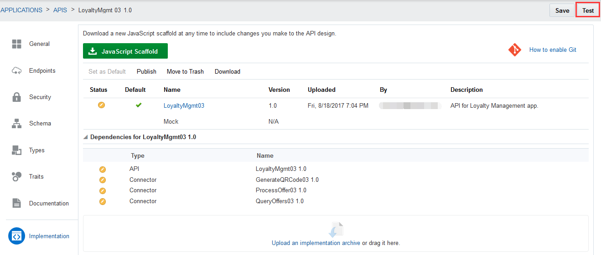

# 오라클 클라우드 테스트 드라이브 #
-----
## 402 : 사용자 지정 API 및 구현 확인 및 테스트 ##

### 소개 ###

사용자 정의 REST API를 만들어 모바일 응용 프로그램에서 사용할 수있는 서비스 라이브러리를 구축 할 수 있습니다. 맞춤 API는 특히 다른 소스의 데이터를 집계하고 관련 비즈니스 로직을 추가하며 결과를 모바일 애플리케이션에 모바일 친화적 인 방식으로 반환하는 데 유용합니다. 

### 오늘 운동에 대하여 ###
이전 연구실에서는 ACCS의 마이크로 서비스를 통해 외부 서비스와 통합 할 수있는 3 개의 커넥터를 만들었으며 쿠폰을 쿼리하고 QR 코드를 생성하고 ICS에서 서비스를 수락하거나 거부하여 기존 CRM을 업데이트하는 서비스를 만들었습니다. 기억할 수 있듯이 이러한 커넥터는 모바일 응용 프로그램에 직접 노출되지 않습니다. 서비스에 액세스하기 위해 커넥터를 만든 후에는 표준 REST 호출을 사용하여 모바일 응용 프로그램 또는 외부 시스템에서 호출 할 수있는 사용자 지정 API (예 : LoyaltyMgmt API)에서 사용할 수 있습니다. 맞춤 API &#39;LoyaltyMgmt0X&#39;는 MBE 패키지에 포함되어 있으며 이전 Lab에서 이미 MCS로 가져 왔습니다. 

이 실습에서는 다음을 수행하게됩니다. 
- 맞춤 API 정의 확인 
- 맞춤 API 테스트 

### 선수 과목 ###

- MBE 패키지가 이전 Lab (Lab 401)에서 성공적으로 가져 왔습니다. 
- 3 개의 커넥터가 이전 랩에서 올바르게 구성되었습니다 (랩 401) 

----
#### 충성도 관리를위한 맞춤형 API의 정의 확인이 실습에서는 이전 실습에서 MBE 패키지를 사용하여 가져온 충성도 관리 용 사용자 지정 API의 끝점, 보안 설정 및 구현을 확인합니다. 

1. 탐색 창에서 &quot;응용 프로그램&quot;-> &quot;API&quot;를 선택하십시오. 내가 만든 사용자 정의 API를 검색하려면 &quot;0X&quot;(0X가 사용자에게 지정된 접미사 임)를 입력하십시오. &quot;LoyaltyMgmt 0X&quot;(0X가 귀하에게 지정된 접미사 임)를 선택하고 &quot;열기&quot;를 클릭하십시오. 

2. &quot;API 이름&quot;의 값이 &quot;LoyaltyMgmt0X&quot;(0X가 사용자에게 지정된 접미사 임)인지 확인하십시오. 

3. &quot;API 이름&quot;의 값을 복사하고 &quot;Mobile_App_Settings_Sample.json&quot;파일에서 속성 &quot;API&quot;값을 바꿉니다. 나중에 사용할 수 있도록 파일을 저장하십시오. 

4. &quot;엔드 포인트&quot;탭으로 전환하면이 사용자 정의 API에 정의 된 엔드 포인트 목록이 표시됩니다. &#39;Compact Mode&#39;버튼을 클릭하여 &#39;Compact Mode&#39;로 전환하십시오. 소형 모드에서 모든 엔드 포인트 목록을 점검 할 수 있습니다. 

5. 정보 제공 : 이제 충성도 관리 사용자 정의 API에 대한 모든 엔드 포인트를 정의했습니다. 아래는 참조 용 엔드 포인트 목록입니다. 

    | Resource Path     | Display Name          | Method | Request Type     | Response Media Type |
    | ----------------- | --------------------- | ------ | ---------------- | ------------------- |
    | offer/{id}/qr	    | Offer QR code         | GET    | N/A	        | image/png           |
    | offer	            | Offers	            | GET    | N/A	        | application/json    |
    | offer/{id}/accept | Accept an offer       | POST   | application/json | application/json    |
    | offer/{id}/reject | Reject an offer       | POST   | application/json | application/json    |
    | offer/notify      | Send noti. of offer   | POST   | application/json | application/json    |
    | offer/{id}        | Get Offer Details     | GET    | N/A	        | application/json    |
    
6. 사용자 W 역할이이 API에 액세스 할 수 있도록 보안 정책을 정의 할 수 있습니다. 이 실습에서는이 API에 대한 익명 액세스를 허용합니다. &#39;보안&#39;탭으로 전환하여 &#39;로그인 필요&#39;옵션이 해제되어 API에서 익명 액세스를 허용하는지 확인하십시오. 

!  

7. 맞춤 API가 정의 된 후 서비스 개발자가 서비스 구현을 완료하기를 기다리지 않고 모바일 개발자가 API 사용을 시작할 수 있도록 모의 서비스가 자동으로 생성됩니다. 이 실습에서는 API 구현을 MBE 패키지와 함께 가져 왔습니다. &quot;구현&quot;탭으로 전환하여 &quot;LoyaltyMgmt0X에 대한 종속성&quot;을 클릭하여 확장하십시오. &quot;LoyaltyMgmt0X&quot;라는 구현이 &#39;Default&#39;로 설정되어 있는지 확인하고 의존성 목록 ( &quot;0X&quot;가 할당 된 접미사 임)에서 &quot;GenerateQRCode0X&quot;, &quot;QueryOffers0X&quot;및 &quot;ProcessOffer0X&quot;커넥터를 찾을 수 있습니다. 

----
#### 로열티 관리를위한 커스텀 API 테스트하기 커스텀 API의 정의와 구현을 검증 했으므로 이제 테스트를 진행할 수 있습니다. 

1. 사용자 정의 API 화면의 오른쪽 상단에있는 &#39;테스트&#39;버튼을 클릭하십시오. 

2. API 테스트 콘솔에서이 API에 사용할 수있는 엔드 포인트 목록이 표시됩니다. &quot;QR 코드 받기&quot;서비스를 예로 들어 왼쪽의 엔드 포인트 목록에서 &quot;QR 코드 얻기&quot;를 클릭하십시오. 

3. &quot;Mobile Backend&quot;드롭 다운 목록에서 값 &quot;10001&quot;으로 &quot;id&quot;매개 변수를 설정하고 &quot;LoyaltyMgmt_MBE0X&quot;(0X는 사용자에게 지정된 접미사 임)를 선택하고 &quot;인증 방법&quot;을 &quot;기본값&quot;으로 유지하십시오. &quot;Test Endpoint&quot;버튼을 클릭하여 서비스를 테스트하십시오. 

4. 응답 코드가 &quot;200&quot;이고 내용 유형이 &quot;image / png&quot;인 응답을 받아야합니다. 이것은 ACCS에 배포 한 &quot;Generate QR Code&quot;서비스에서 반환 한 QR 코드 이미지입니다. 

이 Lab을 성공적으로 마쳤습니다. 

[Procced to Next - 403: Set up Push Notification and configure the mobile app](403-MobileLab.md) 

또는 

[Back to Mobile Service and Application Home](README.md) 

