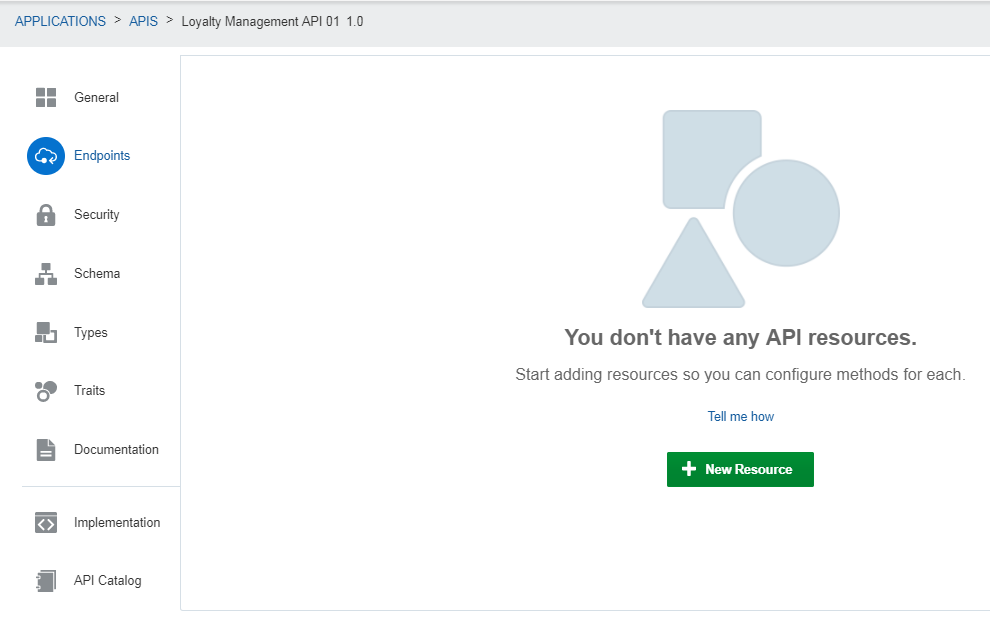
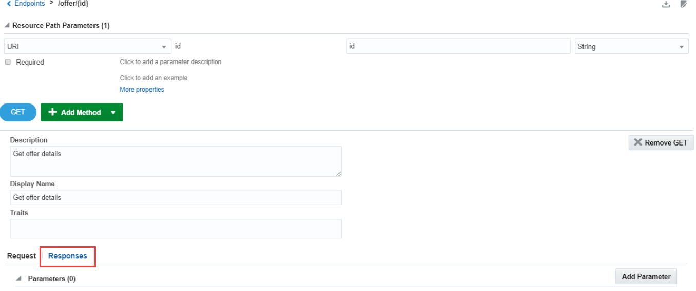
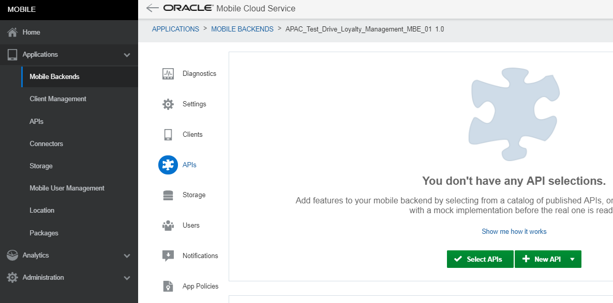
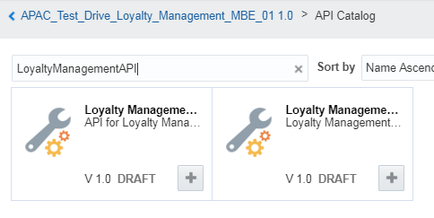

# ORACLE Cloud Test Drive #
-----
## 403: Develop Custom APIs and Custom Code to extend mobile services ##

### Introduction ###


You can create custom REST APIs to build up a library of services that can be used by your mobile applications. Custom APIs are particularly useful for aggregating data from other sources, adding any relevant business logic, and returning results in a mobile-friendly way for mobile applications.


### About the Exercise Today ###
In this exercise, we will:
- Create the custom API and define its endpoints for loyalty management. We need the custom API with several endpoints for offer information query, QR code creation and offer result (e.g. reject or accept) update.
- Associate the APIs with the loyalty management MBE.
- Test the Customer API for loyalty management

### Prerequisites ###
- Loyalty management MBE created in the previous lab.
- Complete custome API with all required endpoints for your use. (It is ready for you.)

----

#### Create custom APIs and define its endpoints for loyalty management ####
In this lab, you will create a custom API for loayalty managment. In fact, we need to define serveral endpoints for the custome API for offer information query, QR code creation and offer result update. Creating endpoints are the same jobs. So, here you will create one endpoint for the query of the specific offer information. **Note:**We will provide the completed custom API with all endpoints for your use in this lab.

1. From the navigation pane, select “Applications” -> “APIs”, click on “+ New API” and select “API” from the dropdown list.


2. Enter name and description and click on “Create” as below:
    + **API Display Name**: `Loyalty Management 0X` (0X is the sequence number assigned to you by instructor. - e.g.: 01)
    + **API Name**: `LoyaltyManagement0X` 
    + **API Short Description**: `Custom API for Loyalty Management`


3. Define endpoints for the Loyalty Management API: 
    - Select “Endpoints” on the page level navigation pane on the left and click on “+ New Resource”.


    - Enter `offer/{id}` as the “Resource Path” and `Offer` as the “Display Name” and click on “Methods”. This endpoint (a URI resource) is for getting the specific offer information by offer ID.


    - Adding method: you can see that {id} entered in previous step has be recognized as a URI Resource Path Parameter “id”. Click on “+ Add Method” and select “GET”.


    - Enter `Get offer details` as the “Description” and `Get offer details` as the “Display Name” for the method. Click on “Responses” link at the bottom.


    - Adding sample response: MCS will use the below sample body to create a mockup implementation for this endpoint method. This is the one of good features MCS provide **nabling parallel development** of mobile application without external services. In the "Example" text area, paste the following code:
	```
	{
    	"id": 10001,
    	"name": "Samsam Galaxy Offer",
    	"points": 6000,
    	"message": "Exchange 6000 points for 10% discount of Samsam Mobile Phone",
    	"productid": 20001,
    	"productname": "Samsam Galaxy 7",
    	"productprice": 1000,
    	"productimage": "20001.jpg",
    	"productdesc": "The best Android phone in the galaxy"
  	} 
	```
    - Scroll to the top of the page and click on “Save”. 


    - In addition to the above endpoint, we need to create endpoints for QR code creation, offer result update, etc. However we will skip to create them because we have the same steps to create other endpoints. They are included in the custom API we provided. The below is the list of endpoints for your reference.

  | Resource Path     | Display Name          | Method | Request Type     | Response Media Type |
  | ----------------- | --------------------- | ------ | ---------------- | ------------------- |
  | offer/{id}/qr	    | Offer QR code         | GET    | N/A	        | image/png           |
  | offer		    | Offers	            | GET    | N/A	        | application/json    |
  | offer/{id}/accept | Accept an offer       | POST   | application/json | application/json    |
  | offer/{id}/reject | Reject an offer       | POST   | application/json | application/json    |
  | offer/notify      | Send noti. of offer   | POST   | application/json | application/json    |

4. Security Settings: You need to assign a role to access the API. Before that, the API is not accessible by anyone.
On page level navigation pane, select “Security”. Click in the Roles box and select the “Default” role. Scroll to the top and click “Save”.


--
#### Associate the APIs with the loyalty management MBE ####
Before you can deploy the custom API, it has to be associated with the mobile backend(e.g.: APAC_Test_Drive_Loyalty_Management_MBE01) you created in the previous lab. The mobile backend provides the security context for accessing the API, including the users that have permissions. In this lab, we will assign the complete custom API for "LoyaltyManagementAPI" that we provide.

1. Navigate to the MBE you created, and turn to the “APIs” tab. Click “Select APIs”.


2. Enter `LoyaltymanagementAPI` and click one “+” icon to select the one without any suffix, which is the one we’ve provided. This is for the app that provided for the lab to use.


3. You will see it got added to the right 


4. Please see the result as below:


5. [Optional] Follow the same instruction to add the API (e.g.: LoyaltyManagement01) you’ve just created so that you can test it.

--
#### Test the Customer API for loyalty management ####
To be Described.

[Procced to Next - 404: Track customer behaviors](404-MobileLab.md)

or

[Back to Mobile Serivce and Application Home](README.md)


