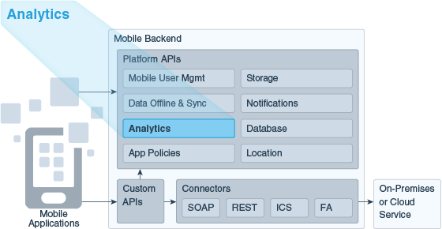
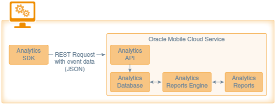

# ORACLE Cloud Test Drive #
-----
## 404: Track customer behaviors ##

### Introduction ###

Oracle Mobile Cloud Service (MCS) provides an Analytics API to help you measure patterns in application performance and usage. As a business development manager or mobile program manager, you can use analytics to find out how to improve your applications.

MCS creates analytics reports from events, which describe how users interact with the mobile application. A mobile application developer can track the mobile app’s entire usage by raising events in the mobile application code. In this lab, we will see how to track events like "AcceptOffer" and "RejectOffer". Mobile backends receive events from the REST calls made from mobile applications. A mobile application makes a single call, which includes a JSON payload that describes the events along with such contextual information like a user’s location, the start and end of a user session, and details about the user’s mobile device. You can craft the payload yourself if you use straight REST calls, or use the mobile client SDK to construct one for you.

### About the Exercise Today ###
In this exercise, we will:
- See the snippet of mobile application's source code to raise events
- See how to check raised events in MCS (Mobile Cloud Service)

### Prerequisites ###
- Loyalty management MBE created in the previous lab.

----

#### How to raise events from mobile applications ####
To be Described.

---
#### How to check raised events in MCS ####
To be Described.

Congratulation! You have finished this lab section.

[Back to Mobile Serivce and Application Home](README.md)

