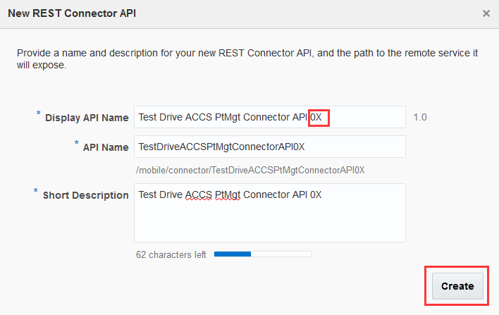
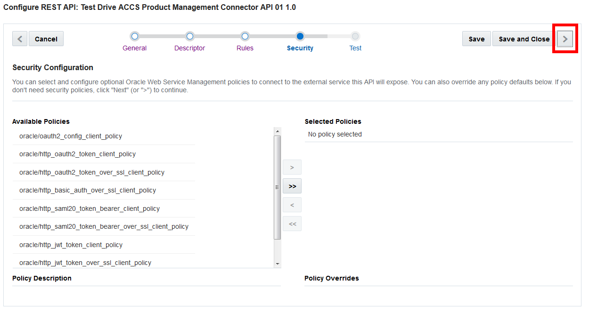
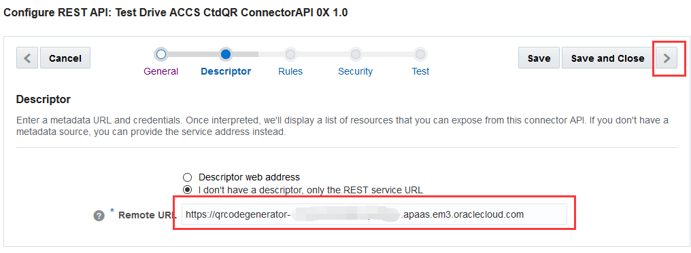
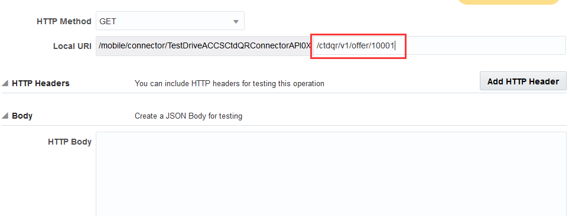
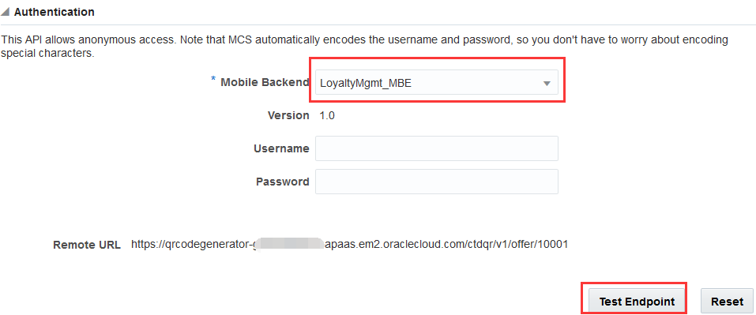
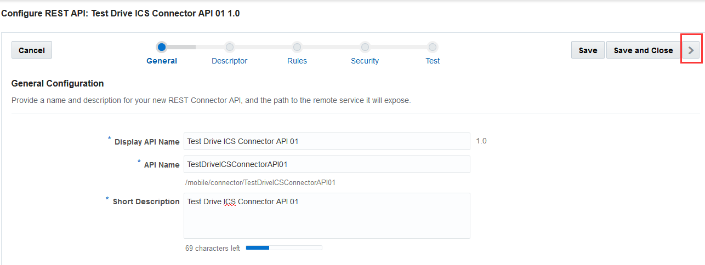
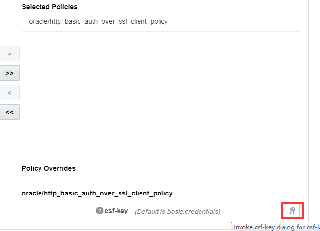
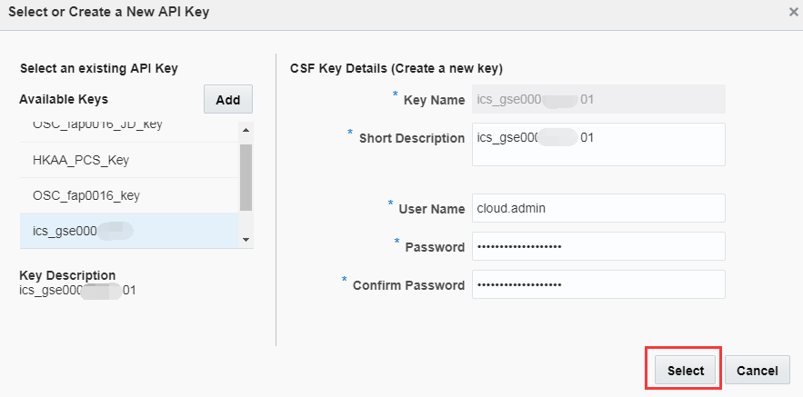
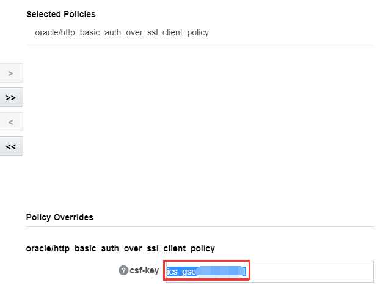
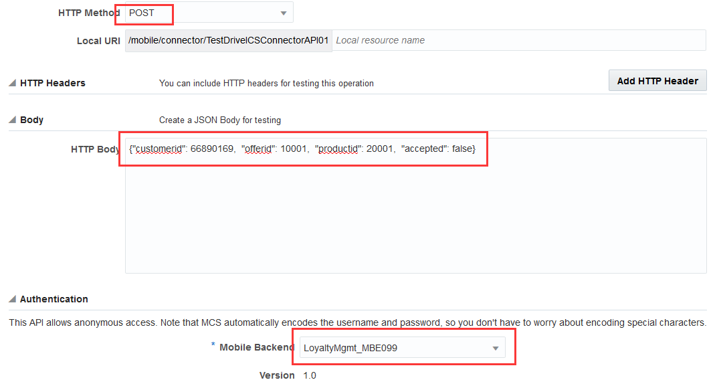

# 오라클 클라우드 테스트 드라이브 #
-----
## 402 : 외부 서비스 용 커넥터 만들기 ##

### 소개 ###

커넥터를 사용하면 백엔드 시스템 (예 : 엔터프라이즈 미들웨어) 및 웹 서비스에 대한 액세스 및 표준화 사용을 단순화하는 API를 선언적으로 작성할 수 있습니다. 커넥터 유형은 REST 웹 서비스, SOAP 웹 서비스, ICS (Oracle Integration Cloud Service) 및 Fusion Applications (FA) 기반의 Oracle Cloud 애플리케이션에서 사용할 수 있습니다. 이 실습에서는 ACCS와 ICS를 통합하기 위해 REST 웹 서비스 용 커넥터를 사용할 것입니다. 

서비스에 액세스하기 위해 커넥터 API를 작성한 후에는 사용자 정의 API (예 : Loyalty Management API)에서이를 사용하여 표준 REST 호출을 사용하여 모바일 애플리케이션에서 호출 할 수 있습니다. 

### 오늘 Practice에 대하여 ###
이 랩에서 액세스해야하는 ACCS (응용 프로그램 컨테이너 클라우드 서비스) 및 ICS (통합 클라우드 서비스)와 같은 외부 시스템에서 제공 정보 쿼리, QR 코드 생성 및 제공 결과 (예 : 거부 또는 수락) 업데이트를위한 3 가지 커넥터 API가 있습니다. 

위의 3 가지 Connector API를 작성하려면 다음을 수행하십시오. 
- ACCS 마이크로 서비스를 사용하여 오퍼 정보를 얻기위한 "제품 관리"API 커넥터 생성 
- ACCS 마이크로 서비스를 사용하여 QR 코드를 생성하는 "QR 코드"API 커넥터 생성 
- ICS 마이크로 서비스를 사용하여 오퍼 결과를 업데이트하는 "Process Offer"API 커넥터를 만듭니다. 

### 선수 과목 ###

- 로열티 관리 MBE는 이전 Lab에서 만들었습니다. 

#### 제안 정보를 얻기 위해 "제품 관리"API 커넥터 만들기이 랩에서는 제안 정보를 위해 ACCS 마이크로 서비스를 통합하는 커넥터 API를 만들 것입니다.**[주]**커넥터 API는 사용자 정의 API 용입니다. 이는 커넥터 API가 모바일 응용 프로그램과 직접 상호 작용하지 않음을 의미합니다. 모바일 응용 프로그램은 사용자 지정 API와 만 상호 작용하며 사용자 지정 API는 커넥터 API를 사용하여 외부 서비스 및 시스템과 상호 작용합니다. 

1. 탐색 창에서 "응용 프로그램"-> "커넥터"를 선택하십시오. "+ 새 커넥터"녹색 버튼을 클릭하고 드롭 다운 목록에서 "REST"를 선택하십시오. 

2. `Test Drive ACCS PtMgt Connector API 0X`를 입력하십시오 (0X는 강사가 지정한 일련 번호 - 예 : 01).이 커넥터의 이름과 간단한 설명으로 입력하십시오. 표시 API 이름을 입력하는 동안 API 이름이 자동으로 생성됩니다. "API 이름"은 맞춤 API 구현 코딩에 사용되므로 JavaScript 변수 명명 표준을 충족해야합니다. 완료되면 오른쪽 하단의 "만들기"를 클릭하십시오. 

3. 일반 화면의 이름 / 설명을 검토하고 다음 단계로 이동하려면 "다음 단계"단추 (오른쪽 상단의 ">")를 클릭하십시오. 

4. URL을 입력하십시오 (예 :`https://offer-<YOUR_ACCS_DOMAIN_NAME>.apaas.em3.oraclecloud.com`. 이것은 Microservice Lab.에서 생성 한 끝점입니다.) REST API에서 "Remote URL"텍스트 상자에 입력하십시오. "다음 단계"를 클릭하십시오. 

5. 여기서 규칙을 설정하지 않으므로 "다음 단계"를 클릭하십시오. 

6. MCS는 다양한 보안 정책을 지원합니다. Lab에서는 간단하게하기 위해 보안 정책 설정이 필요하지 않습니다. "다음 단계"를 클릭하기 만하면됩니다. 

7. 확인을 묻는 메시지가 나타나면 "저장"을 클릭하십시오. 

8. 이제 커넥터가 준비되었으며이를 테스트 할 수 있습니다. HTTP 메소드로`GET`을 선택하고, "Local URI"뒤에 "Local resource name"에`/ptmgt/v1/offers/10001`을 입력하십시오. 

9. "인증"섹션의 드롭 다운 목록에서 만든 MBE (예 : LoyaltyMgmt_MBE01)를 선택하면 "원격 URL"필드의 끝에 실제로 호출되는 실제 URL을 찾을 수 있습니다. "Test Endpoint"를 클릭하십시오. 

10. 페이지 맨 아래에 HTTP 200 OK 응답이 표시되고 모두 설정됩니다. 

---
#### QR 코드를 생성하는 "QR 코드"API 커넥터 만들기이 실습에서는 QR 코드 생성을 위해 ACCS 마이크로 서비스를 통합하는 커넥터 API를 만듭니다. 전체 과정은 위와 거의 같습니다. 

1. 탐색 창에서 "응용 프로그램"-> "커넥터"를 선택하십시오. "+ 새 커넥터"녹색 버튼을 클릭하고 드롭 다운 목록에서 "REST"를 선택하십시오. 

2. `Test Drive ACCS CtdQR ConnectorAPI 0X`를 입력하십시오 (0X는 강사가 지정한 일련 번호 - 예 : 01). 표시 API 이름을 입력하는 동안 API 이름이 자동으로 생성됩니다. "API 이름"은 맞춤 API 구현 코딩에 사용되므로 JavaScript 변수 명명 표준을 충족해야합니다. 완료되면 오른쪽 하단의 "만들기"를 클릭하십시오. 

3. 일반 화면의 이름 / 설명을 검토하고 다음 단계로 이동하려면 "다음 단계"단추 (오른쪽 상단의 ">")를 클릭하십시오. 

4. URL을 입력하십시오 (예 :`https://qrcodegenerator-<YOUR_ACCS_DOMAIN_NAME> .apaas.em3.oraclecloud.com`. 이것은 Microservice Lab.에서 생성 한 끝점입니다.) REST API에서 "Remote URL"텍스트 상자에 입력하십시오. "다음 단계"를 클릭하십시오. 

5. 여기서 규칙을 설정하지 않으므로 "다음 단계"를 클릭하십시오. 

6. MCS는 다양한 보안 정책을 지원합니다. Lab에서는 간단하게하기 위해 보안 정책 설정이 필요하지 않습니다. "다음 단계"를 클릭하기 만하면됩니다. 

7. 확인을 묻는 메시지가 나타나면 "저장"을 클릭하십시오. 

8. 이제 커넥터가 준비되었으며이를 테스트 할 수 있습니다. HTTP 메소드로 GET을 선택하고, "Local URI"다음에 "Local resource name"에`/ctdqr/v1/offer/10001`을 입력하십시오. 

9. "인증"섹션의 드롭 다운 목록에서 만든 MBE (예 :`LoyaltyMgmt_MBE01`)를 선택하면 "원격 URL"필드의 끝에 실제로 호출되는 실제 URL을 찾을 수 있습니다. "Test Endpoint"를 클릭하십시오. 

10. 페이지 맨 아래에 HTTP 200 OK 응답이 표시되고 모두 설정됩니다. 

----
#### 제안 결과를 업데이트하기 위해 "Process Offer"Connector API 만들기이 실습에서는 제안 결과를 업데이트하기 위해 ICS 마이크로 서비스를 통합하는 커넥터 API를 만듭니다. 전체 과정은 위와 거의 같습니다. 

1. 탐색 창에서 "응용 프로그램"-> "커넥터"를 선택하십시오. "+ 새 커넥터"녹색 버튼을 클릭하고 드롭 다운 목록에서 "REST"를 선택하십시오. 

2. `Test Drive ICS Connector API 0X`(0X는 강사가 지정한 일련 번호 - 예 : 01)를이 커넥터의 이름으로 입력하십시오. 표시 API 이름을 입력하는 동안 API 이름이 자동으로 생성됩니다. "API 이름"은 맞춤 API 구현 코딩에 사용되므로 JavaScript 변수 명명 표준을 충족해야합니다. 완료되면 오른쪽 하단의 "만들기"를 클릭하십시오. 

3. 일반 화면의 이름 / 설명을 검토하고 다음 단계로 이동하려면 "다음 단계"단추 (오른쪽 상단의 ">")를 클릭하십시오. 

4. URL을 입력하십시오 (예 :`https : // integration- <YOUR_ICS_DOMAIN_NAME> .integration.us2.oraclecloud.com / integration / flowapi / rest / <YOUR_INTEGRATION_NAME> / v01 / processoffer`. 이것은 Integrations Lab.에서 작성한 엔드 포인트입니다.) REST API에서 "Remote URL"텍스트 상자로 이동하십시오. "다음 단계"를 클릭하십시오. 

5. 여기서 규칙을 설정하지 않으므로 "다음 단계"를 클릭하십시오. 

6. MCS는 다양한 보안 정책을 지원합니다. Lab에서는 보안 정책 설정에 http 기본 인증을 사용합니다. 왼쪽의 "사용 가능한 정책"에서 "oracle /http_basic_auth_over_ssl_client_policy"를 선택하고 중간에있는 ">"단추를 사용하여 오른쪽의 "선택한 정책"으로 이동하십시오. 

7. 보안 정책 설정을위한 CSF-Key 대화 상자 열기 : MCS는 CSF (Credential Store Framework)를 사용하여 보안 양식으로 자격 증명을 관리합니다. CSF를 사용하면 웹 서비스 및 기타 응용 프로그램의 자격 증명을 저장, 검색, 업데이트 및 삭제할 수 있습니다. CSF 키는 인증 및 권한 부여 중에 사용되는 사용자 및 시스템 구성 요소의 권한을 인증하는 자격 증명입니다. CSF 키는 기본 인증 (사용자 이름 및 암호)을 사용하여 고유 한 키 값을 생성합니다. 

8. CSF-Key 추가 : 팝업창에서 "Add"를 클릭하고 자신 만의 csf-key를 생성하고, 고유 한 값을 입력하십시오 (예 :`ICS_GSE 0X`, 0X는 강사가 지정한 일련 번호입니다.) - 예 : 01 )를 "키 이름"으로 사용하십시오. "사용자 이름"과 "비밀번호"를 입력하십시오. (Thery는 액세스 문서 또는 강사가 제공함) "저장"을 클릭하십시오. 

9. 작성한 CSF-Key를 선택하십시오 : "Select"를 클릭하면 메인 화면으로 돌아갑니다. 

10. 새로 생성 된 csf-key가 csf-key 텍스트 상자에 나타납니다. "다음 단계"를 클릭하여 다음 단계로 넘어갑니다. 

11. 확인을 묻는 메시지가 나타나면 "저장"을 클릭하십시오. 

12. 이제 커넥터가 준비되었으며 이를 테스트 할 수 있습니다. HTTP 메소드로`POST`를 선택하고, "HTTP Body"에`{"customerid": 66890169,  "offerid": 10001,  "productid": 20001,  "accepted": false}`를 입력하십시오. "인증"섹션의 드롭 다운 목록에서 만든 모바일 백엔드 (예 :`LoyaltyMgmt_MBE01`)를 선택하고 "엔드 포인트 테스트"를 클릭하십시오. 

13. 페이지 하단에 HTTP 200 OK 응답이 표시되고 모두 설정됩니다. 

이 Lab을 성공적으로 마쳤습니다. 

[Procced to Next - 403: Develop Custom APIs and Custom Code to extend mobile services](403-MobileLab.md)

or

[Back to Mobile Service and Application Home](README.md)
