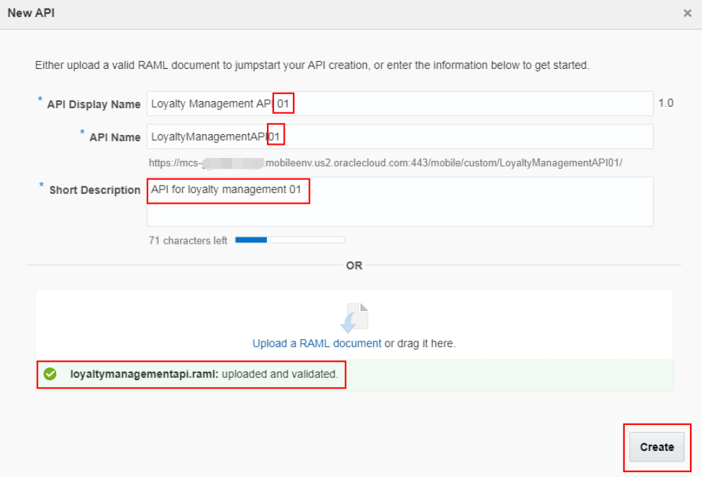
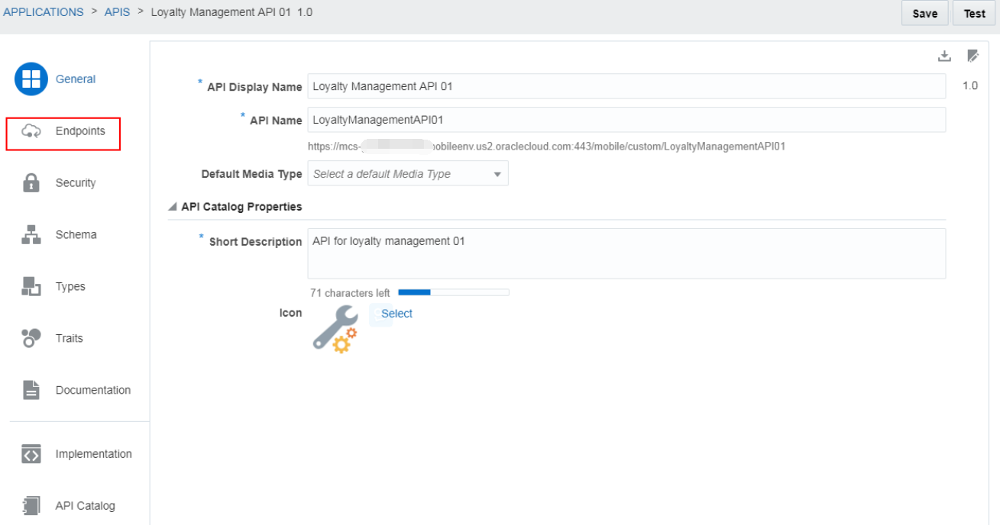
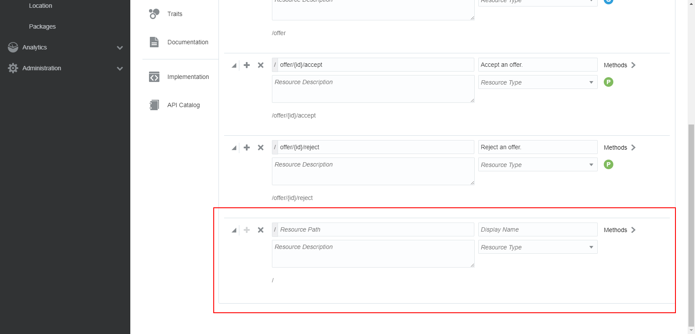
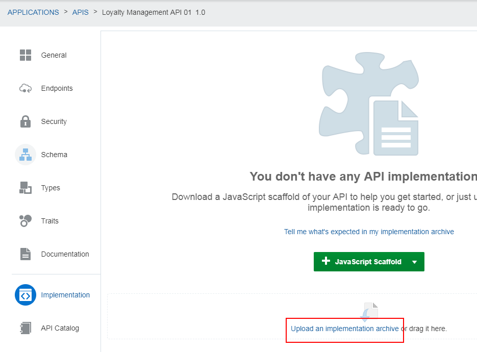
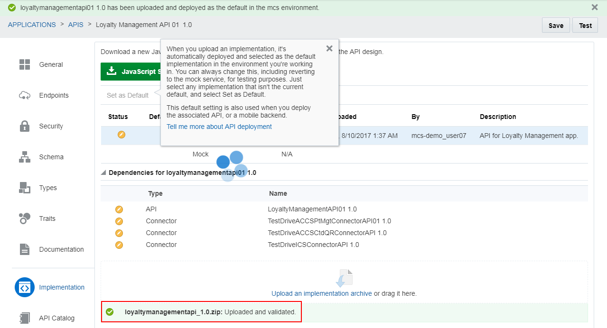
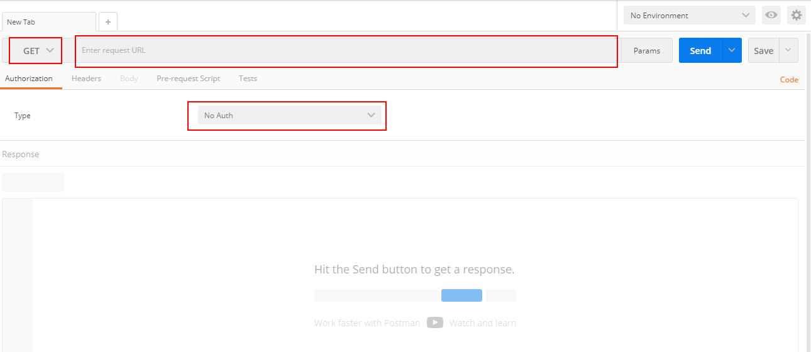

# 오라클 클라우드 테스트 드라이브 #
-----
## 403 : 모바일 서비스를 확장하기 위해 맞춤 API 및 맞춤 코드 개발 ##


### 소개 ###


사용자 정의 REST API를 만들어 모바일 응용 프로그램에서 사용할 수있는 서비스 라이브러리를 구축 할 수 있습니다. 맞춤 API는 특히 다른 소스의 데이터를 집계하고 관련 비즈니스 로직을 추가하며 결과를 모바일 애플리케이션에 모바일 친화적 인 방식으로 반환하는 데 유용합니다. 


### 오늘 운동에 대하여 ###
이전 연구실에서는 제안 정보 쿼리, QR 코드 작성 및 제안 결과 업데이트를 위해 외부 서비스와 통합 할 수 있도록 3 개의 커넥터 API를 만들었습니다. 기억할 수 있듯이 이러한 커넥터 API는 모바일 응용 프로그램에 직접 노출되지 않습니다. 서비스에 액세스하기 위해 커넥터 API를 작성한 후에는 사용자 정의 API (예 : Loyalty Management API)에서이 API를 사용하여 표준 REST 호출을 사용하여 모바일 애플리케이션 또는 외부 시스템에서 호출 할 수 있습니다. 이 실습에서는 세 개의 커넥터 API에 대한 사용자 지정 API를 만듭니다. 

이 연습에서는 다음을 수행합니다. 
- 커스텀 API를 생성하고 충성도 관리를위한 엔드 포인트를 정의하십시오. 쿠폰 정보 쿼리, QR 코드 생성 및 제안 결과 (예 : 거부 또는 수락) 업데이트를 위해 여러 끝점이있는 사용자 지정 API가 필요합니다. 
- 맞춤 API 구현 :이 실습에서는 API 구현을위한 코드 스 니펫을 제공합니다. 지침을 따르기 만하면됩니다. 
- 맞춤 API에 대한 보안 설정 
- API를 충성도 관리 MBE와 연결합니다. 
충성도 관리를위한 맞춤 API 테스트 

### 선수 과목 ###

- 충성도 관리 MBE는 이전 Lab에서 만들었습니다. (401 Lab) 
- 이전 연구실에서 만든 3 개의 커넥터 API (402 Lab) 
- 사용할 엔드 포인트가있는 사용자 정의 API 용 RAML 파일. [this link](https://raw.githubusercontent.com/APACTestDrive/CloudNative_Mobile/MobileLab-short-delta-only/common/assets/mobile/loyaltymanagementapi.raml)을 마우스 오른쪽 버튼으로 클릭하고 &quot;다른 이름으로 링크 저장 ...&quot;을 선택하여 랩에서 사용할 수 있습니다. 

- Chrome Postman이 맞춤 API를 테스트합니다. 
- 모든 텍스트 파일 편집기 

----
#### 맞춤 API 생성 및 충성도 관리를위한 끝점 정의이 실습에서는 충성도 관리를위한 맞춤 API를 작성합니다. 사실, 오퍼 정보 조회, QR 코드 작성 및 오퍼 결과 갱신을 위해 사용자 정의 API에 대해 여러 엔드 포인트를 정의해야합니다. 엔드 포인트 작성은 동일한 작업입니다. 사용자 편의를 위해 다른 엔드 포인트 용 RAML 파일을 사용하여 자체 사용자 정의 API를 작성한 후 하나의 추가 엔드 포인트를 수동으로 작성합니다. 여기에서 특정 오퍼 정보에 대한 쿼리를위한 하나의 엔드 포인트를 생성합니다. 

1. 탐색 창에서 &quot;Applications&quot;-> &quot;APIs&quot;를 선택하고 &quot;+ New API&quot;를 클릭 한 다음 드롭 다운 목록에서 &quot;API&quot;를 선택하십시오. 


2. &quot;RAML 문서 업로드&quot;링크를 클릭하고 선행 조건 섹션에서 다운로드 한 RAML 파일 (`loyaltymanagementapi.raml`)을 선택하십시오. 


3. 성공적으로 업로드되면 이름과 설명을 입력하고 아래와 같이 &quot;만들기&quot;를 클릭하십시오 : 
+ **API 표시 이름**: &#39;충성도 관리 API 0X&#39;(0X는 강사가 지정한 일련 번호입니다. 예 : 01) 
+ **API 이름**: &#39;LoyaltyManagementAPI0X` 
+ **API 짧은 설명**:`로열티 관리 API 0X 용 맞춤 API &#39;오른쪽 하단의&#39;만들기 &#39;를 클릭하십시오. 




4. **&quot;API Name&quot;의 값을 복사하고 Lab 401의 &quot;Mobile_App_Settings_Sample.json&quot;파일에서 &quot;API&quot;라는 속성 값을 바꿉니다.**나중에 사용할 수 있도록 JSON 파일을 저장하십시오. 

```
{
      "baseUrl": "https://mcs-<YOUR_MCS_DOMAIN_NAME>.mobileenv.us2.oraclecloud.com:443",
      "applicationKey": "9722de7f-4ecf-443f-8e0e-714b2f6e0f9c",
      "backendId": "4a9d0d32-8aad-48fb-b803-5315459dce9f",
      "anonymousToken": "R1NFMDAwMTE2NzhfTUNTX01PQklMRV9BTk9OWU1PVVNfQVBQSUQ6Smk3cXBld3lrczlfbmI=",
      "API":"LoyaltyManagementAPI0X",
            --> Replace the value inside double quotes with the value of "API Name" in previous step.
```

5. Define additional endpoint for the Loyalty Management API
   - Now the custom API just created is automatically open for you. Switch to the “Endpoints” tab to define the additional endpoint.





   ```
	{
		"id": 10001,
		"name": "Our new aroma roast",
		"points": 10000,
		"message": "Try special brew today and enjoy 10% off with 10,000 points",
		"productid": 20001,
		"productname": "Aroma Beans",
		"productprice": 21,
		"productimage": "20001.jpg",
		"productdesc": "Blend of incomparable Balance of sweetness, aroma and body. Composed of 50% Arabica and 50% Robusta."
	}
	
   ```

    - Scroll to the top of the page and click on “Save”.
    
     

    - For your information: Now we have created all endpoints for the Loyalty Management Custom APIs. The below is the list of endpoints for your reference.

    | Resource Path     | Display Name          | Method | Request Type     | Response Media Type |
    | ----------------- | --------------------- | ------ | ---------------- | ------------------- |
    | offer/{id}/qr	    | Offer QR code         | GET    | N/A	        | image/png           |
    | offer	            | Offers	            | GET    | N/A	        | application/json    |
    | offer/{id}/accept | Accept an offer       | POST   | application/json | application/json    |
    | offer/{id}/reject | Reject an offer       | POST   | application/json | application/json    |
    | offer/notify      | Send noti. of offer   | POST   | application/json | application/json    |
    | offer/{id}        | Get Offer Details     | GET    | N/A	        | application/json    |


----



----

---


---




