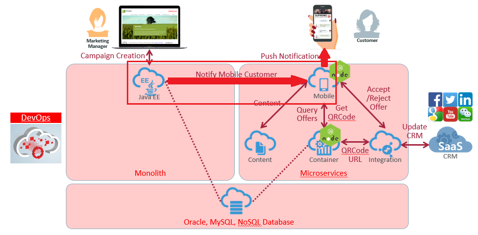
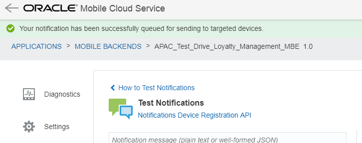
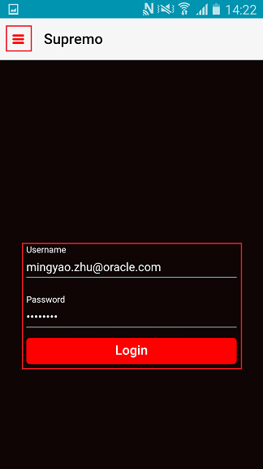
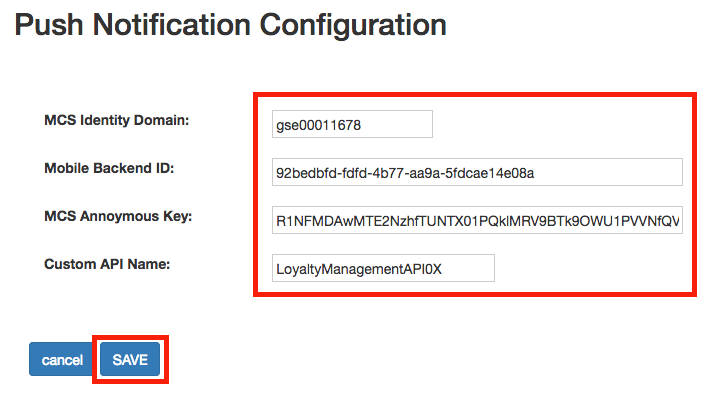
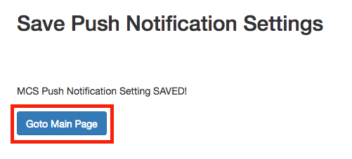

# 오라클 클라우드 테스트 드라이브 #
-----
## 501 : JEE 응용 프로그램에서 모바일 클라우드 서비스로 푸시 알림 전송을위한 소스 코드 업데이트 ##


### 소개 ###
랩 4 - 모바일 서비스 및 앱 완료시 Android 기기에서 `Cafe Supremo`앱을 실행하고 필요한 모든 모바일 백엔드 서비스를 구성 할 수 있어야합니다. Cafe Supremo 앱을 사용하는 고객은 로그온하여 맞춤 프로모션 및 메뉴를 탐색 할 수 있습니다. 고객이 정기적으로 최신의 새로운 프로모션 코드를 확인하게하는 대신 회사는 고객에게 적극적으로 알리고 싶어합니다. 마케팅 관리자가 새로운 쿠폰을 만들면 이미 `Cafe Supremo`앱을 설치 한 사용자에게 앱 기반 푸시 알림이 전송됩니다. 따라서 로열티 관리 JEE 애플리케이션을 메시징 알림 API를 호출하여 모바일 클라우드 서비스 (MCS)에 연결해야합니다. 




### 오늘 Practice에 대하여 ###
이 연습에서는 다음을 수행합니다. 
- `Continuous Integration and Continuous Delivery`의 두 번째 반복 수행, 즉 다른 코드 변경 세트 제공 
- JEE 응용 프로그램에서 모바일 장치로 푸시 알림을 보내려면 MCS API를 호출하십시오. 

### 선수 과목 ###

+ 이전의 4 가지 Lab 실습 모두 완료 : [Java Apps](../Java%20Apps/README.md), [Microservices](../Microservices/README.md), [Integration](../Integrations/README.md) and [Mobile](Mobile%20Service%20and%20App/README.md) 


----


#### 푸시 알림을 수신하도록 모바일 장치 준비 

1. 이전 Lab [404: Set up Push Notification and Test Push Notification to mobile app](../Mobile Service and App/404-MobileLab.md), you should be able to receive notification message pop-up from your mobile device upon **Test Notifications** from MCS like below. (Please check with instructor if you cannot complete lab exercise 404)의 끝 부분 




2. 모바일 앱을 실행하고 강사가 제공 한**사용자 이름**및**비밀번호**를 입력 한 다음 `로그인`버튼을 클릭하십시오. 




3. 로그인이 완료되면 시작 페이지가 표시됩니다. 휴대 기기에서 캠페인 쿠폰에 대한 푸시 알림을받을 준비가되었습니다. 


#### Java 앱 푸시 알림 구성 수정 

1. 로열티 관리 응용 프로그램의 홈 페이지로 이동하십시오. 로열티 관리 애플리케이션 URL은 다음 형식이어야합니다. https : //**<JCS WLS instance IP Adress>**/ 충성도 / jsp / 환영합니다 .jsp` 

페이지 하단의 [**푸시 알림 구성**] URL을 클릭하십시오. 


2. 환경에 따라 MCS 알림 설정을 업데이트하십시오. 이전에 Lab 404의 2 단계에서 준비한 Mobile_App_Settings_Sample.json에서 값을 사용할 수 있습니다. 
- MCS 신원 도메인 이름 :`신원 도메인, gse000XXXXX` 
- 모바일 백엔드 ID :`json 파일의 백엔드 ID` 
- MCS 익명 키 :`json 파일의 익명 토큰` 
- 사용자 정의 API 이름 :`json 파일의 API, LoyaltyMAnagementAPIXX` 

당신의 json 파일은 이것과 비슷하게 보일 것입니다 - **물론 다른 것은 다릅니다**
    ```json
    {
          "baseUrl": "https://<Your Mobile Cloud Service Identity Domain Name>.mobileenv.us2.oraclecloud.com:443",
          "applicationKey": "9722de7f-4ecf-443f-8e0e-714b2f6e0f9c",
          "backendId": "4a9d0d32-8aad-48fb-b803-5315459dce9f",
          "anonymousToken":  "R1NFMDAwMTE2NzhfTUNTX01PQklMRV9BTk9OWU1PVVNfQVBQSUQ6Smk3cXBld3lrczlfbmI=",
          "API":"LoyaltyManagementAPI0X",
          "senderID":"925757644219"
    ```

    When Copy-n-Paste to the web form, be careful
      - do NOT add white space   
      - you copy and paste the **COMPLETE** value     
  Click [ **SAVE** ] button to save your new settings.



