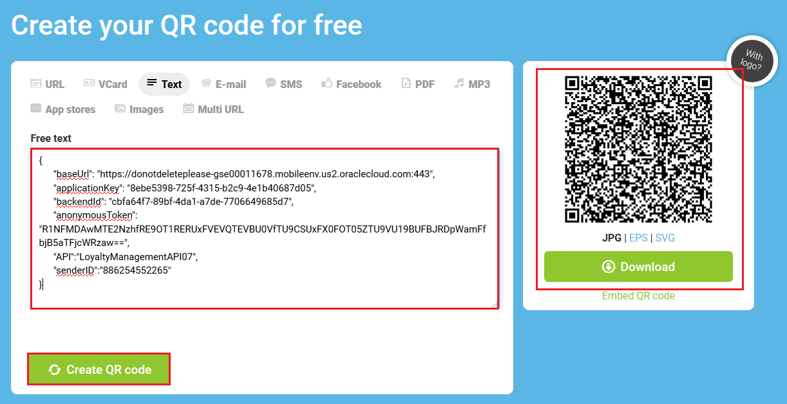
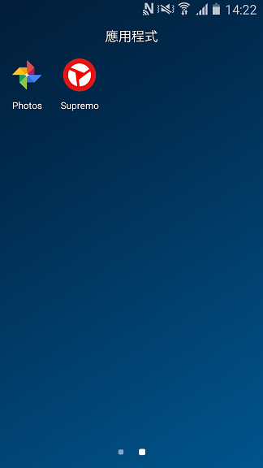
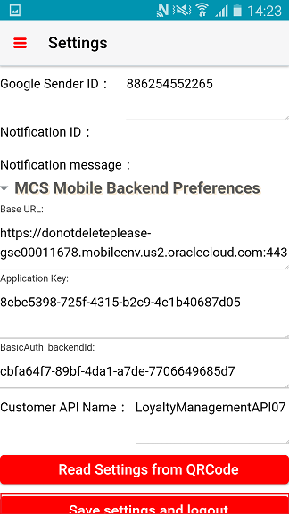
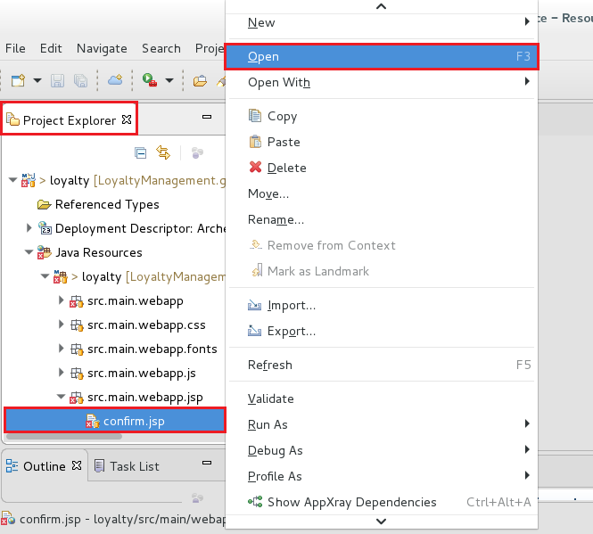
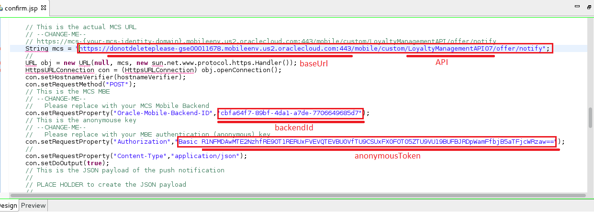
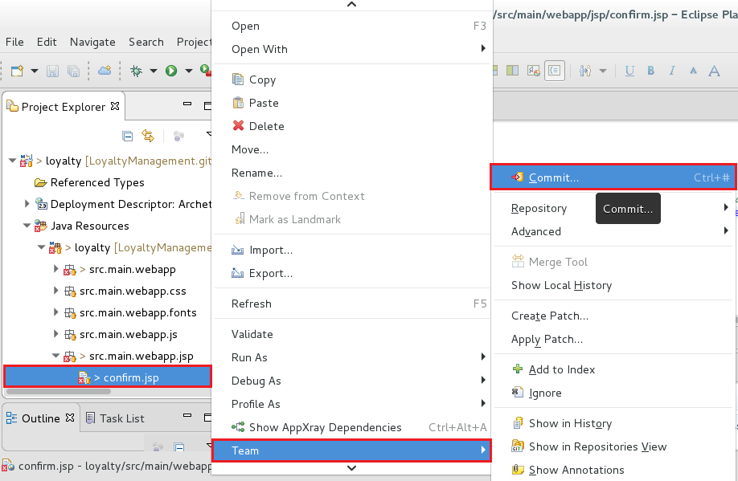
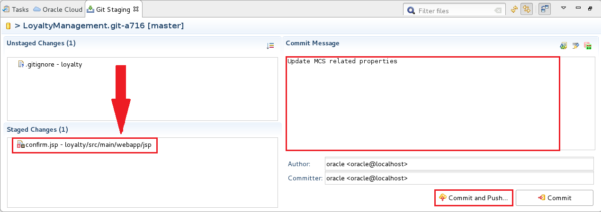
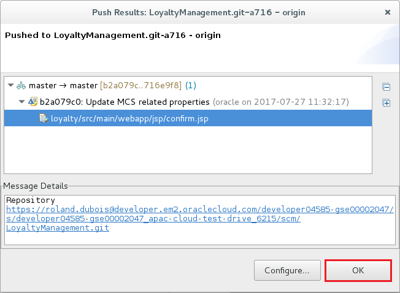

# ORACLE Cloud Test Drive #
-----
## 501: Update Source Code for Sending Push Notification from JEE Application to Mobile Cloud Service ##

### Introduction ###
On the completion of Lab 4 - Mobile Service and App, you should be able to run the 'Cafe Supremo' app on Android device and configured all necessary mobile backend services. Customer using Cafe Supremo app can logon, explore personalized promotion and menu.  
Rather than having the customer periodically checks the latest new promotion offer, the company wants to actively notify customers. An app-based push notification will be sent to those who already installed the 'Cafe Supremo' app, upon a new offer is created by marketing manager. Therefore, we will need to connect the Loyalty Management JEE application to Mobile Cloud Service (MCS) by calling a messaging notification API.


### About the Exercise Today ###
In this exercise, we will:
- Perform second iteration of 'Continuous Integration and Continuous Delivery', i.e. provision another set of code changes
- Call MCS API to send push notification from JEE application to mobile device

### Prerequisites ###
+ Completion of all previous 4 lab exercises: [Java Apps](../Java%20Apps/README.md), [Microservices](../Microservices/README.md), [Integration](../Integrations/README.md) and [Mobile](Mobile%20Service%20and%20App/README.md)
+ Re-open the VirtualBox Virtual Machine image used previously in [Java Apps Lab 103](../Java%20Apps/103-JavaAppsLab.md), or [click here if you forget the VirtualBox installation and usage instruction](../Java%20Apps/virtualbox.md)

----

#### Prepare Mobile Device to Receive Push Notification ####

1. By the end of previous lab [401: Set up Push Notification and Test Push Notification to mobile app](../Mobile Service and App/401-MobileLab.md), you should be able to receive notification message pop-up from your mobile device upon **Test Notifications** from MCS like below. (Please check with intructor if you cannot complete lab exercise 401)


2. Before running notification test, you were told to prepare a file called **Mobile_App_Settings_Sample.json** like below format:    
```
{
      "baseUrl": "https://<Your Mobile Cloud Service Identity Domain Name>.mobileenv.us2.oraclecloud.com:443",
      "applicationKey": "9722de7f-4ecf-443f-8e0e-714b2f6e0f9c",
      "backendId": "4a9d0d32-8aad-48fb-b803-5315459dce9f",
      "anonymousToken": "R1NFMDAwMTE2NzhfTUNTX01PQklMRV9BTk9OWU1PVVNfQVBQSUQ6Smk3cXBld3lrczlfbmI=",
      "API":"LoyaltyManagementAPI0X",
      "senderID":"925757644219"
}
```
We will use it shortly.

3. From your web browser, go to `http://www.qr-code-generator.com/`, click on `Text` button and the **Free text** text area is shown.


4. Copy **Your own** JSON file content from step 2 above, paste it into the **Free text** text area, then click `Create QR code` button. A QR code image will be generated on the right hand side of window.



You can keep this browser open, or save the image for later use.

5. From your mobile device, open the app 'Supremo'.



6. On app started and login page shown, click on the hamburger menu on top left corner.


7. On expanded menu, click `Settings`


8. On Settings page opened, click `Read Settings from QRCode` button at middle.


9. When the QR scanner running, face your mobile device towards the QR code image (from step 4).  
You may need to adjust the distance between your mobile deivce and your screen until the scanner camera can recognize the QR image.


10. On successful QR scanning, all property settings in your JSON file will be automatically filled into the mobile app Setting page like below. (You may need to expand `MCS Mobile Backend Preferences`)



Click `Save settings and logout` button. You will then be returned to home screen.

11. Enter the mobile app **Username** and **Password** provided by instructor, then click `Login` button.


12. Upon successful login, the welcome page is shown. Your mobile device is now ready to receive push notification of campaign offer.


#### Modify Source Code from Developer Cloud Service ####

1. Recall in early Java Apps Lab [103: Continuous Integration & Delivery (CICD): Using Eclipse IDE, Commit and Push Code Change to Oracle Developer Cloud Service](../Java%20Apps/103-JavaAppsLab.md), we have made a simply change on the title of *welcome.jsp* (step 14):


2. Now, we need to further modify source code such that this JEE web application will make a call to Mobile Cloud Service to delivery mobile notification to end user mobile device.  
Make sure your Oracle Enterprise Plugin for Eclipse (OEPE) in VirtualBox VM is running, with the previous import project opened.  
(Refer to **Using VirtualBox** in the beginning and step 1 of [Java Apps Lab 103](../Java%20Apps/103-JavaAppsLab.md) if you forget how to)


3. Expand the project tree of *loyalty*, locate and right click on `confirm.jsp` and then click `Open` button like below:



4. On `confirm.jsp` design window opened, scroll to source code line ~95, update 4 values respectively, i.e. **baseUrl**, **API**, **backendId** and **anonymousToken**.



The corresponding values are available from step 2 - **Mobile_App_Settings_Sample.json** in this lab guide above, i.e. 
```
{
      --> "baseUrl": "https://<Your Mobile Cloud Service Identity Domain Name>.mobileenv.us2.oraclecloud.com:443",
      "applicationKey": "9722de7f-4ecf-443f-8e0e-714b2f6e0f9c",
      --> "backendId": "4a9d0d32-8aad-48fb-b803-5315459dce9f",
      --> "anonymousToken": "R1NFMDAwMTE2NzhfTUNTX01PQklMRV9BTk9OWU1PVVNfQVBQSUQ6Smk3cXBld3lrczlfbmI=",
      --> "API":"LoyaltyManagementAPI0X",
      "senderID":"925757644219"
}
```
5. Enter `Ctrl` + `S` to save your change.

6. Next, right click on `confirm.jsp` again, then select `Team` button and follow by click `Commit` button.
 


7. The `Git Staging` window is opened, drag the *confirm.jsp* from `Unstaged Changes` area and drop it onto `Staged Changes` area.  
Enter a short description on the textarea at right side and then click `Commit and Push` button at bottom.



8. Wait for the changed project push to Developer Cloud Service, and on completion status dialog, click `OK` button to close.



\*Optional Step: Refer to [Java Apps Lab 103](../Java%20Apps/103-JavaAppsLab.md) - step 18 and onwards to verify source code being provisioned automatically under the scene, i.e. **Continuous Integration and Continuous Devlivery**

Your Loyalty Management JEE Application is now ready to create campaign offer and notify customer mobile device.

You have finished this lab section.

[Procced to Next - 502: End-to-End Testing](502-PuttingAllTogetherLab)

or

[Back to Putting All Together Lab Home](README.md)
