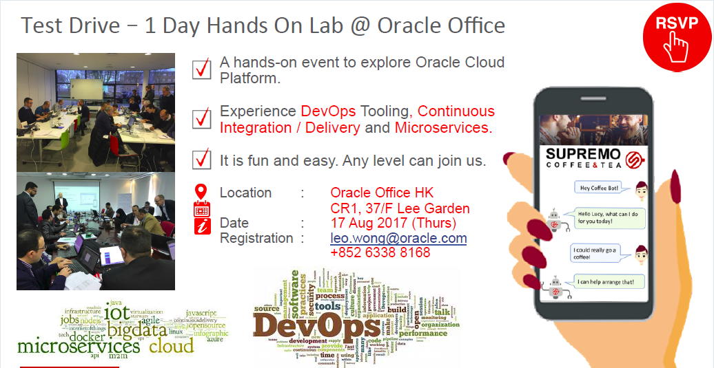

---
# ORACLE Cloud Test Drive #

## Introduction ##

This Oracle Cloud project contains the lab materials for the Oracle Cloud Test Drive events for Cloud Native Apps and Mobile organized in various locations. Participants can experiment through these labs with a series of Oracle Cloud Services like JCS (Java Cloud Service), DevCS (Developer Cloud Service), ACCS (Application Container Cloud Service), ICS (Integration Cloud Service) and MCS (Mobile Cloud Service). Thorough this Cloud Native and Mobile Test Drive, participants will have chances to know how they can use Oracle Cloud Services to implement Cloud Native Apps, Microservices, Integrations and Mobile Services. For better understaning on how and when companies can use Oracle Cloud Services, we will use a service scenario called "[loyalty management](https://github.com/APACTestDrive/CloudNative_Mobile/blob/master/common/scenario/README.md)".   

More specifically, following topics are currently included in this project:

## Java Apps Lab ##
[Java Apps lab](https://github.com/APACTestDrive/CloudNative_Mobile/tree/master/Java%20Apps) is composed of :
+ Backgrounds on Cloud Native Apps - What is Cloud Native Apps?, Why you need Cloud Native Apps?, About JCS, DevCS and DBCS etc.
+ Prepare environment for Cloud Native Apps - Set up the infrastructure to run your applications : Create a JCS Weblogic instance and DBMS (Oracle DBCS)
+ Cloud Native Apps Development - Building applications with DevOps: using Developer Cloud Service to build a J2EE application and deploying to JCS.

## Microservices ##
[Microservices lab](https://github.com/APACTestDrive/CloudNative_Mobile/tree/master/Microservices) shows you how to prepare an environment for Microserivces and develop Mircoserivces using Oracle ACCS (Application Container Cloud Serivces). This lab is composed of : 
+ Backgrounds on Microservices - What is Microservices?, Why you need Cloud Native Apps?, Examples of Microserivces, About ACCS etc.
+ Prepare environment for Microservices - Set up the infrastructure to run your Microserves : Create an ACCSc instance
+ Develop Microservices - Building Microservices.

## Integrations ##
[Integrations lab](https://github.com/APACTestDrive/CloudNative_Mobile/tree/master/Integrations) shows you how to prepare an environment for Microserivces and develop Mircoserivces using Oracle ACCS (Application Container Cloud Serivces).
+ Backgounds on Integration - Challenges and solutions, Integration patterns, About ICS etc.
+ Create MCS (Mobile Cloud Service) connection
+ Create Sales CS connection
+ Create ACCS (Application Container Cloud Service) connection
+ Create integrations based on connections
+ Creation orchestration

## Mobile Service and Application ##
[Mobile Service and Applicaton lab](https://github.com/APACTestDrive/CloudNative_Mobile/tree/master/Mobile%20Service%20and%20App) chapter will help you understand the use of MCS, the Mobile Cloud Service.  As a result, you will develop a simple mobile application and install it on your Mobile phone.
+ Backgounds on Mobile Service - Challenges and solutions, About MCS etc.
+ Set up Push Notification and Send Notification to mobile app
+ Develop Custom APIs and Custom Code to interact external serivces
+ Create Custom Analytics Report to track “Offer Completion by User”
At the end of this lab, we will give you End to End demo on Loyalty Management based on all the labs we’ve done. 

The workshop is intended to work with the Oracle Cloud account information handed out to you during the event. You will need the following information to start working on these exercises :

+ Oracle Cloud account **username** and **password**
+ Oracle Cloud **identity domain**

Including above information, we will distribute "Access Document" to give you information on how to access each of Cloud Services for this Cloud Test Drive.
